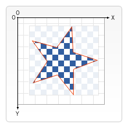

{{DefaultAPISidebar("Canvas API")}} {{PreviousNext("Web/API/Canvas_API/Tutorial/Transformations", "Web/API/Canvas_API/Tutorial/Basic_animations")}}

In all of our [previous examples](/en-US/docs/Web/API/Canvas_API/Tutorial/Transformations), shapes were always drawn one on top of the other. This is more than adequate for most situations, but it limits the order in which composite shapes are built. We can, however, change this behavior by setting the `globalCompositeOperation` property. In addition, the `clip` property allows us to hide unwanted parts of shapes.

## `globalCompositeOperation`

We can not only draw new shapes behind existing shapes but we can also use it to mask off certain areas, clear sections from the canvas (not limited to rectangles like the {{domxref("CanvasRenderingContext2D.clearRect", "clearRect()")}} method does) and more.

- {{domxref("CanvasRenderingContext2D.globalCompositeOperation", "globalCompositeOperation = type")}}
  - : This sets the type of compositing operation to apply when drawing new shapes, where type is a string identifying which of the twelve compositing operations to use.

## Clipping paths

A clipping path is like a normal canvas shape but it acts as a mask to hide unwanted parts of shapes. This is visualized in the image below. The red star shape is our clipping path. Everything that falls outside of this path won't get drawn on the canvas.



If we compare clipping paths to the `globalCompositeOperation` property we've seen above, we see two compositing modes that achieve more or less the same effect in `source-in` and `source-atop`. The most important differences between the two are that clipping paths are never actually drawn to the canvas and the clipping path is never affected by adding new shapes. This makes clipping paths ideal for drawing multiple shapes in a restricted area.

In the chapter about [drawing shapes](/en-US/docs/Web/API/Canvas_API/Tutorial/Drawing_shapes) I only mentioned the `stroke()` and `fill()` methods, but there's a third method we can use with paths, called `clip()`.

- {{domxref("CanvasRenderingContext2D.clip", "clip()")}}
  - : Turns the path currently being built into the current clipping path.

You use `clip()` instead of `closePath()` to close a path and turn it into a clipping path instead of stroking or filling the path.

By default the {{HTMLElement("canvas")}} element has a clipping path that's the exact same size as the canvas itself. In other words, no clipping occurs.

### A `clip` example

In this example, we'll use a circular clipping path to restrict the drawing of a set of random stars to a particular region.

```js
function draw() {
  const ctx = document.getElementById("canvas").getContext("2d");
  ctx.fillRect(0, 0, 150, 150);
  ctx.translate(75, 75);

  // Create a circular clipping path
  ctx.beginPath();
  ctx.arc(0, 0, 60, 0, Math.PI * 2, true);
  ctx.clip();

  // Draw background
  const linGrad = ctx.createLinearGradient(0, -75, 0, 75);
  linGrad.addColorStop(0, "#232256");
  linGrad.addColorStop(1, "#143778");

  ctx.fillStyle = linGrad;
  ctx.fillRect(-75, -75, 150, 150);

  generateStars(ctx);
}

function generateStars(ctx) {
  for (let j = 1; j < 50; j++) {
    ctx.save();
    ctx.fillStyle = "#fff";
    ctx.translate(
      75 - Math.floor(Math.random() * 150),
      75 - Math.floor(Math.random() * 150),
    );
    drawStar(ctx, Math.floor(Math.random() * 4) + 2);
    ctx.restore();
  }
}

function drawStar(ctx, r) {
  ctx.save();
  ctx.beginPath();
  ctx.moveTo(r, 0);
  for (let i = 0; i < 9; i++) {
    ctx.rotate(Math.PI / 5);
    if (i % 2 === 0) {
      ctx.lineTo((r / 0.525731) * 0.200811, 0);
    } else {
      ctx.lineTo(r, 0);
    }
  }
  ctx.closePath();
  ctx.fill();
  ctx.restore();
}
```

```html hidden
<canvas id="canvas" width="150" height="150"></canvas>
```

```js hidden
draw();
```

In the first few lines of code, we draw a black rectangle the size of the canvas as a backdrop, then translate the origin to the center. Next, we create the circular clipping path by drawing an arc and calling `clip()`. Clipping paths are also part of the canvas save state. If we wanted to keep the original clipping path we could have saved the canvas state before creating the new one.

Everything that's drawn after creating the clipping path will only appear inside that path. You can see this clearly in the linear gradient that's drawn next. After this a set of 50 randomly positioned and scaled stars is drawn, using the custom `drawStar()` function. Again the stars only appear inside the defined clipping path.

{{EmbedLiveSample("A_clip_example", "", "160")}}

### Inverse clipping path

There is no such thing as an inverse clipping mask. However, we can define a mask that fills the entire canvas with a rectangle and has a hole in it for the parts that you want to skip. When [drawing a shape with a hole](/en-US/docs/Web/API/Canvas_API/Tutorial/Drawing_shapes#shapes_with_holes), we need to draw the hole in the opposite direction as the outer shape. In the example below we punch a hole into the sky.

A rectangle does not have a drawing direction, but it behaves as if we drew it clockwise. By default, the arc command also goes clockwise, but we can change its direction with the last argument.

```html hidden
<html lang="en">
  <body>
    <canvas id="canvas" width="150" height="150"></canvas>
  </body>
</html>
```

```js
function draw() {
  const canvas = document.getElementById("canvas");
  if (canvas.getContext) {
    const ctx = canvas.getContext("2d");
    ctx.translate(75, 75);

    // Clipping path
    ctx.beginPath();
    ctx.rect(-75, -75, 150, 150); // Outer rectangle
    ctx.arc(0, 0, 60, 0, Math.PI * 2, true); // Hole anticlockwise
    ctx.clip();

    // Draw background
    const linGrad = ctx.createLinearGradient(0, -75, 0, 75);
    linGrad.addColorStop(0, "#232256");
    linGrad.addColorStop(1, "#143778");

    ctx.fillStyle = linGrad;
    ctx.fillRect(-75, -75, 150, 150);

    generateStars(ctx);
  }
}
```

```js hidden
function generateStars(ctx) {
  for (let j = 1; j < 50; j++) {
    ctx.save();
    ctx.fillStyle = "#fff";
    ctx.translate(
      75 - Math.floor(Math.random() * 150),
      75 - Math.floor(Math.random() * 150),
    );
    drawStar(ctx, Math.floor(Math.random() * 4) + 2);
    ctx.restore();
  }
}

function drawStar(ctx, r) {
  ctx.save();
  ctx.beginPath();
  ctx.moveTo(r, 0);
  for (let i = 0; i < 9; i++) {
    ctx.rotate(Math.PI / 5);
    if (i % 2 === 0) {
      ctx.lineTo((r / 0.525731) * 0.200811, 0);
    } else {
      ctx.lineTo(r, 0);
    }
  }
  ctx.closePath();
  ctx.fill();
  ctx.restore();
}

draw();
```

{{EmbedLiveSample("Hole_in_rectangle", "", "160")}}

{{PreviousNext("Web/API/Canvas_API/Tutorial/Transformations", "Web/API/Canvas_API/Tutorial/Basic_animations")}}
