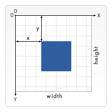
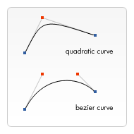

{{DefaultAPISidebar("Canvas API")}} {{PreviousNext("Web/API/Canvas_API/Tutorial/Basic_usage", "Web/API/Canvas_API/Tutorial/Applying_styles_and_colors")}}

Now that we have set up our [canvas environment](/en-US/docs/Web/API/Canvas_API/Tutorial/Basic_usage), we can get into the details of how to draw on the canvas. By the end of this article, you will have learned how to draw rectangles, triangles, lines, arcs and curves, providing familiarity with some of the basic shapes. Working with paths is essential when drawing objects onto the canvas and we will see how that can be done.

## The grid

Before we can start drawing, we need to talk about the canvas grid or **coordinate space**. Our HTML skeleton from the previous page had a canvas element 150 pixels wide and 150 pixels high.



Normally 1 unit in the grid corresponds to 1 pixel on the canvas. The origin of this grid is positioned in the _top left_ corner at coordinate (0,0). All elements are placed relative to this origin. So the position of the top left corner of the blue square becomes x pixels from the left and y pixels from the top, at coordinate (x,y). Later in this tutorial we'll see how we can translate the origin to a different position, rotate the grid and even scale it, but for now we'll stick to the default.

## Drawing rectangles

Unlike {{Glossary("SVG")}}, {{HTMLElement("canvas")}} only supports two primitive shapes: rectangles and paths (lists of points connected by lines). All other shapes must be created by combining one or more paths. Luckily, we have an assortment of path drawing functions which make it possible to compose very complex shapes.

First let's look at the rectangle. There are three functions that draw rectangles on the canvas:

- {{domxref("CanvasRenderingContext2D.fillRect", "fillRect(x, y, width, height)")}}
  - : Draws a filled rectangle.
- {{domxref("CanvasRenderingContext2D.strokeRect", "strokeRect(x, y, width, height)")}}
  - : Draws a rectangular outline.
- {{domxref("CanvasRenderingContext2D.clearRect", "clearRect(x, y, width, height)")}}
  - : Clears the specified rectangular area, making it fully transparent.

Each of these three functions takes the same parameters. `x` and `y` specify the position on the canvas (relative to the origin) of the top-left corner of the rectangle. `width` and `height` provide the rectangle's size.

Below is the `draw()` function from the previous page, but now it is making use of these three functions.

### Rectangular shape example

```html hidden
<html lang="en">
  <body>
    <canvas id="canvas" width="150" height="150"></canvas>
  </body>
</html>
```

```js
function draw() {
  const canvas = document.getElementById("canvas");
  if (canvas.getContext) {
    const ctx = canvas.getContext("2d");

    ctx.fillRect(25, 25, 100, 100);
    ctx.clearRect(45, 45, 60, 60);
    ctx.strokeRect(50, 50, 50, 50);
  }
}
```

```js hidden
draw();
```

This example's output is shown below.

{{EmbedLiveSample("Rectangular_shape_example", "", "160")}}

The `fillRect()` function draws a large black square 100 pixels on each side. The `clearRect()` function then erases a 60x60 pixel square from the center, and then `strokeRect()` is called to create a rectangular outline 50x50 pixels within the cleared square.

In upcoming pages we'll see two alternative methods for `clearRect()`, and we'll also see how to change the color and stroke style of the rendered shapes.

Unlike the path functions we'll see in the next section, all three rectangle functions draw immediately to the canvas.

## Drawing paths

Now let's look at paths. A path is a list of points, connected by segments of lines that can be of different shapes, curved or not, of different width and of different color. A path, or even a subpath, can be closed. To make shapes using paths, we take some extra steps:

1. First, you create the path.
2. Then you use [drawing commands](/en-US/docs/Web/API/CanvasRenderingContext2D#paths) to draw into the path.
3. Once the path has been created, you can stroke or fill the path to render it.

Here are the functions used to perform these steps:

- {{domxref("CanvasRenderingContext2D.beginPath", "beginPath()")}}
  - : Creates a new path. Once created, future drawing commands are directed into the path and used to build the path up.
- [Path methods](/en-US/docs/Web/API/CanvasRenderingContext2D#paths)
  - : Methods to set different paths for objects.
- {{domxref("CanvasRenderingContext2D.closePath", "closePath()")}}
  - : Adds a straight line to the path, going to the start of the current sub-path.
- {{domxref("CanvasRenderingContext2D.stroke", "stroke()")}}
  - : Draws the shape by stroking its outline.
- {{domxref("CanvasRenderingContext2D.fill", "fill()")}}
  - : Draws a solid shape by filling the path's content area.

The first step to create a path is to call the `beginPath()`. Internally, paths are stored as a list of sub-paths (lines, arcs, etc.) which together form a shape. Every time this method is called, the list is reset and we can start drawing new shapes.

> [!NOTE]
> When the current path is empty, such as immediately after calling `beginPath()`, or on a newly created canvas, the first path construction command is always treated as a `moveTo()`, regardless of what it actually is. For that reason, you will almost always want to specifically set your starting position after resetting a path.

The second step is calling the methods that actually specify the paths to be drawn. We'll see these shortly.

The third, and an optional step, is to call `closePath()`. This method tries to close the shape by drawing a straight line from the current point to the start. If the shape has already been closed or there's only one point in the list, this function does nothing.

> [!NOTE]
> When you call `fill()`, any open shapes are closed automatically, so you don't have to call `closePath()`. This is **not** the case when you call `stroke()`.

### Drawing a triangle

For example, the code for drawing a triangle would look something like this:

```html hidden
<html lang="en">
  <body>
    <canvas id="canvas" width="100" height="100"></canvas>
  </body>
</html>
```

```js
function draw() {
  const canvas = document.getElementById("canvas");
  if (canvas.getContext) {
    const ctx = canvas.getContext("2d");

    ctx.beginPath();
    ctx.moveTo(75, 50);
    ctx.lineTo(100, 75);
    ctx.lineTo(100, 25);
    ctx.fill();
  }
}
```

```js hidden
draw();
```

The result looks like this:

{{EmbedLiveSample("Drawing_a_triangle", "", "110")}}

### Moving the pen

One very useful function, which doesn't actually draw anything but becomes part of the path list described above, is the `moveTo()` function. You can probably best think of this as lifting a pen or pencil from one spot on a piece of paper and placing it on the next.

- {{domxref("CanvasRenderingContext2D.moveTo", "moveTo(x, y)")}}
  - : Moves the pen to the coordinates specified by `x` and `y`.

When the canvas is initialized or `beginPath()` is called, you typically will want to use the `moveTo()` function to place the starting point somewhere else. We could also use `moveTo()` to draw unconnected paths. Take a look at the smiley face below.

To try this for yourself, you can use the code snippet below. Just paste it into the `draw()` function we saw earlier.

```html hidden
<html lang="en">
  <body>
    <canvas id="canvas" width="150" height="150"></canvas>
  </body>
</html>
```

```js
function draw() {
  const canvas = document.getElementById("canvas");
  if (canvas.getContext) {
    const ctx = canvas.getContext("2d");

    ctx.beginPath();
    ctx.arc(75, 75, 50, 0, Math.PI * 2, true); // Outer circle
    ctx.moveTo(110, 75);
    ctx.arc(75, 75, 35, 0, Math.PI, false); // Mouth (clockwise)
    ctx.moveTo(65, 65);
    ctx.arc(60, 65, 5, 0, Math.PI * 2, true); // Left eye
    ctx.moveTo(95, 65);
    ctx.arc(90, 65, 5, 0, Math.PI * 2, true); // Right eye
    ctx.stroke();
  }
}
```

```js hidden
draw();
```

The result looks like this:

{{EmbedLiveSample("Moving_the_pen", "", "160")}}

If you'd like to see the connecting lines, you can remove the lines that call `moveTo()`.

> [!NOTE]
> To learn more about the `arc()` function, see the [Arcs](#arcs) section below.

### Lines

For drawing straight lines, use the `lineTo()` method.

- {{domxref("CanvasRenderingContext2D.lineTo", "lineTo(x, y)")}}
  - : Draws a line from the current drawing position to the position specified by `x` and `y`.

This method takes two arguments, `x` and `y`, which are the coordinates of the line's end point. The starting point is dependent on previously drawn paths, where the end point of the previous path is the starting point for the following, etc. The starting point can also be changed by using the `moveTo()` method.

The example below draws two triangles, one filled and one outlined.

```html hidden
<html lang="en">
  <body>
    <canvas id="canvas" width="150" height="150"></canvas>
  </body>
</html>
```

```js
function draw() {
  const canvas = document.getElementById("canvas");
  if (canvas.getContext) {
    const ctx = canvas.getContext("2d");

    // Filled triangle
    ctx.beginPath();
    ctx.moveTo(25, 25);
    ctx.lineTo(105, 25);
    ctx.lineTo(25, 105);
    ctx.fill();

    // Stroked triangle
    ctx.beginPath();
    ctx.moveTo(125, 125);
    ctx.lineTo(125, 45);
    ctx.lineTo(45, 125);
    ctx.closePath();
    ctx.stroke();
  }
}
```

```js hidden
draw();
```

This starts by calling `beginPath()` to start a new shape path. We then use the `moveTo()` method to move the starting point to the desired position. Below this, two lines are drawn which make up two sides of the triangle.

{{EmbedLiveSample("Lines", "", "160")}}

You'll notice the difference between the filled and stroked triangle. This is, as mentioned above, because shapes are automatically closed when a path is filled, but not when they are stroked. If we left out the `closePath()` for the stroked triangle, only two lines would have been drawn, not a complete triangle.

### Arcs

To draw arcs or circles, we use the `arc()` or `arcTo()` methods.

- {{domxref("CanvasRenderingContext2D.arc", "arc(x, y, radius, startAngle, endAngle, counterclockwise)")}}
  - : Draws an arc which is centered at _(x, y)_ position with radius _r_ starting at _startAngle_ and ending at _endAngle_ going in the given direction indicated by _counterclockwise_ (defaulting to clockwise).
- {{domxref("CanvasRenderingContext2D.arcTo", "arcTo(x1, y1, x2, y2, radius)")}}
  - : Draws an arc with the given control points and radius, connected to the previous point by a straight line.

Let's have a more detailed look at the `arc` method, which takes six parameters: `x` and `y` are the coordinates of the center of the circle on which the arc should be drawn. `radius` is self-explanatory. The `startAngle` and `endAngle` parameters define the start and end points of the arc in radians, along the curve of the circle. These are measured from the x axis. The `counterclockwise` parameter is a Boolean value which, when `true`, draws the arc counterclockwise; otherwise, the arc is drawn clockwise.

> [!NOTE]
> Angles in the `arc` function are measured in radians, not degrees. To convert degrees to radians you can use the following JavaScript expression: `radians = (Math.PI/180)*degrees`.

The following example is a little more complex than the ones we've seen above. It draws 12 different arcs all with different angles and fills.

The two [`for` loops](/en-US/docs/Web/JavaScript/Reference/Statements/for) are for looping through the rows and columns of arcs. For each arc, we start a new path by calling `beginPath()`. In the code, each of the parameters for the arc is in a variable for clarity, but you wouldn't necessarily do that in real life.

The `x` and `y` coordinates should be clear enough. `radius` and `startAngle` are fixed. The `endAngle` starts at 180 degrees (half a circle) in the first column and is increased by steps of 90 degrees, culminating in a complete circle in the last column.

The statement for the `clockwise` parameter results in the first and third row being drawn as clockwise arcs and the second and fourth row as counterclockwise arcs. Finally, the `if` statement makes the top half stroked arcs and the bottom half filled arcs.

> [!NOTE]
> This example requires a slightly larger canvas than the others on this page: 150 x 200 pixels.

```html hidden
<html lang="en">
  <body>
    <canvas id="canvas" width="150" height="200"></canvas>
  </body>
</html>
```

```js
function draw() {
  const canvas = document.getElementById("canvas");
  if (canvas.getContext) {
    const ctx = canvas.getContext("2d");

    for (let i = 0; i < 4; i++) {
      for (let j = 0; j < 3; j++) {
        ctx.beginPath();
        const x = 25 + j * 50; // x coordinate
        const y = 25 + i * 50; // y coordinate
        const radius = 20; // Arc radius
        const startAngle = 0; // Starting point on circle
        const endAngle = Math.PI + (Math.PI * j) / 2; // End point on circle
        const counterclockwise = i % 2 !== 0; // clockwise or counterclockwise

        ctx.arc(x, y, radius, startAngle, endAngle, counterclockwise);

        if (i > 1) {
          ctx.fill();
        } else {
          ctx.stroke();
        }
      }
    }
  }
}
```

```js hidden
draw();
```

{{EmbedLiveSample("Arcs", "", "210")}}

### Bezier and quadratic curves

The next type of paths available are [Bézier curves](/en-US/docs/Glossary/Bezier_curve), available in both cubic and quadratic varieties. These are generally used to draw complex organic shapes.

- {{domxref("CanvasRenderingContext2D.quadraticCurveTo", "quadraticCurveTo(cp1x, cp1y, x, y)")}}
  - : Draws a quadratic Bézier curve from the current pen position to the end point specified by `x` and `y`, using the control point specified by `cp1x` and `cp1y`.
- {{domxref("CanvasRenderingContext2D.bezierCurveTo", "bezierCurveTo(cp1x, cp1y, cp2x, cp2y, x, y)")}}
  - : Draws a cubic Bézier curve from the current pen position to the end point specified by `x` and `y`, using the control points specified by (`cp1x`, `cp1y`) and (`cp2x`, `cp2y`).

The difference between these is that a quadratic Bézier curve has a start and an end point (blue dots) and just one **control point** (indicated by the red dot) while a cubic Bézier curve uses two control points.


The `x` and `y` parameters in both of these methods are the coordinates of the end point. `cp1x` and `cp1y` are the coordinates of the first control point, and `cp2x` and `cp2y` are the coordinates of the second control point.

Using quadratic and cubic Bézier curves can be quite challenging, because unlike vector drawing software like Adobe Illustrator, we don't have direct visual feedback as to what we're doing. This makes it pretty hard to draw complex shapes. In the following example, we'll be drawing some simple organic shapes, but if you have the time and, most of all, the patience, much more complex shapes can be created.

There's nothing very difficult in these examples. In both cases we see a succession of curves being drawn which finally result in a complete shape.

#### Quadratic Bezier curves

This example uses multiple quadratic Bézier curves to render a speech balloon.

```html hidden
<html lang="en">
  <body>
    <canvas id="canvas" width="150" height="150"></canvas>
  </body>
</html>
```

```js
function draw() {
  const canvas = document.getElementById("canvas");
  if (canvas.getContext) {
    const ctx = canvas.getContext("2d");

    // Quadratic curves example
    ctx.beginPath();
    ctx.moveTo(75, 25);
    ctx.quadraticCurveTo(25, 25, 25, 62.5);
    ctx.quadraticCurveTo(25, 100, 50, 100);
    ctx.quadraticCurveTo(50, 120, 30, 125);
    ctx.quadraticCurveTo(60, 120, 65, 100);
    ctx.quadraticCurveTo(125, 100, 125, 62.5);
    ctx.quadraticCurveTo(125, 25, 75, 25);
    ctx.stroke();
  }
}
```

```js hidden
draw();
```

{{EmbedLiveSample("Quadratic_Bezier_curves", "", "160")}}

#### Cubic Bezier curves

This example draws a heart using cubic Bézier curves.

```html hidden
<html lang="en">
  <body>
    <canvas id="canvas" width="150" height="150"></canvas>
  </body>
</html>
```

```js
function draw() {
  const canvas = document.getElementById("canvas");
  if (canvas.getContext) {
    const ctx = canvas.getContext("2d");

    // Cubic curves example
    ctx.beginPath();
    ctx.moveTo(75, 40);
    ctx.bezierCurveTo(75, 37, 70, 25, 50, 25);
    ctx.bezierCurveTo(20, 25, 20, 62.5, 20, 62.5);
    ctx.bezierCurveTo(20, 80, 40, 102, 75, 120);
    ctx.bezierCurveTo(110, 102, 130, 80, 130, 62.5);
    ctx.bezierCurveTo(130, 62.5, 130, 25, 100, 25);
    ctx.bezierCurveTo(85, 25, 75, 37, 75, 40);
    ctx.fill();
  }
}
```

```js hidden
draw();
```

{{EmbedLiveSample("Cubic_Bezier_curves", "", "160")}}

### Rectangles

In addition to the three methods we saw in [Drawing rectangles](#drawing_rectangles), which draw rectangular shapes directly to the canvas, there's also the `rect()` method, which adds a rectangular path to a currently open path.

- {{domxref("CanvasRenderingContext2D.rect", "rect(x, y, width, height)")}}
  - : Draws a rectangle whose top-left corner is specified by (`x`, `y`) with the specified `width` and `height`.

Before this method is executed, the `moveTo()` method is automatically called with the parameters (x,y). In other words, the current pen position is automatically reset to the default coordinates.

### Making combinations

So far, each example on this page has used only one type of path function per shape. However, there's no limitation to the number or types of paths you can use to create a shape. So in this final example, let's combine all of the path functions to make a set of very famous game characters.

```html hidden
<html lang="en">
  <body>
    <canvas id="canvas" width="200" height="185"></canvas>
  </body>
</html>
```

```js
function draw() {
  const canvas = document.getElementById("canvas");
  if (canvas.getContext) {
    const ctx = canvas.getContext("2d");

    roundedRect(ctx, 12, 12, 184, 168, 15);
    roundedRect(ctx, 19, 19, 170, 154, 9);
    roundedRect(ctx, 53, 53, 49, 33, 10);
    roundedRect(ctx, 53, 119, 49, 16, 6);
    roundedRect(ctx, 135, 53, 49, 33, 10);
    roundedRect(ctx, 135, 119, 25, 49, 10);

    ctx.beginPath();
    ctx.arc(37, 37, 13, Math.PI / 7, -Math.PI / 7, false);
    ctx.lineTo(31, 37);
    ctx.fill();

    for (let i = 0; i < 8; i++) {
      ctx.fillRect(51 + i * 16, 35, 4, 4);
    }

    for (let i = 0; i < 6; i++) {
      ctx.fillRect(115, 51 + i * 16, 4, 4);
    }

    for (let i = 0; i < 8; i++) {
      ctx.fillRect(51 + i * 16, 99, 4, 4);
    }

    ctx.beginPath();
    ctx.moveTo(83, 116);
    ctx.lineTo(83, 102);
    ctx.bezierCurveTo(83, 94, 89, 88, 97, 88);
    ctx.bezierCurveTo(105, 88, 111, 94, 111, 102);
    ctx.lineTo(111, 116);
    ctx.lineTo(106.333, 111.333);
    ctx.lineTo(101.666, 116);
    ctx.lineTo(97, 111.333);
    ctx.lineTo(92.333, 116);
    ctx.lineTo(87.666, 111.333);
    ctx.lineTo(83, 116);
    ctx.fill();

    ctx.fillStyle = "white";
    ctx.beginPath();
    ctx.moveTo(91, 96);
    ctx.bezierCurveTo(88, 96, 87, 99, 87, 101);
    ctx.bezierCurveTo(87, 103, 88, 106, 91, 106);
    ctx.bezierCurveTo(94, 106, 95, 103, 95, 101);
    ctx.bezierCurveTo(95, 99, 94, 96, 91, 96);
    ctx.moveTo(103, 96);
    ctx.bezierCurveTo(100, 96, 99, 99, 99, 101);
    ctx.bezierCurveTo(99, 103, 100, 106, 103, 106);
    ctx.bezierCurveTo(106, 106, 107, 103, 107, 101);
    ctx.bezierCurveTo(107, 99, 106, 96, 103, 96);
    ctx.fill();

    ctx.fillStyle = "black";
    ctx.beginPath();
    ctx.arc(101, 102, 2, 0, Math.PI * 2, true);
    ctx.fill();

    ctx.beginPath();
    ctx.arc(89, 102, 2, 0, Math.PI * 2, true);
    ctx.fill();
  }
}

// A utility function to draw a rectangle with rounded corners.

function roundedRect(ctx, x, y, width, height, radius) {
  ctx.beginPath();
  ctx.moveTo(x, y + radius);
  ctx.arcTo(x, y + height, x + radius, y + height, radius);
  ctx.arcTo(x + width, y + height, x + width, y + height - radius, radius);
  ctx.arcTo(x + width, y, x + width - radius, y, radius);
  ctx.arcTo(x, y, x, y + radius, radius);
  ctx.stroke();
}
```

```js hidden
draw();
```

The resulting image looks like this:

{{EmbedLiveSample("Making_combinations", "", "200")}}

We won't go over this in detail, since it's actually surprisingly simple. The most important things to note are the use of the `fillStyle` property on the drawing context, and the use of a utility function (in this case `roundedRect()`). Using utility functions for bits of drawing you do often can be very helpful and reduce the amount of code you need, as well as its complexity.

We'll take another look at `fillStyle`, in more detail, later in this tutorial. Here, all we're doing is using it to change the fill color for paths from the default color of black to white, and then back again.

### Shapes with holes

To draw a shape with a hole in it, we need to draw the hole in different clock directions as we draw the outer shape. We either draw the outer shape clockwise and the inner shape anticlockwise or the outer shape anticlockwise and the inner shape clockwise.

```html hidden
<html lang="en">
  <body>
    <canvas id="canvas" width="150" height="150"></canvas>
  </body>
</html>
```

```js
function draw() {
  const canvas = document.getElementById("canvas");
  if (canvas.getContext) {
    const ctx = canvas.getContext("2d");

    ctx.beginPath();

    // Outer shape clockwise ⟳
    ctx.moveTo(0, 0);
    ctx.lineTo(150, 0);
    ctx.lineTo(75, 129.9);

    // Inner shape anticlockwise ↺
    ctx.moveTo(75, 20);
    ctx.lineTo(50, 60);
    ctx.lineTo(100, 60);

    ctx.fill();
  }
}
```

```js hidden
draw();
```

{{EmbedLiveSample("Shapes_with_holes", "", "160")}}

In the example above, the outer triangle goes clockwise (move to the top-left corner, then draw a line to the top-right corner, and finish at the bottom) and the inner triangle goes anticlockwise (move to the top, then line to the bottom-left corner, and finish at the bottom-right).

## Path2D objects

As we have seen in the last example, there can be a series of paths and drawing commands to draw objects onto your canvas. To simplify the code and to improve performance, the {{domxref("Path2D")}} object, available in recent versions of browsers, lets you cache or record these drawing commands. You are able to play back your paths quickly.
Let's see how we can construct a `Path2D` object:

- {{domxref("Path2D.Path2D", "Path2D()")}}
  - : The **`Path2D()`** constructor returns a newly instantiated `Path2D` object, optionally with another path as an argument (creates a copy), or optionally with a string consisting of [SVG path](/en-US/docs/Web/SVG/Tutorial/Paths) data.

```js
new Path2D(); // empty path object
new Path2D(path); // copy from another Path2D object
new Path2D(d); // path from SVG path data
```

All [path methods](/en-US/docs/Web/API/CanvasRenderingContext2D#paths) like `moveTo`, `rect`, `arc` or `quadraticCurveTo`, etc., which we got to know above, are available on `Path2D` objects.

The `Path2D` API also adds a way to combine paths using the `addPath` method. This can be useful when you want to build objects from several components, for example.

- {{domxref("Path2D.addPath", "Path2D.addPath(path [, transform])")}}
  - : Adds a path to the current path with an optional transformation matrix.

### Path2D example

In this example, we are creating a rectangle and a circle. Both are stored as a `Path2D` object, so that they are available for later usage. With the new `Path2D` API, several methods got updated to optionally accept a `Path2D` object to use instead of the current path. Here, `stroke` and `fill` are used with a path argument to draw both objects onto the canvas, for example.

```html hidden
<html lang="en">
  <body>
    <canvas id="canvas" width="130" height="100"></canvas>
  </body>
</html>
```

```js
function draw() {
  const canvas = document.getElementById("canvas");
  if (canvas.getContext) {
    const ctx = canvas.getContext("2d");

    const rectangle = new Path2D();
    rectangle.rect(10, 10, 50, 50);

    const circle = new Path2D();
    circle.arc(100, 35, 25, 0, 2 * Math.PI);

    ctx.stroke(rectangle);
    ctx.fill(circle);
  }
}
```

```js hidden
draw();
```

{{EmbedLiveSample("Path2D_example", "", "110")}}

### Using SVG paths

Another powerful feature of the new canvas `Path2D` API is using [SVG path data](/en-US/docs/Web/SVG/Tutorial/Paths) to initialize paths on your canvas. This might allow you to pass around path data and re-use them in both, SVG and canvas.

The path will move to point (`M10 10`) and then move horizontally 80 points to the right (`h 80`), then 80 points down (`v 80`), then 80 points to the left (`h -80`), and then back to the start (`z`). You can see this example on the [`Path2D` constructor](/en-US/docs/Web/API/Path2D/Path2D#using_svg_paths) page.

```js
const p = new Path2D("M10 10 h 80 v 80 h -80 Z");
```

{{PreviousNext("Web/API/Canvas_API/Tutorial/Basic_usage", "Web/API/Canvas_API/Tutorial/Applying_styles_and_colors")}}
