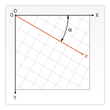

{{CanvasSidebar}} {{PreviousNext("Web/API/Canvas_API/Tutorial/Using_images", "Web/API/Canvas_API/Tutorial/Compositing")}}

Earlier in this tutorial we've learned about the [canvas grid](/en-US/docs/Web/API/Canvas_API/Tutorial/Drawing_shapes) and the **coordinate space**. Until now, we only used the default grid and changed the size of the overall canvas for our needs. With transformations there are more powerful ways to translate the origin to a different position, rotate the grid and even scale it.

## Saving and restoring state

Before we look at the transformation methods, let's look at two other methods which are indispensable once you start generating ever more complex drawings.

- {{domxref("CanvasRenderingContext2D.save", "save()")}}
  - : Saves the entire state of the canvas.
- {{domxref("CanvasRenderingContext2D.restore", "restore()")}}
  - : Restores the most recently saved canvas state.

Canvas states are stored on a stack. Every time the `save()` method is called, the current drawing state is pushed onto the stack. A drawing state consists of

- The transformations that have been applied (i.e. `translate`, `rotate` and `scale` – see below).
- The current values of the following attributes: {{domxref("CanvasRenderingContext2D.strokeStyle", "strokeStyle")}}, {{domxref("CanvasRenderingContext2D.fillStyle", "fillStyle")}}, {{domxref("CanvasRenderingContext2D.globalAlpha", "globalAlpha")}}, {{domxref("CanvasRenderingContext2D.lineWidth", "lineWidth")}}, {{domxref("CanvasRenderingContext2D.lineCap", "lineCap")}}, {{domxref("CanvasRenderingContext2D.lineJoin", "lineJoin")}}, {{domxref("CanvasRenderingContext2D.miterLimit", "miterLimit")}}, {{domxref("CanvasRenderingContext2D.lineDashOffset", "lineDashOffset")}}, {{domxref("CanvasRenderingContext2D.shadowOffsetX", "shadowOffsetX")}}, {{domxref("CanvasRenderingContext2D.shadowOffsetY", "shadowOffsetY")}}, {{domxref("CanvasRenderingContext2D.shadowBlur", "shadowBlur")}}, {{domxref("CanvasRenderingContext2D.shadowColor", "shadowColor")}}, {{domxref("CanvasRenderingContext2D.globalCompositeOperation", "globalCompositeOperation")}}, {{domxref("CanvasRenderingContext2D.font", "font")}}, {{domxref("CanvasRenderingContext2D.textAlign", "textAlign")}}, {{domxref("CanvasRenderingContext2D.textBaseline", "textBaseline")}}, {{domxref("CanvasRenderingContext2D.direction", "direction")}}, {{domxref("CanvasRenderingContext2D.imageSmoothingEnabled", "imageSmoothingEnabled")}}.
- The current [clipping path](/en-US/docs/Web/API/Canvas_API/Tutorial/Compositing#clipping_paths), which we'll see in the next section.

You can call the `save()` method as many times as you like. Each time the `restore()` method is called, the last saved state is popped off the stack and all saved settings are restored.

### A `save` and `restore` canvas state example

This example tries to illustrate how the stack of drawing states functions by drawing a set of consecutive rectangles.

```js
function draw() {
  const ctx = document.getElementById('canvas').getContext('2d');

  ctx.fillRect(0, 0, 150, 150);   // Draw a rectangle with default settings
  ctx.save();                  // Save the default state

  ctx.fillStyle = '#09F';      // Make changes to the settings
  ctx.fillRect(15, 15, 120, 120); // Draw a rectangle with new settings

  ctx.save();                  // Save the current state
  ctx.fillStyle = '#FFF';      // Make changes to the settings
  ctx.globalAlpha = 0.5;
  ctx.fillRect(30, 30, 90, 90);   // Draw a rectangle with new settings

  ctx.restore();               // Restore previous state
  ctx.fillRect(45, 45, 60, 60);   // Draw a rectangle with restored settings

  ctx.restore();               // Restore original state
  ctx.fillRect(60, 60, 30, 30);   // Draw a rectangle with restored settings
}
```

```html hidden
<canvas id="canvas" width="150" height="150"></canvas>
```

```js hidden
draw();
```

The first step is to draw a large rectangle with the default settings. Next we save this state and make changes to the fill color. We then draw the second and smaller blue rectangle and save the state. Again we change some drawing settings and draw the third semi-transparent white rectangle.

So far this is pretty similar to what we've done in previous sections. However once we call the first `restore()` statement, the top drawing state is removed from the stack, and settings are restored. If we hadn't saved the state using `save()`, we would need to change the fill color and transparency manually in order to return to the previous state. This would be easy for two properties, but if we have more than that, our code would become very long, very fast.

When the second `restore()` statement is called, the original state (the one we set up before the first call to `save`) is restored and the last rectangle is once again drawn in black.

{{EmbedLiveSample("A_save_and_restore_canvas_state_example", "180", "190", "canvas_savestate.png")}}

## Translating

The first of the transformation methods we'll look at is `translate()`. This method is used to move the canvas and its origin to a different point in the grid.

- {{domxref("CanvasRenderingContext2D.translate", "translate(x, y)")}}
  - : Moves the canvas and its origin on the grid. `x` indicates the horizontal distance to move, and `y` indicates how far to move the grid vertically.


It's a good idea to save the canvas state before doing any transformations. In most cases, it is just easier to call the `restore` method than having to do a reverse translation to return to the original state. Also if you're translating inside a loop and don't save and restore the canvas state, you might end up missing part of your drawing, because it was drawn outside the canvas edge.

### A `translate` example

This example demonstrates some of the benefits of translating the canvas origin. Without the `translate()` method, all of the rectangles would be drawn at the same position (0,0). The `translate()` method also gives us the freedom to place the rectangle anywhere on the canvas without having to manually adjust coordinates in the `fillRect()` function. This makes it a little easier to understand and use.

In the `draw()` function, we call the `fillRect()` function nine times using two `for` loops. In each loop, the canvas is translated, the rectangle is drawn, and the canvas is returned back to its original state. Note how the call to `fillRect()` uses the same coordinates each time, relying on `translate()` to adjust the drawing position.

```js
function draw() {
  const ctx = document.getElementById('canvas').getContext('2d');
  for (let i = 0; i < 3; i++) {
    for (let j = 0; j < 3; j++) {
      ctx.save();
      ctx.fillStyle = `rgb(${51 * i}, ${255 - 51 * i}, 255)`;
      ctx.translate(10 + j * 50, 10 + i * 50);
      ctx.fillRect(0, 0, 25, 25);
      ctx.restore();
    }
  }
}
```

```html hidden
<canvas id="canvas" width="150" height="150"></canvas>
```

```js hidden
draw();
```

{{EmbedLiveSample("A_translate_example", "160", "190", "translate.png")}}

## Rotating

The second transformation method is `rotate()`. We use it to rotate the canvas around the current origin.

- {{domxref("CanvasRenderingContext2D.rotate", "rotate(angle)")}}
  - : Rotates the canvas clockwise around the current origin by the `angle` number of radians.



The rotation center point is always the canvas origin. To change the center point, we will need to move the canvas by using the `translate()` method.

### A `rotate` example

In this example, we'll use the `rotate()` method to first rotate a rectangle from the canvas origin and then from the center of the rectangle itself with the help of `translate()`.

> **Note:** Angles are in radians, not degrees. To convert, we are using: `radians = (Math.PI/180)*degrees`.

```js
function draw() {
  const ctx = document.getElementById('canvas').getContext('2d');

  // left rectangles, rotate from canvas origin
  ctx.save();
  // blue rect
  ctx.fillStyle = '#0095DD';
  ctx.fillRect(30, 30, 100, 100);
  ctx.rotate((Math.PI / 180) * 25);
  // grey rect
  ctx.fillStyle = '#4D4E53';
  ctx.fillRect(30, 30, 100, 100);
  ctx.restore();

  // right rectangles, rotate from rectangle center
  // draw blue rect
  ctx.fillStyle = '#0095DD';
  ctx.fillRect(150, 30, 100, 100);

  ctx.translate(200, 80); // translate to rectangle center
                          // x = x + 0.5 * width
                          // y = y + 0.5 * height
  ctx.rotate((Math.PI / 180) * 25); // rotate
  ctx.translate(-200, -80); // translate back

  // draw grey rect
  ctx.fillStyle = '#4D4E53';
  ctx.fillRect(150, 30, 100, 100);
}
```

To rotate the rectangle around its own center, we translate the canvas to the center of the rectangle, then rotate the canvas, then translate the canvas back to 0,0, and then draw the rectangle.

```html hidden
<canvas id="canvas" width="300" height="200"></canvas>
```

```js hidden
draw();
```

{{EmbedLiveSample("A_rotate_example", "310", "260", "rotate.png")}}

## Scaling

The next transformation method is scaling. We use it to increase or decrease the units in our canvas grid. This can be used to draw scaled down or enlarged shapes and bitmaps.

- {{domxref("CanvasRenderingContext2D.scale", "scale(x, y)")}}
  - : Scales the canvas units by x horizontally and by y vertically. Both parameters are real numbers. Values that are smaller than 1.0 reduce the unit size and values above 1.0 increase the unit size. Values of 1.0 leave the units the same size.

Using negative numbers you can do axis mirroring (for example using `translate(0,canvas.height); scale(1,-1);` you will have the well-known Cartesian coordinate system, with the origin in the bottom left corner).

By default, one unit on the canvas is exactly one pixel. If we apply, for instance, a scaling factor of 0.5, the resulting unit would become 0.5 pixels and so shapes would be drawn at half size. In a similar way setting the scaling factor to 2.0 would increase the unit size and one unit now becomes two pixels. This results in shapes being drawn twice as large.

### A `scale` example

In this last example, we'll draw shapes with different scaling factors.

```js
function draw() {
  const ctx = document.getElementById('canvas').getContext('2d');

  // draw a simple rectangle, but scale it.
  ctx.save();
  ctx.scale(10, 3);
  ctx.fillRect(1, 10, 10, 10);
  ctx.restore();

  // mirror horizontally
  ctx.scale(-1, 1);
  ctx.font = '48px serif';
  ctx.fillText('MDN', -135, 120);
}
```

```html hidden
<canvas id="canvas" width="150" height="150"></canvas>
```

```js hidden
draw();
```

{{EmbedLiveSample("A_scale_example", "160", "190", "scale.png")}}

## Transforms

Finally, the following transformation methods allow modifications directly to the transformation matrix.

- {{domxref("CanvasRenderingContext2D.transform", "transform(a, b, c, d, e, f)")}}

  - : Multiplies the current transformation matrix with the matrix described by its arguments. The transformation matrix is described by:

    <math><semantics><mrow><mo>[</mo><mtable columnalign="center center center" rowspacing="0.5ex"><mtr><mtd><mi>a</mi></mtd><mtd><mi>c</mi></mtd><mtd><mi>e</mi></mtd></mtr><mtr><mtd><mi>b</mi></mtd><mtd><mi>d</mi></mtd><mtd><mi>f</mi></mtd></mtr><mtr><mtd><mn>0</mn></mtd><mtd><mn>0</mn></mtd><mtd><mn>1</mn></mtd></mtr></mtable><mo>]</mo></mrow><annotation encoding="TeX">\left[ \begin{array}{ccc} a &#x26; c &#x26; e \\ b &#x26; d &#x26; f \\ 0 &#x26; 0 &#x26; 1 \end{array} \right]</annotation></semantics></math>

    If any of the arguments are [`Infinity`](/en-US/docs/Web/JavaScript/Reference/Global_Objects/Infinity) the transformation matrix must be marked as infinite instead of the method throwing an exception.

The parameters of this function are:

- `a (m11)`
  - : Horizontal scaling.
- `b (m12)`
  - : Horizontal skewing.
- `c (m21)`
  - : Vertical skewing.
- `d (m22)`
  - : Vertical scaling.
- `e (dx)`
  - : Horizontal moving.
- `f (dy)`
  - : Vertical moving.
- {{domxref("CanvasRenderingContext2D.setTransform", "setTransform(a, b, c, d, e, f)")}}
  - : Resets the current transform to the identity matrix, and then invokes the `transform()` method with the same arguments. This basically undoes the current transformation, then sets the specified transform, all in one step.
- {{domxref("CanvasRenderingContext2D.resetTransform", "resetTransform()")}}
  - : Resets the current transform to the identity matrix. This is the same as calling: `ctx.setTransform(1, 0, 0, 1, 0, 0);`

### Example for `transform` and `setTransform`

```js
function draw() {
  const ctx = document.getElementById('canvas').getContext('2d');

  const sin = Math.sin(Math.PI / 6);
  const cos = Math.cos(Math.PI / 6);
  ctx.translate(100, 100);
  let c = 0;
  for (let i = 0; i <= 12; i++) {
    c = Math.floor(255 / 12 * i);
    ctx.fillStyle = `rgb(${c}, ${c}, ${c})`;
    ctx.fillRect(0, 0, 100, 10);
    ctx.transform(cos, sin, -sin, cos, 0, 0);
  }

  ctx.setTransform(-1, 0, 0, 1, 100, 100);
  ctx.fillStyle = 'rgba(255, 128, 255, 0.5)';
  ctx.fillRect(0, 50, 100, 100);
}
```

```html hidden
<canvas id="canvas" width="200" height="250"></canvas>
```

```js hidden
draw();
```

{{EmbedLiveSample("Example_for_transform_and_setTransform", "230", "290", "canvas_transform.png")}}

{{PreviousNext("Web/API/Canvas_API/Tutorial/Using_images", "Web/API/Canvas_API/Tutorial/Compositing")}}
