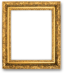

{{DefaultAPISidebar("Canvas API")}} {{PreviousNext("Web/API/Canvas_API/Tutorial/Drawing_text", "Web/API/Canvas_API/Tutorial/Transformations" )}}

Until now we have created our own [shapes](/en-US/docs/Web/API/Canvas_API/Tutorial/Drawing_shapes) and [applied styles](/en-US/docs/Web/API/Canvas_API/Tutorial/Applying_styles_and_colors) to them. One of the more exciting features of {{HTMLElement("canvas")}} is the ability to use images. These can be used to do dynamic photo compositing or as backdrops of graphs, for sprites in games, and so forth. External images can be used in any format supported by the browser, such as PNG, GIF, or JPEG. You can even use the image produced by other canvas elements on the same page as the source!

Importing images into a canvas is basically a two step process:

1. Get a reference to an {{domxref("HTMLImageElement")}} object or to another canvas element as a source. It is also possible to use images by providing a URL.
2. Draw the image on the canvas using the `drawImage()` function.

Let's take a look at how to do this.

## Getting images to draw

The canvas API is able to use any of the following data types as an image source:

- {{domxref("HTMLImageElement")}}
  - : These are images created using the `Image()` constructor, as well as any {{HTMLElement("img")}} element.
- {{domxref("SVGImageElement")}}
  - : These are images embedded using the {{SVGElement("image")}} element.
- {{domxref("HTMLVideoElement")}}
  - : Using an HTML {{HTMLElement("video")}} element as your image source grabs the current frame from the video and uses it as an image.
- {{domxref("HTMLCanvasElement")}}
  - : You can use another {{HTMLElement("canvas")}} element as your image source.
- {{domxref("ImageBitmap")}}
  - : A bitmap image, eventually cropped. Such type are used to extract part of an image, a _sprite_, from a larger image
- {{domxref("OffscreenCanvas")}}
  - : A special kind of `<canvas>` that is not displayed and is prepared without being displayed. Using such an image source allows to switch to it without the composition of the content to be visible to the user.
- {{domxref("VideoFrame")}}
  - : An image representing one single frame of a video.

There are several ways to get images for use on a canvas.

### Using images from the same page

We can obtain a reference to images on the same page as the canvas by using one of:

- The {{domxref("document.images")}} collection
- The {{domxref("document.getElementsByTagName()")}} method
- If you know the ID of the specific image you wish to use, you can use {{domxref("document.getElementById()")}} to retrieve that specific image

### Using images from other domains

Using the [`crossorigin`](/en-US/docs/Web/HTML/Element/img#crossorigin) attribute of an {{HTMLElement("img")}} element (reflected by the {{domxref("HTMLImageElement.crossOrigin")}} property), you can request permission to load an image from another domain for use in your call to `drawImage()`. If the hosting domain permits cross-domain access to the image, the image can be used in your canvas without tainting it; otherwise using the image will [taint the canvas](/en-US/docs/Web/HTML/CORS_enabled_image#security_and_tainted_canvases).

### Using other canvas elements

Just as with normal images, we access other canvas elements using either the {{domxref("document.getElementsByTagName()")}} or {{domxref("document.getElementById()")}} method. Be sure you've drawn something to the source canvas before using it in your target canvas.

One of the more practical uses of this would be to use a second canvas element as a thumbnail view of the other larger canvas.

### Creating images from scratch

Another option is to create new {{domxref("HTMLImageElement")}} objects in our script. To do this, we have the convenience of an `Image()` constructor:

```js
const img = new Image(); // Create new img element
img.src = "myImage.png"; // Set source path
```

When this script gets executed, the image starts loading, but if you try to call `drawImage()` before the image has finished loading, it won't do anything.
Older browsers may even throw an exception, so you need to be sure to use the [load event](/en-US/docs/Web/API/HTMLElement/load_event) so you don't draw the image to the canvas before it's ready:

```js
const ctx = document.getElementById("canvas").getContext("2d");
const img = new Image();

img.addEventListener("load", () => {
  ctx.drawImage(img, 0, 0);
});

img.src = "myImage.png";
```

If you're using one external image, this can be a good approach, but once you want to use many images or [lazy-load resources](/en-US/docs/Web/Performance/Lazy_loading), you probably need to wait for all the files to be available before drawing to the canvas.
The examples below that deal with multiple images use an async function and [Promise.all](/en-US/docs/Web/JavaScript/Reference/Global_Objects/Promise/all) to wait for all images to load before calling `drawImage()`:

```js
async function draw() {
  // Wait for all images to be loaded:
  await Promise.all(
    Array.from(document.images).map(
      (image) =>
        new Promise((resolve) => image.addEventListener("load", resolve)),
    ),
  );

  const ctx = document.getElementById("canvas").getContext("2d");
  // call drawImage() as usual
}
draw();
```

### Embedding an image via data: URL

Another possible way to include images is via the [data: URL](/en-US/docs/Web/HTTP/Basics_of_HTTP/Data_URLs). Data URLs allow you to completely define an image as a Base64 encoded string of characters directly in your code.

```js
const img = new Image(); // Create new img element
img.src =
  "data:image/gif;base64,R0lGODlhCwALAIAAAAAA3pn/ZiH5BAEAAAEALAAAAAALAAsAAAIUhA+hkcuO4lmNVindo7qyrIXiGBYAOw==";
```

One advantage of data URLs is that the resulting image is available immediately without another round trip to the server. Another potential advantage is that it is also possible to encapsulate in one file all of your [CSS](/en-US/docs/Web/CSS), [JavaScript](/en-US/docs/Web/JavaScript), [HTML](/en-US/docs/Web/HTML), and images, making it more portable to other locations.

Some disadvantages of this method are that your image is not cached, and for larger images the encoded URL can become quite long.

### Using frames from a video

You can also use frames from a video being presented by a {{HTMLElement("video")}} element (even if the video is not visible). For example, if you have a {{HTMLElement("video")}} element with the ID "myVideo", you can do this:

```js
function getMyVideo() {
  const canvas = document.getElementById("canvas");
  if (canvas.getContext) {
    const ctx = canvas.getContext("2d");
    return document.getElementById("myVideo");
  }
}
```

This returns the {{domxref("HTMLVideoElement")}} object for the video, which, as covered earlier, can be used as an image source for the canvas.

## Drawing images

Once we have a reference to our source image object we can use the `drawImage()` method to render it to the canvas. As we will see later the `drawImage()` method is overloaded and has several variants. In its most basic form it looks like this:

- {{domxref("CanvasRenderingContext2D.drawImage", "drawImage(image, x, y)")}}
  - : Draws the image specified by the `image` parameter at the coordinates (`x`, `y`).

> **Note:** SVG images must specify a width and height in the root \<svg> element.

### Example: A small line graph

In the following example, we will use an external image as the backdrop for a small line graph. Using backdrops can make your script considerably smaller because we can avoid the need for code to generate the background. In this example, we're only using one image, so I use the image object's `load` event handler to execute the drawing statements. The `drawImage()` method places the backdrop at the coordinate (0, 0), which is the top-left corner of the canvas.

```html hidden
<html lang="en">
  <body>
    <canvas id="canvas" width="180" height="150"></canvas>
  </body>
</html>
```

```js
function draw() {
  const ctx = document.getElementById("canvas").getContext("2d");
  const img = new Image();
  img.onload = () => {
    ctx.drawImage(img, 0, 0);
    ctx.beginPath();
    ctx.moveTo(30, 96);
    ctx.lineTo(70, 66);
    ctx.lineTo(103, 76);
    ctx.lineTo(170, 15);
    ctx.stroke();
  };
  img.src = "backdrop.png";
}

draw();
```

The resulting graph looks like this:

{{EmbedLiveSample("Example_A_simple_line_graph", "", "160")}}

## Scaling

The second variant of the `drawImage()` method adds two new parameters and lets us place scaled images on the canvas.

- {{domxref("CanvasRenderingContext2D.drawImage", "drawImage(image, x, y, width, height)")}}
  - : This adds the `width` and `height` parameters, which indicate the size to which to scale the image when drawing it onto the canvas.

### Example: Tiling an image

In this example, we'll use an image as a wallpaper and repeat it several times on the canvas. This is done by looping and placing the scaled images at different positions. In the code below, the first `for` loop iterates over the rows. The second `for` loop iterates over the columns. The image is scaled to one third of its original size, which is 50x38 pixels.

> **Note:** Images can become blurry when scaling up or grainy if they're scaled down too much. Scaling is probably best not done if you've got some text in it which needs to remain legible.

```html hidden
<html lang="en">
  <body>
    <canvas id="canvas" width="150" height="150"></canvas>
  </body>
</html>
```

```js
function draw() {
  const ctx = document.getElementById("canvas").getContext("2d");
  const img = new Image();
  img.onload = () => {
    for (let i = 0; i < 4; i++) {
      for (let j = 0; j < 3; j++) {
        ctx.drawImage(img, j * 50, i * 38, 50, 38);
      }
    }
  };
  img.src = "rhino.jpg";
}

draw();
```

The resulting canvas looks like this:

{{EmbedLiveSample("Example_Tiling_an_image", "", "160")}}

## Slicing

The third and last variant of the `drawImage()` method has eight parameters in addition to the image source. It lets us cut out a section of the source image, then scale and draw it on our canvas.

- {{domxref("CanvasRenderingContext2D.drawImage", "drawImage(image, sx, sy, sWidth, sHeight, dx, dy, dWidth, dHeight)")}}
  - : Given an `image`, this function takes the area of the source image specified by the rectangle whose top-left corner is (`sx`, `sy`) and whose width and height are `sWidth` and `sHeight` and draws it into the canvas, placing it on the canvas at (`dx`, `dy`) and scaling it to the size specified by `dWidth` and `dHeight`, maintaining its {{glossary("aspect ratio")}}.

To really understand what this does, it may help to look at this image:


The first four parameters define the location and size of the slice on the source image. The last four parameters define the rectangle into which to draw the image on the destination canvas.

Slicing can be a useful tool when you want to make compositions. You could have all elements in a single image file and use this method to composite a complete drawing. For instance, if you want to make a chart you could have a PNG image containing all the necessary text in a single file and depending on your data could change the scale of your chart fairly easily. Another advantage is that you don't need to load every image individually, which can improve load performance.

### Example: Framing an image

In this example, we'll use the same rhino as in the previous example, but we'll slice out its head and composite it into a picture frame. The picture frame image is a 24-bit PNG which includes a drop shadow. Because 24-bit PNG images include a full 8-bit alpha channel, unlike GIF and 8-bit PNG images, it can be placed onto any background without worrying about a matte color.

```html
<canvas id="canvas" width="150" height="150"></canvas>
<div style="display: none;">
  
  
</div>
```

```js
async function draw() {
  // Wait for all images to be loaded.
  await Promise.all(
    Array.from(document.images).map(
      (image) =>
        new Promise((resolve) => image.addEventListener("load", resolve)),
    ),
  );

  const canvas = document.getElementById("canvas");
  const ctx = canvas.getContext("2d");

  // Draw slice
  ctx.drawImage(
    document.getElementById("source"),
    33,
    71,
    104,
    124,
    21,
    20,
    87,
    104,
  );

  // Draw frame
  ctx.drawImage(document.getElementById("frame"), 0, 0);
}

draw();
```

We took a different approach to loading the images this time. Instead of loading them by creating new {{domxref("HTMLImageElement")}} objects, we included them as {{HTMLElement("img")}} tags in our HTML source and retrieved the images from those when drawing to the canvas. The images are hidden from page by setting the CSS property {{cssxref("display")}} to `none` for those images.

{{EmbedLiveSample("example_framing_an_image", "", "160")}}

Each {{HTMLElement("img")}} is assigned an ID attribute, so we have one for a `source` and one for the `frame`, which makes them easy to select using {{domxref("document.getElementById()")}}.
We're using [Promise.all](/en-US/docs/Web/JavaScript/Reference/Global_Objects/Promise/all) to wait for all images to load before calling `drawImage()`.
`drawImage()` slices the rhino out of the first image and scales it onto the canvas.
Lastly, we draw the picture frame using a second `drawImage()` call.

## Art gallery example

In the final example of this chapter, we'll build a little art gallery. The gallery consists of a table containing several images. When the page is loaded, a {{HTMLElement("canvas")}} element is inserted for each image and a frame is drawn around it.

In this case, every image has a fixed width and height, as does the frame that's drawn around them. You could enhance the script so that it uses the image's width and height to make the frame fit perfectly around it.

In the code below, we're using [Promise.all](/en-US/docs/Web/JavaScript/Reference/Global_Objects/Promise/all) to wait for all images to load before drawing any images to the canvas.
We loop through the {{domxref("document.images")}} container and add new canvas elements for each one. One other thing to note is the use of the {{domxref("Node.insertBefore")}} method. `insertBefore()` is a method of the parent node (a table cell) of the element (the image) before which we want to insert our new node (the canvas element).

```html
<table>
  <tr>
    <td></td>
    <td></td>
    <td></td>
    <td></td>
  </tr>
  <tr>
    <td></td>
    <td></td>
    <td></td>
    <td></td>
  </tr>
</table>

```

And here's some CSS to make things look nice:

```css
body {
  background: 0 -100px repeat-x url(bg_gallery.png) #4f191a;
  margin: 10px;
}

img {
  display: none;
}

table {
  margin: 0 auto;
}

td {
  padding: 15px;
}
```

Tying it all together is the JavaScript to draw our framed images:

```js
async function draw() {
  // Wait for all images to be loaded.
  await Promise.all(
    Array.from(document.images).map(
      (image) =>
        new Promise((resolve) => image.addEventListener("load", resolve)),
    ),
  );

  // Loop through all images.
  for (const image of document.images) {
    // Don't add a canvas for the frame image
    if (image.getAttribute("id") !== "frame") {
      // Create canvas element
      const canvas = document.createElement("canvas");
      canvas.setAttribute("width", 132);
      canvas.setAttribute("height", 150);

      // Insert before the image
      image.parentNode.insertBefore(canvas, image);

      ctx = canvas.getContext("2d");

      // Draw image to canvas
      ctx.drawImage(image, 15, 20);

      // Add frame
      ctx.drawImage(document.getElementById("frame"), 0, 0);
    }
  }
}

draw();
```

{{EmbedLiveSample("Art_gallery_example", 725, 400)}}

## Controlling image scaling behavior

As mentioned previously, scaling images can result in fuzzy or blocky artifacts due to the scaling process. You can use the drawing context's {{domxref("CanvasRenderingContext2D.imageSmoothingEnabled", "imageSmoothingEnabled")}} property to control the use of image smoothing algorithms when scaling images within your context. By default, this is `true`, meaning images will be smoothed when scaled.

{{PreviousNext("Web/API/Canvas_API/Tutorial/Drawing_text", "Web/API/Canvas_API/Tutorial/Transformations")}}
