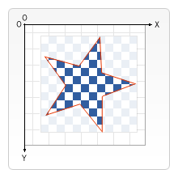

{{APIRef}}

The
**`CanvasRenderingContext2D.clip()`**
method of the Canvas 2D API turns the current or given path into the current clipping
region. The previous clipping region, if any, is intersected with the current or given
path to create the new clipping region.

In the image below, the red outline represents a clipping region shaped like a star.
Only those parts of the checkerboard pattern that are within the clipping region get
drawn.



> **Note:** Be aware that the clipping region is only constructed from
> shapes added to the path. It doesn't work with shape primitives drawn directly to the
> canvas, such as {{domxref("CanvasRenderingContext2D.fillRect()","fillRect()")}}.
> Instead, you'd have to use {{domxref("CanvasRenderingContext2D.rect()","rect()")}} to
> add a rectangular shape to the path before calling `clip()`.

## Syntax

```js
clip()
clip(path)
clip(fillRule)
clip(path, fillRule)
```

### Parameters

- `fillRule`

  - : The algorithm by which to determine if a point is inside or outside the clipping
    region. Possible values:

    - `nonzero`
      - : The [non-zero winding rule](https://en.wikipedia.org/wiki/Nonzero-rule).
      Default rule.
    - `evenodd`
      - : The [even-odd winding rule](https://en.wikipedia.org/wiki/Even%E2%80%93odd_rule).

- `path`
  - : A {{domxref("Path2D")}} path to use as the clipping region.

### Return value

None ({{jsxref("undefined")}}).

## Examples

### A simple clipping region

This example uses the `clip()` method to create a clipping region according
to the shape of a circular arc. Two rectangles are then drawn; only those parts within
the clipping region are rendered.

#### HTML

```html
<canvas id="canvas"></canvas>
```

#### JavaScript

The clipping region is a full circle, with its center at (100, 75), and a radius of 50.

```js
const canvas = document.getElementById('canvas');
const ctx = canvas.getContext('2d');

// Create circular clipping region
ctx.beginPath();
ctx.arc(100, 75, 50, 0, Math.PI * 2);
ctx.clip();

// Draw stuff that gets clipped
ctx.fillStyle = 'blue';
ctx.fillRect(0, 0, canvas.width, canvas.height);
ctx.fillStyle = 'orange';
ctx.fillRect(0, 0, 100, 100);
```

#### Result

{{ EmbedLiveSample('A_simple_clipping_region', 700, 180) }}

### Specifying a path and a fillRule

This example saves two rectangles to a Path2D object, which is then made the current
clipping region using the `clip()` method. The `"evenodd"` rule
creates a hole where the clipping rectangles intersect; by default (with the
`"nonzero"` rule), there would be no hole.

#### HTML

```html
<canvas id="canvas"></canvas>
```

#### JavaScript

```js
const canvas = document.getElementById('canvas');
const ctx = canvas.getContext('2d');

// Create clipping path
let region = new Path2D();
region.rect(80, 10, 20, 130);
region.rect(40, 50, 100, 50);
ctx.clip(region, "evenodd");

// Draw stuff that gets clipped
ctx.fillStyle = 'blue';
ctx.fillRect(0, 0, canvas.width, canvas.height);
```

#### Result

{{ EmbedLiveSample('Specifying_a_path_and_a_fillRule', 700, 180) }}

### Creating a complex clipping region

This example uses two paths, a rectangle and a square to create a complex clipping
region. The `clip()` method is called twice, first to set the current
clipping region to the circle using a `Path2D` object, then again to
intersect the circle clipping region with a square. The final clipping region is a shape
representing the intersection of the circle and the square.

#### HTML

```html
<canvas id="canvas"></canvas>
```

#### JavaScript

```js
const canvas = document.getElementById('canvas');
const ctx = canvas.getContext('2d');

// Create two clipping paths
let circlePath = new Path2D();
circlePath.arc(150, 75, 75, 0, 2 * Math.PI);
let squarePath = new Path2D();
squarePath.rect(85, 10, 130, 130);

// Set the clip to the circle
ctx.clip(circlePath);
// Set the clip to be the intersection of the circle and the square
ctx.clip(squarePath);

// Draw stuff that gets clipped
ctx.fillStyle = 'blue';
ctx.fillRect(0, 0, canvas.width, canvas.height);
```

#### Result

{{ EmbedLiveSample('Creating_a_complex_clipping_region', 300, 150) }}

## Specifications

{{Specifications}}

## Browser compatibility

{{Compat}}

## See also

- The interface defining this method: {{domxref("CanvasRenderingContext2D")}}
