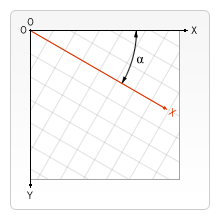

{{APIRef}}

The
**`CanvasRenderingContext2D.rotate()`**
method of the Canvas 2D API adds a rotation to the transformation matrix.

## Syntax

```js
rotate(angle)
```



### Parameters

- `angle`
  - : The rotation angle, clockwise in radians. You can use
    `degree * Math.PI / 180` to calculate a radian from a degree.

The rotation center point is always the canvas origin. To change the center point, you
will need to move the canvas by using the
{{domxref("CanvasRenderingContext2D.translate", "translate()")}} method.

### Return value

None ({{jsxref("undefined")}}).

## Examples

### Rotating a shape

This example rotates a rectangle by 45°. Note that the center of rotation is the
top-left corner of the canvas, and not a location relative to any shape.

#### HTML

```html
<canvas id="canvas"></canvas>
```

#### JavaScript

```js
const canvas = document.getElementById('canvas');
const ctx = canvas.getContext('2d');

// Point of transform origin
ctx.arc(0, 0, 5, 0, 2 * Math.PI);
ctx.fillStyle = 'blue';
ctx.fill();

// Non-rotated rectangle
ctx.fillStyle = 'gray';
ctx.fillRect(100, 0, 80, 20);

// Rotated rectangle
ctx.rotate(45 * Math.PI / 180);
ctx.fillStyle = 'red';
ctx.fillRect(100, 0, 80, 20);

// Reset transformation matrix to the identity matrix
ctx.setTransform(1, 0, 0, 1, 0, 0);
```

#### Result

The center of rotation is blue. The non-rotated rectangle is gray, and the rotated rectangle is red.

{{ EmbedLiveSample('Rotating_a_shape', 700, 180) }}

### Rotating a shape around its center

This example rotates a shape around its center point. To do this, the following steps
are applied to the matrix:

1. First, {{domxref("CanvasRenderingContext2D.translate()", "translate()")}} moves the
    matrix's origin to the shape's center.
2. `rotate()` rotates the matrix by the desired amount.
3. Finally, `translate()` moves the matrix's origin back to its starting
    point. This is done by applying the values of the shape's center coordinates in a
    negative direction.

#### HTML

```html
<canvas id="canvas"></canvas>
```

#### JavaScript

The shape is a rectangle with its corner at (80, 60), a width of 140, a height of 30.
Its horizontal center is at (80 + 140 / 2), or 150. Its vertical center is at (60 + 30 /
2\), or 75. Thus, the center point is at (150, 75).

```js
const canvas = document.getElementById('canvas');
const ctx = canvas.getContext('2d');

// Non-rotated rectangle
ctx.fillStyle = 'gray';
ctx.fillRect(80, 60, 140, 30);

// Matrix transformation
ctx.translate(150, 75);
ctx.rotate(Math.PI / 2);
ctx.translate(-150, -75);

// Rotated rectangle
ctx.fillStyle = 'red';
ctx.fillRect(80, 60, 140, 30);
```

#### Result

The non-rotated rectangle is gray, and the rotated rectangle is red.

{{ EmbedLiveSample('Rotating_a_shape_around_its_center', 700, 180) }}

## Specifications

{{Specifications}}

## Browser compatibility

{{Compat}}

## See also

- The interface defining this method: {{domxref("CanvasRenderingContext2D")}}
