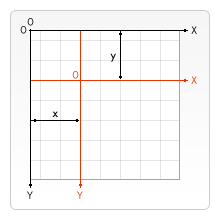

{{APIRef}}

The
**`CanvasRenderingContext2D.translate()`**
method of the Canvas 2D API adds a translation transformation to the current matrix.

## Syntax

```js
translate(x, y)
```

The `translate()` method adds a translation transformation to the current
matrix by moving the canvas and its origin `x` units horizontally and
`y` units vertically on the grid.



### Parameters

- `x`
  - : Distance to move in the horizontal direction. Positive values are to the right, and
    negative to the left.
- `y`
  - : Distance to move in the vertical direction. Positive values are down, and negative
    are up.

### Return value

None ({{jsxref("undefined")}}).

## Examples

### Moving a shape

This example draws a square that is moved from its default position by the
`translate()` method. An unmoved square of the same size is then drawn for
comparison.

#### HTML

```html
<canvas id="canvas"></canvas>
```

#### JavaScript

The `translate()` method translates the context by 110 horizontally and 30
vertically. The first square is shifted by those amounts from its default position.

```js
const canvas = document.getElementById('canvas');
const ctx = canvas.getContext('2d');

// Moved square
ctx.translate(110, 30);
ctx.fillStyle = 'red';
ctx.fillRect(0, 0, 80, 80);

// Reset current transformation matrix to the identity matrix
ctx.setTransform(1, 0, 0, 1, 0, 0);

// Unmoved square
ctx.fillStyle = 'gray';
ctx.fillRect(0, 0, 80, 80);
```

#### Result

The moved square is red, and the unmoved square is gray.

{{ EmbedLiveSample('Moving_a_shape', 700, 180) }}

## Specifications

{{Specifications}}

## Browser compatibility

{{Compat}}

## See also

- The interface defining this method: {{domxref("CanvasRenderingContext2D")}}
