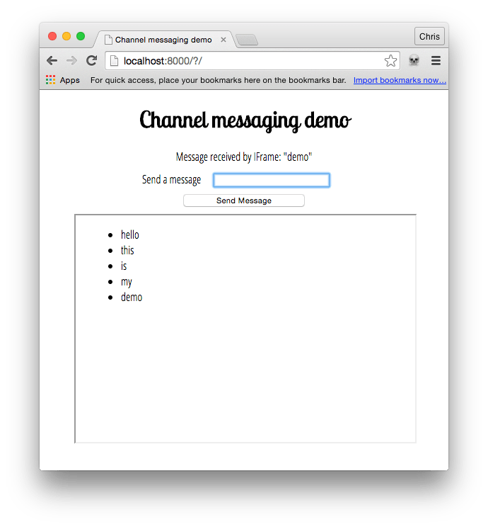

{{DefaultAPISidebar("Channel Messaging API")}}

The [Channel Messaging API](/en-US/docs/Web/API/Channel_Messaging_API) allows two separate scripts running in different browsing contexts attached to the same document (e.g., two {{HTMLElement("iframe")}} elements, the main document and a single {{HTMLElement("iframe")}}, or two documents via a {{domxref("SharedWorker")}}) to communicate directly, passing messages between each other through two-way channels (or pipes) with a port at each end.

In this article we'll explore the basics of using this technology.

{{AvailableInWorkers}}

## Use cases

Channel messaging is mainly useful in cases where you've got a social site that embeds capabilities from other sites into its main interface via iframes, such as games, address books or an audio player with personalized music choices. When these act as standalone units, things are OK, but the difficulty comes when you want interaction between the main site and the {{HTMLElement("iframe")}} elements, or between different {{HTMLElement("iframe")}} elements. For example, what if you wanted to add a contact to the address book from the main site, add high scores from your game to your main profile, or add new background music choices from the audio player to the game? Such things are not so easy using conventional web technology, because of the security models the web uses. You have to think about whether the origins trust each other, and how the messages are passed.

Message channels on the other hand can provide a secure channel that allows you to pass data between different browsing contexts.

> **Note:** For more information and ideas, the [Ports as the basis of an object-capability model on the Web](https://html.spec.whatwg.org/multipage/comms.html#ports-as-the-basis-of-an-object-capability-model-on-the-web) section of the spec is a useful read.

## Simple examples

To get you started, we have published a couple of demos on GitHub. First, check our [channel messaging basic demo](https://github.com/mdn/dom-examples/tree/main/channel-messaging-basic) ([run it live too](https://mdn.github.io/dom-examples/channel-messaging-basic/)), which shows a really simple single message transfer between a page and an embedded {{htmlelement("iframe")}}.

Second, have a look at our [multimessaging demo](https://github.com/mdn/dom-examples/tree/main/channel-messaging-multimessage) ([run this live](https://mdn.github.io/dom-examples/channel-messaging-multimessage/)), which shows a slightly more complex setup that can send multiple messages between the main page and an IFrame.

We'll be focusing on the latter example in this article, which looks like:



## Creating the channel

In the main page of the demo, we have a simple form with a text input for entering messages to be sent to an {{htmlelement("iframe")}}. We also have a paragraph which we will use later on to display confirmation messages that we will receive back from the {{htmlelement("iframe")}}.

```js
const input = document.getElementById("message-input");
const output = document.getElementById("message-output");
const button = document.querySelector("button");
const iframe = document.querySelector("iframe");

const channel = new MessageChannel();
const port1 = channel.port1;

// Wait for the iframe to load
iframe.addEventListener("load", onLoad);

function onLoad() {
  // Listen for button clicks
  button.addEventListener("click", onClick);

  // Listen for messages on port1
  port1.onmessage = onMessage;

  // Transfer port2 to the iframe
  iframe.contentWindow.postMessage("init", "*", [channel.port2]);
}

// Post a message on port1 when the button is clicked
function onClick(e) {
  e.preventDefault();
  port1.postMessage(input.value);
}

// Handle messages received on port1
function onMessage(e) {
  output.innerHTML = e.data;
  input.value = "";
}
```

We start off by creating a new message channel by using the {{domxref("MessageChannel.MessageChannel","MessageChannel()")}} constructor.

When the IFrame has loaded, we register an `onclick` handler for our button and an `onmessage` handler for {{domxref("MessageChannel.port1")}}. Finally we transfer {{domxref("MessageChannel.port2")}} to the IFrame using the {{domxref("window.postMessage")}} method.

Let's explore how the `iframe.contentWindow.postMessage` line works in more detail. It takes three arguments:

1. The message being sent. For this initial port transferring this message could be an empty string but in this example it is set to `'init'`.
2. The origin the message is to be sent to. `*` means "any origin".
3. An object, the ownership of which is transferred to the receiving browsing context. In this case, we are transferring {{domxref("MessageChannel.port2")}} to the IFrame, so it can be used to communicate with the main page.

When our button is clicked, we prevent the form from submitting as normal and then send the value entered in our text input to the IFrame via the {{domxref("MessageChannel")}}.

## Receiving the port and message in the IFrame

In the {{HTMLElement("iframe")}} elements, we have the following JavaScript:

```js
const list = document.querySelector("ul");
let port2;

// Listen for the initial port transfer message
window.addEventListener("message", initPort);

// Setup the transferred port
function initPort(e) {
  port2 = e.ports[0];
  port2.onmessage = onMessage;
}

// Handle messages received on port2
function onMessage(e) {
  const listItem = document.createElement("li");
  listItem.textContent = e.data;
  list.appendChild(listItem);
  port2.postMessage(`Message received by IFrame: "${e.data}"`);
}
```

When the initial message is received from the main page via the {{domxref("window.postMessage")}} method, we run the `initPort` function. This saves the transferred port and registers an `onmessage` handler that will be called each time a message is passed through our {{domxref("MessageChannel")}}.

When a message is received from the main page, we create a list item and insert it in the unordered list, setting the {{domxref("Node.textContent","textContent")}} of the list item equal to the event's `data` attribute (this contains the actual message).

Next, we post a confirmation message back to the main page via the message channel by calling {{domxref("MessagePort.postMessage")}} on {{domxref("MessageChannel.port2")}} that was initially transferred to the iframe.

## Receiving the confirmation in the main page

Returning to the main page, let's now look at the `onmessage` handler function.

```js
// Handle messages received on port1
function onMessage(e) {
  output.innerHTML = e.data;
  input.value = "";
}
```

When a message is received back from the IFrame confirming that the original message was received successfully, this outputs the confirmation to a paragraph and empties the text input ready for the next message to be sent.

## Specifications

{{Specifications}}

## Browser compatibility

{{Compat}}

## See also

- [Channel Messaging API](/en-US/docs/Web/API/Channel_Messaging_API)
- [Web Workers API](/en-US/docs/Web/API/Web_Workers_API)
- [Broadcast Channel API](/en-US/docs/Web/API/Broadcast_Channel_API)
