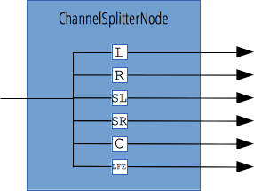

{{APIRef("Web Audio API")}}

The `ChannelSplitterNode` interface, often used in conjunction with its opposite, {{domxref("ChannelMergerNode")}}, separates the different channels of an audio source into a set of mono outputs. This is useful for accessing each channel separately, e.g. for performing channel mixing where gain must be separately controlled on each channel.

If your `ChannelSplitterNode` always has one single input, the amount of outputs is defined by a parameter on its constructor and the call to {{domxref("BaseAudioContext/createChannelSplitter", "AudioContext.createChannelSplitter()")}}. In the case that no value is given, it will default to `6`. If there are fewer channels in the input than there are outputs, supernumerary outputs are silent.

{{InheritanceDiagram}}

<table class="properties">
  <tbody>
    <tr>
      <th scope="row">Number of inputs</th>
      <td><code>1</code></td>
    </tr>
    <tr>
      <th scope="row">Number of outputs</th>
      <td>variable; default to <code>6</code>.</td>
    </tr>
    <tr>
      <th scope="row">Channel count mode</th>
      <td>
        <code>"explicit"</code> Older implementations, as per earlier versions
        of the spec use <code>"max"</code>.
      </td>
    </tr>
    <tr>
      <th scope="row">Channel count</th>
      <td>
        Fixed to the number of outputs. Older implementations, as per earlier
        versions of the spec use <code>2</code> (not used in the default count
        mode).
      </td>
    </tr>
    <tr>
      <th scope="row">Channel interpretation</th>
      <td><code>"discrete"</code></td>
    </tr>
  </tbody>
</table>

## Constructor

- {{domxref("ChannelSplitterNode.ChannelSplitterNode()","ChannelSplitterNode()")}}
  - : Creates a new `ChannelSplitterNode` object instance.

## Instance properties

_No specific property; inherits properties from its parent, {{domxref("AudioNode")}}_.

## Instance methods

_No specific method; inherits methods from its parent, {{domxref("AudioNode")}}_.

## Example

See [`BaseAudioContext.createChannelSplitter()`](/en-US/docs/Web/API/BaseAudioContext/createChannelSplitter#examples) for example code.

## Specifications

{{Specifications}}

## Browser compatibility

{{Compat}}

## See also

- [Using the Web Audio API](/en-US/docs/Web/API/Web_Audio_API/Using_Web_Audio_API)
