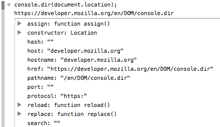

{{APIRef("Console API")}} {{AvailableInWorkers}}

The **`console.dir()`** static method displays a list of the properties of the specified JavaScript object. In browser consoles, the output is presented as a hierarchical listing with disclosure triangles that let you see the contents of child objects.

Unlike other logging methods, `console.dir()` does not attempt to pretty-print the object. For example, if you pass a DOM element to `console.dir()`, it will not be displayed like in the element inspector, but will instead show a list of properties.



In runtimes like {{glossary("Node.js", "Node")}} and {{glossary("Deno")}}, where console output goes to the terminal and is therefore not interactive, the `options` parameter provides a way to customize the way the object is presented.

## Syntax

```js-nolint
console.dir(object)
console.dir(object, options)
```

### Parameters

- `object`
  - : A JavaScript object whose properties should be printed.
- `options` {{optional_inline}}
  - : An object with the following properties, all optional:
    - `colors` {{non-standard_inline}} {{optional_inline}}
      - : A boolean value: if `true`, style the properties of the object according to their type. Defaults to `true`.
    - `depth` {{non-standard_inline}} {{optional_inline}}
      - : A number representing the number of nesting levels to print when an object contains other objects or arrays. The value `null` means: print all levels. Defaults to 2.
    - `showHidden` {{non-standard_inline}} {{optional_inline}}
      - : A boolean value: if `true`, print the object's non-enumerable and symbol properties. Defaults to `false`.

### Return value

None ({{jsxref("undefined")}}).

## Specifications

{{Specifications}}

## Browser compatibility

{{Compat}}

## See also

- [Microsoft Edge's documentation for `console.dir()`](https://learn.microsoft.com/en-us/microsoft-edge/devtools-guide-chromium/console/api#dir)
- [Node.js documentation for `console.dir()`](https://nodejs.org/docs/latest/api/console.html#consoledirobj-options)
- [Google Chrome's documentation for `console.dir()`](https://developer.chrome.com/docs/devtools/console/api/#dir)
