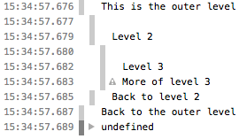

{{APIRef("Console API")}} {{AvailableInWorkers}}

The **`console.group()`** static method creates a new inline group in the [Web console](https://firefox-source-docs.mozilla.org/devtools-user/web_console/index.html) log, causing any subsequent console messages to be indented by an additional level, until {{domxref("console/groupend_static", "console.groupEnd()")}} is called.

## Syntax

```js-nolint
group()
group(label)
```

### Parameters

- `label` {{optional_inline}}
  - : Label for the group.

### Return value

None ({{jsxref("undefined")}}).

## Examples

You can use nested groups to help organize your output by visually associating related messages. To create a new nested block, call `console.group()`. The `console.groupCollapsed()` method is similar, but the new block is collapsed and requires clicking a disclosure button to read it.

To exit the current group, call `console.groupEnd()`. For example, given this code:

```js
console.log("This is the outer level");
console.group();
console.log("Level 2");
console.group();
console.log("Level 3");
console.warn("More of level 3");
console.groupEnd();
console.log("Back to level 2");
console.groupEnd();
console.log("Back to the outer level");
```

The output looks like this:



See [Using groups in the console](/en-US/docs/Web/API/console#using_groups_in_the_console) in the documentation of {{domxref("console")}} for more details.

## Specifications

{{Specifications}}

## Browser compatibility

{{Compat}}

## See also

- {{domxref("console/groupEnd_static", "console.groupEnd()")}}
- {{domxref("console/groupCollapsed_static", "console.groupCollapsed()")}}
- [Microsoft Edge's documentation for `console.group()`](https://learn.microsoft.com/en-us/microsoft-edge/devtools-guide-chromium/console/api#group)
- [Node.JS documentation for `console.group()`](https://nodejs.org/docs/latest/api/console.html#consolegrouplabel)
- [Google Chrome's documentation for `console.group()`](https://developer.chrome.com/docs/devtools/console/api/#group)
