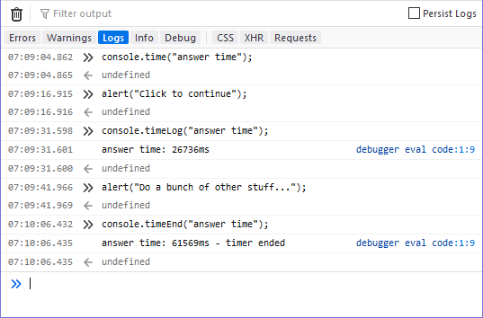

{{APIRef("Console API")}}

The **`console.timeEnd()`** stops a timer that was previously started by calling {{domxref("console.time()")}}.

See [Timers](/en-US/docs/Web/API/console#timers) in the documentation for
details and examples.

{{AvailableInWorkers}}

## Syntax

```js-nolint
timeEnd()
timeEnd(label)
```

### Parameters

- `label` {{optional_inline}}
  - : A `string` representing the name of the timer to stop. Once stopped, the elapsed time is automatically
    displayed in the [Web console](https://firefox-source-docs.mozilla.org/devtools-user/web_console/index.html) along
    with an indicator that the time has ended. If omitted, the label "default" is used.

### Return value

None ({{jsxref("undefined")}}).

## Examples

```js
console.time("answer time");
alert("Click to continue");
console.timeLog("answer time");
alert("Do a bunch of other stuff…");
console.timeEnd("answer time");
```

The output from the example above shows the time taken by the user to dismiss the first
alert box, followed by the cumulative time it took for the user to dismiss both alerts:



Notice that the timer's name is displayed when the timer value is logged using
`timeLog()` and again when it's stopped. In addition, the call to timeEnd()
has the additional information, "timer ended" to make it obvious that the timer is no
longer tracking time.

## Specifications

{{Specifications}}

## Browser compatibility

{{Compat}}
