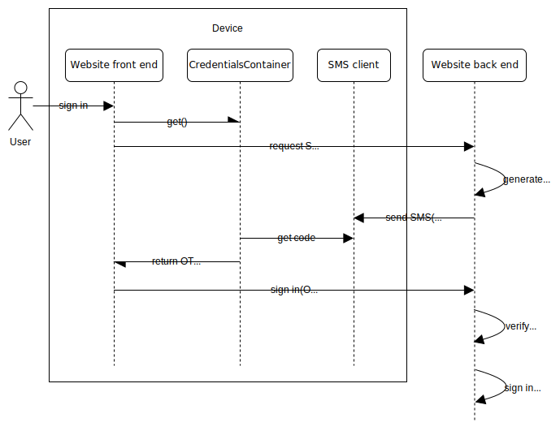

{{DefaultAPISidebar("Credential Management API")}}

The Credential Management API enables a website to create, store, and retrieve the {{glossary("credential", "credentials")}} that allow a user to securely log in. It supports four different types of credentials:

| Type                    | Interface                                                                          |
| ----------------------- | ---------------------------------------------------------------------------------- |
| Password                | {{domxref("PasswordCredential")}}                                                  |
| Federated identity      | {{domxref("IdentityCredential")}}, {{domxref("FederatedCredential")}} (deprecated) |
| One-time password (OTP) | {{domxref("OTPCredential")}}                                                       |
| Web Authentication      | {{domxref("PublicKeyCredential")}}                                                 |

The credential types are all represented as subclasses of the {{domxref("Credential")}} interface:

In this guide we'll introduce the different credential types and explain at a high level how they are used.

> [!NOTE]
> Although we're describing all the credential types together here, the different credential types are defined in several different specifications, which extend the main Credential Management API specification.
>
> - [Credential Management API](https://w3c.github.io/webappsec-credential-management/) defines passwords and legacy federated credentials.
> - [Federated Credential Management API](https://w3c-fedid.github.io/FedCM/) defines the new federated credentials.
> - [WebOTP API](https://wicg.github.io/web-otp/) defines OTP credentials.
> - [Web Authentication API](https://w3c.github.io/webauthn/) defines Web Authentication assertions.

## Passwords

> [!NOTE]
> Most browsers do not support this credential type and it is not widely used on the web. Instead, browsers automatically offer to store passwords in a password manager, and can automatically retrieve stored passwords to autofill [password input elements](/en-US/docs/Web/HTML/Element/input/password).

Modern browsers provide users with a password manager, which enables users to store the passwords they enter on websites, and later retrieve them when they need to log in again. Password managers can help with password security by remembering passwords for users and autofilling them, which allows users to choose stronger passwords.

In the Credential Management API, a password is represented by the {{domxref("PasswordCredential")}} interface. When a user successfully registers for or signs into your site, you can call the {{domxref("PasswordCredential.PasswordCredential()", "PasswordCredential()")}} constructor or {{domxref("CredentialsContainer.create", "navigator.credentials.create()")}} to create a `PasswordCredential` object from the credentials the user entered. You can then pass this into {{domxref("CredentialsContainer.store", "navigator.credentials.store()")}}, and the browser will ask the user if they want to store the password in the password manager.

When a user visits your site, you can call {{domxref("CredentialsContainer.get", "navigator.credentials.get()")}} to retrieve a stored password for your site, and use it to log the user in. Depending on the situation, you can log the user in silently or use the returned password to auto-fill a form field.

## Federated identity credentials

In a {{glossary("federated identity")}} system, a separate entity acts as an intermediary between the user and the website they are trying to sign into. This entity, called an {{glossary("identity provider")}} (IdP), manages the user's credentials, can authenticate users, and is trusted by the website to make assertions about a user's identity.

The user has an account with the IdP: when they need to sign into the website they authenticate with the IdP. The IdP then returns a token to the user's browser, which the browser delivers to the website. The website verifies the token and, if verification succeeds, signs the user in.

Federated identity is often provided as a service by corporations: for example, users who have Google, Microsoft, or Facebook accounts can use them to sign into websites that support them.

The [Federated Credential Management API](/en-US/docs/Web/API/FedCM_API) defines a privacy-preserving mechanism for federated identity on the web. You start by calling {{domxref("CredentialsContainer.get", "navigator.credentials.get()")}} to request a federated identity credential, and this triggers a protocol exchange between the browser and the IdP.

If, in the course of this exchange, the user can be authenticated with the IdP, the browser returns an {{domxref("IdentityCredential")}} object in the fulfillment of the `Promise` returned from `get()`. The website front end code can send this to the server for verification.

Note that {{domxref("CredentialsContainer.create", "create()")}} and {{domxref("CredentialsContainer.store", "store()")}} are not used when working with the Federated Credential Management API.

> [!NOTE]
> Support for federated identity in the Credential Management API was originally provided through the {{domxref("FederatedCredential")}} interface. However, this mechanism depends on technologies such as [third-party cookies](/en-US/docs/Web/Privacy/Third-party_cookies), which are intrinsically privacy-invasive. These technologies were [deprecated in browsers](/en-US/blog/goodbye-third-party-cookies/), therefore a new approach was needed.

## One-time passwords

A one-time password (OTP) is an authentication technique in which the website sends a unique code to the user via a messaging system such as email or SMS. The user must then enter the code on the site to prove their control of the communications endpoint. Websites sometimes use this as a second authentication factor in addition to a password.

The [WebOTP API](/en-US/docs/Web/API/WebOTP_API) defines the {{domxref("OTPCredential")}} interface, which solves a specific usability problem in this exchange: when a user receives the code, they have to open a different application, find the message, then copy the code into a form on the website. This is awkward, especially on a mobile device, and especially when the device receiving the message is the same as the device being used to sign into the site.

In browsers that support the `OTPCredential` type, the website's front end can call {{domxref("CredentialsContainer.get", "navigator.credentials.get()")}}, asking for an OTP credential, then ask the backend to generate a code and send the message containing it (only SMS is supported as a transport). The backend must send a specially formatted SMS message, which the browser can read.

The browser then returns an `OTPCredential` object in the fulfillment of the `Promise` returned from `get()`, and this object contains the code. The website front end can use the code to autofill an input element on the site, or submit the code to the server automatically.

Note that {{domxref("CredentialsContainer.create", "create()")}} and {{domxref("CredentialsContainer.store", "store()")}} are not used when working with OTP credentials.

## Web Authentication assertions

The [Web Authentication API](/en-US/docs/Web/API/Web_Authentication_API) (WebAuthn) enables users to log into websites by asking an _authenticator_ to generate digitally signed assertions about a user's identity.

An authenticator is an entity that is inside or attached to the user's device, and that can perform the cryptographic operations needed to register and authenticate users, and securely store the cryptographic keys used in these operations. An authenticator might be integrated into the device, like the [Touch ID](https://en.wikipedia.org/wiki/Touch_ID) system in Apple devices or the [Windows Hello](https://en.wikipedia.org/wiki/Windows_10#System_security) system, or it might be a removable module like a [YubiKey](https://en.wikipedia.org/wiki/YubiKey).

Instead of passwords, WebAuthn uses {{glossary("public-key cryptography")}} to authenticate users.

To register a user on a website using WebAuthn, call {{domxref("CredentialsContainer.create", "navigator.credentials.create()")}}, providing all the information needed to create a key pair. The authenticator may first ask the user to authenticate themselves, for example using a biometric reader. It will then generate a key pair and return the public key. This key pair is specific to the user and the website. The authenticator may also generate and return a signed _attestation_: this is a statement that the authenticator itself is (for example) a genuine YubiKey.

The website front end sends the public key and attestation to the server, which verifies the attestation and stores the public key with the rest of the new user's account information.

To sign a user into the website, the front end code first fetches a random number from the server, called a _challenge_. Then it calls {{domxref("CredentialsContainer.get", "navigator.credentials.get()")}}, passing in the challenge and some other options. The authenticator may, again, first ask the user to authenticate themselves, and will then sign the challenge using the private key.

The browser then returns a `PublicKeyCredential` object in the fulfillment of the `Promise` returned from `get()`, and this object contains the signed challenge, which is called an _assertion_. The website front end then sends the assertion to the server, which checks the signature using the stored public key, and decides whether to log the user in.

Note that {{domxref("CredentialsContainer.store", "store()")}} is not used when working with WebAuthn: the key pair is created in the authenticator and the private key never leaves it.

## See also

- [Web Authentication API](/en-US/docs/Web/API/Web_Authentication_API)
- [WebOTP API](/en-US/docs/Web/API/WebOTP_API)
- [Federated Credential Management (FedCM) API](/en-US/docs/Web/API/FedCM_API)
