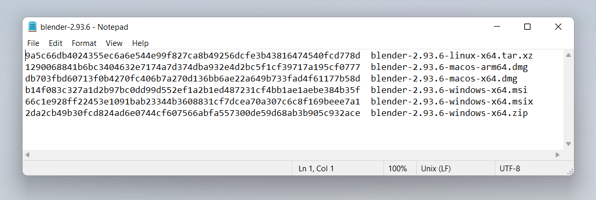

# Non-cryptographic uses of Subtle Crypto

This article will almost entirely focus on uses of the Digest method of the Subtle Crypto API since a lot of the other methods have very specific cryptographic use cases whereas creating hashes of content has lots of very useful purposes.

I'm not going into the Cryptographic uses of the Subtle Crypto API because, and this is the most important thing from this article is **don't use this API** for production cryptographic purposes because it is powerful and low level to use it correctly you will need to take many context specific steps to accomplish Cryptographic tasks correctly if any of those steps is taken incorrectly at best your code won't run at the worse it will run and you will unknowingly be putting your users at risk with an insecure product.

You may not even need to use Crypto at all.  Many of the things you would want to use cryptography for are already solved and part of the Web platform for example if you are worried about man-in-the-middle attacks such as wifi hotspots reading the information between the client and the server this is solved by ensuring correct use of HTTPS. Do you want to securely send information between users? Then you can set up a data connection between users using [WebRTC Data Channels](https://developer.mozilla.org/en-US/docs/Web/API/WebRTC_API/Using_data_channels) which is encrypted as part of the standard.

The subtle crypto API is provides low level primitives for working with cryptography but implementing a system using these tools is a complicated task where mistakes are hard to notice and the results can mean your user's data is not as secure as you think it is. Which could have catastrophic results if your users are sharing sensitive or valuable data.

If in doubt don't try doing it yourself hire someone with experience and ensure your software is audited by a security expert.

<h2 id="hashing-a-file">Hashing a file</h2>

This is the simplest useful thing you can do with the Subtle Crypto API it doesn't involve generating keys or Certificates and has only a single step.

Hashing is a technique where you convert a large string of bytes into a smaller string where small changes to the long string result in large changes in the smaller string. This technique is useful for identifying two identical files without checking every byte of both files. Which is very useful for having a simple string to compare. To be clear Hashing is a **one way** operation. You cannot generate the original string of bytes from the hash.

If two generated hashes are the same but the files that used to generate them are different that is known as a *hash collision* which is an extremely improbable thing to occur by accident and, for a secure hash function like SHA256, almost impossible to manufacture.

So if the 2 strings are the same you can be reasonably sure the two original files are identical.

As of publication SHA256 is the usual choice for hashing files but there are higher order hashing functions available in the subtle crypto API. The most common representation you will see a SHA256 hash given is a string of 64 hexadecimal digits. Hexadecimal means it only uses the characters 0-9 and a-f, representing 4 bits of information. So in short a SHA256 hash turns any length of data into an almost unique 256 bits of data.

This technique is often used by sites that let you download executables to ensure that the downloaded file matches the one the author intended to ensure that your users are not installing malware. The most common way to do this is:

1. Note Down the file's name and the SHA256 checksum provided by the Website
2. Download the executable
3. Run `sha256sum /path/to/the/file` to generate your own code
4. compare the two strings they should match unless the file has been compromised



The [digest()](https://developer.mozilla.org/en-US/docs/Web/API/SubtleCrypto/digest) method of Subtle Crypto is useful for this. To generate a checksum of a file you can do it like so:

First we add some HTML elements for loading some files and displaying the SHA-256 Output:

```html
<label>Choose file(s) to hash <input type="file" id="file" name="file" multiple></label>
<output></output>
```

Next we use the SubtleCrypto API to process them this works by:

- Reading the files to an ArrayBuffer using a FileReader
- Use `crypto.subtle.digest('SHA-256', arrayBuffer)` to digest the ArrayBuffer
- Convert the resulting hash (another ArrayBuffer) into a string to it can be displayed

```javascript
const output = document.querySelector('output');
const file = document.getElementById('file');
file.addEventListener('change', hashTheseFiles);

async function fileHash(file) {
  const arrayBuffer = await file.arrayBuffer();
	const hashAsArrayBuffer = await crypto.subtle.digest('SHA-256', arrayBuffer);
  const uint8ViewOfHash = new Uint8Array(hashAsArrayBuffer);
  const hashAsString = Array.from(uint8View).map(b => b.toString(16).padStart(2, '0')).join('');
	return hashAsString;
}

async function hashTheseFiles(e) {
  let outHTML = ''
  for (const file of this.files) {
    outHTML += `${file.name}    ${await fileHash(file)}`
  }
  output.innerHTML = outHTML;
}
```

 {{EmbedLiveSample(hashing-a-file)}}

### Where would you use this?

At this point you may be thinking to yourself "*I can use this on my own website so that when users go to download a file we can ensure the hashes match to reassure the user their download is secure*" unfortunately this has two issues that immediate spring to mind:

- Executable downloads should **always** be done over HTTPS to prevent intermediate parties from performing attacks like this so it would be redundant
- If the attacker is able to replace the download file on the original server then they can also simply replace the code which invokes the SubtleCrypto API to bypass it and just state that everything is fine. Probably something sneaky like replacing which can be a pain to spot in your own code:

```javascript
--- if (checksum === correctCheckSum) return true;
+++ if (checksum = correctCheckSum) return true;
```

One place it maybe worth while is if you want to test a file from a 3rd party download source, which you do not control. This could be worthwhile as long as the download location has CORS headers enabled to let you scan the file before you make it available to your users. Unfortunately not many servers have CORS turned on by default.

## What is "Salting the Hash"?

A phrase you may have heard before is *"Salting the hash"* it's not super relevant to our topics at hand but it's a good topic to know about.

**NB:** this section is talking about password security and the hash functions provided by SubtleCrypto are not suitable for this use case, for these purposes you need expensive slow hash functions like *scrypt* and *bcrypt*. SHA is designed to be pretty fast and efficient which makes it unsuitable for password hashing. This section is purely for your interest do not use the Web Crypto API to hash passwords on the client.

Another popular use cases for hashing is passwords, you never ever want to store a users password in plain text it's simply a terrible idea. Instead you store a hash of the user's password. So the original password cannot be recovered should a hacker obtain your username and password database. The eagle eyed amongst you would then notice you can still work out the original passwords for some of these by comparing the hashes from lists of known passwords against the obtained password hash list, concatenating some string to the passwords changes the hash so it no longer matches, this is known as salting. Another tricky problem is that if you use the same salt for each password then passwords with matching hashes will also be the same original password so if you know one then you know all matching passwords.

To solve this issue you perform what is known as salting the hash. For each password you generate a salt as a random string of characters and concatenate it with the password string. You then store the hash and the salt in the same database so you can check a match when the user tries to log in later. This means that if two users use the same password the hashes will be different. This is the reason why you need an expensive cryptographic function so that it makes it too time consuming to use lists of common passwords to find out what the original passwords were.

## Hash Tables with SHA

You can use SHA1 to quickly generate non-cryptographically secure hashes. These are incredibly useful for turning some arbitrary data into a key you can look up later.

For example if you wanted to have a database which included a large blob of data as one of the fields in a row. This decreases the efficiency of your database because one of the fields has to be either variable length or large enough to store the largest possible blob. An alternative solution is to generate a hash of the blob and store it in a separate look up table using the hash as the index. You can then store just the hash in your original database which is a nice fixed length.

The possible variations for a SHA1 hash our incredibly numerous so much so that accidentally producing two blobs with the same SHA1 hash is nearly-impossible. It is possible to intentionally produce two files to with the same SHA1 hash because SHA1 is not cryptographically secure. So a malicious user could in theory generate a blob of data that replaces the original in the database which goes undetected because the hash is the same, which is an attack vector worth being aware of.

Git uses SHA1 hashes and is a great example here, it uses hashes in two interesting ways.

<h2 id="how-git-stores-files">How git stores files</h2>

When files are stored in git they are referenced by their SHA1 hash this makes it quick for git to find the data and restore files.

It doesn't just use the file contents for the hash though it also prepends it with the UTF8 string `"blob "` followed by the file size in bytes written in decimal followed the null character which in JavaScript can be written `"\0"` you can use the TextEncoder API to encode the UTF8 text since strings in JavaScript are UTF16.

The code below like our SHA256 example above can be used to generate these hashes from files. The HTML to upload files remains the same but the we do some additional work to prepend the size information in the same way git does.

```html
<label>Choose file(s) to hash <input type="file" id="file" name="file" multiple></label>
<output></output>
```

Notice how it uses the Text Encoder API to produce the header which is concatenated with the original ArrayBuffer to produce the string to be hashed:

```javascript
async function fileHash(file) {
  const arrayBuffer = await file.arrayBuffer();
  const uint8View = new Uint8Array(arrayBuffer);
  const length = uint8View.length;
  const encoder = new TextEncoder();
  const view = encoder.encode('blob ' + length + '\0');
  const newBlob = new Blob([view.buffer, arrayBuffer], {
      type: 'text/plain'
  });
  return hashToString(await crypto.subtle.digest('SHA-1', await newBlob.arrayBuffer()));
}

function hashToString(arrayBuffer) {
  const uint8View = new Uint8Array(arrayBuffer);
  return Array.from(uint8View).map(b => b.toString(16).padStart(2, '0')).join('');
}

async function hashTheseFiles(e) {
  let outHTML = ''
  for (const file of this.files) {
    outHTML += `${file.name}    ${await fileHash(file)}`
  }
  output.innerHTML = outHTML;
}
```

{{EmbedLiveSample(How git stores files)}}

## How git generates commit hashes

Interestingly git also generates commit hashes in a similar way based upon multiple pieces of information so that you have multiple pieces of information such as the previous commit hash and the commit message which come together to make a new hash which can be used to reference commits which are based on several unique identifiers.

On the terminal the command is: `(printf "commit %s\0" $(git --no-replace-objects cat-file commit HEAD | wc -c); git cat-file commit HEAD) | sha1sum`

Source:

[How is git commit sha1 formed](https://gist.github.com/masak/2415865)

Essentially it's the UTF8 string (null character written as \0):

```
commit [size in bytes as decimal of this info]\0tree [tree hash]
parent [parent commit hash]
author [author info] [timestamp]
committer [commiter info] [timestamp]

commit message
```

This is great because none of the individual fields are guaranteed to be unique but when combined together give a unique pointer to a single commit but the whole string is too long and unwieldly to use. So by hashing it you get a new unique string which is short enough to share conveniently from multiple fields.

This is why the hash changes if you have ever amended your commit even if you don't make any changes to the message, the timestamp of the commit has changed which event if it is a single character is enough to totally change the new hash.

What I want you to take away from this is that when you want to a key to some data but any single piece of information isn't unique enough then concatenating multiple together and hashing them is a great way to generate a useful key.

I hope these examples have encourage you to take a look at this new powerful API. Remember don't try recreating cryptography things yourself but it's enough to know the tools are there and some of them like the `crypto.digest()` function are useful tools for your day to day development.
