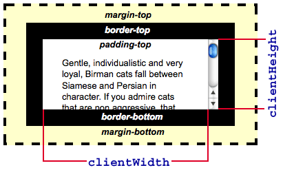

{{DefaultAPISidebar("CSSOM View")}}

There are several properties you can look at in order to determine the width and height of elements, and it can be tricky to determine which is the right one for your needs. This article is designed to help you make that decision. Note that all these properties are read-only. If you want to set the width and height of an element, use {{CSSxRef("width")}} and {{CSSxRef("height")}} or the overriding {{CSSxRef("min-width")}} and {{CSSxRef("max-width")}}, and {{CSSxRef("min-height")}} and {{CSSxRef("max-height")}} properties.

<h2 id="How_much_room_does_it_use_up.3F">How much room does it use up?</h2>

If you need to know the total amount of space an element occupies, including the width of the visible content, scrollbars (if any), padding, and border, you want to use the {{DOMxRef("HTMLElement.offsetWidth")}} and {{DOMxRef("HTMLElement.offsetHeight")}} properties. Most of the time these are the same as width and height of {{DOMxRef("Element.getBoundingClientRect()")}}, when there aren't any transforms applied to the element. In case of transforms, the <code>offsetWidth</code> and <code>offsetHeight</code> returns the element's layout width and height, while <code>getBoundingClientRect()</code> returns the rendering width and height. As an example, if the element has <code>width: 100px;</code> and <code>transform: scale(0.5);</code> the <code>getBoundingClientRect()</code> will return 50 as the width, while <code>offsetWidth</code> will return 100.

<h2 id="What.27s_the_size_of_the_displayed_content.3F">What's the size of the displayed content?</h2>

If you need to know how much space the actual displayed content takes up, including padding but not including the border, margins, or scrollbars, you want to use the {{DOMxRef("Element.clientWidth")}} and {{DOMxRef("Element.clientHeight")}} properties:

<h2 id="How_big_is_the_content.3F">How big is the content?</h2>

If you need to know the actual size of the content, regardless of how much of it is currently visible, you need to use the {{DOMxRef("Element.scrollWidth")}} and {{DOMxRef("Element.scrollHeight")}} properties. These return the width and height of the entire content of an element, even if only part of it is presently visible due to the use of scroll bars.

For example, if a 600x400 pixel element is being displayed inside a 300x300 pixel scrollbox, <code>scrollWidth</code> will return 600 while <code>scrollHeight</code> will return 400.

<h2 id="See_also">See also</h2>

<ul>
 <li><a href="https://www.w3.org/TR/cssom-view-1/">https://www.w3.org/TR/cssom-view-1/</a></li>
 <li><a href="https://docs.microsoft.com/en-us/previous-versions/hh781509(v=vs.85)">MSDN: Measuring Element Dimension and Location</a></li>
</ul>
