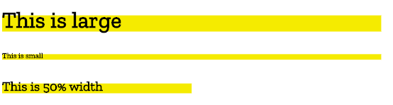
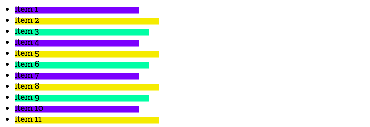
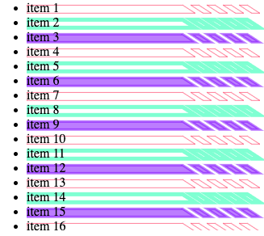

{{DefaultAPISidebar("CSS Painting API")}}
The [CSS Paint API](/en-US/docs/Web/API/CSS_Painting_API) is designed to enable developers to programmatically define images which can then be used anywhere a CSS image can be invoked, such as CSS [`background-image`](/en-US/docs/Web/CSS/background-image), [`border-image`](/en-US/docs/Web/CSS/border-image-source), [`mask-image`](/en-US/docs/Web/CSS/mask-image), etc.

To programmatically create an image used by a CSS stylesheet we need to work through a few steps:

1. Define a paint worklet using the [`registerPaint()`](/en-US/docs/Web/API/PaintWorkletGlobalScope/registerPaint) function
2. Register the worklet
3. Include the `{{cssxref("image/paint","paint()")}}` CSS function

To elaborate over these steps, we're going to start by creating a half-highlight background, like on this header:


> **Note:** The complete source for all the examples in this article can be found at [https://github.com/mdn/dom-examples/tree/main/css-painting](https://github.com/mdn/dom-examples/tree/main/css-painting), and the examples are running live at [https://mdn.github.io/dom-examples/css-painting/](https://mdn.github.io/dom-examples/css-painting/).

## CSS paint worklet

In an external script file, we employ the [`registerPaint()`](/en-US/docs/Web/API/PaintWorkletGlobalScope/registerPaint) function to name our [CSS Paint worklet](/en-US/docs/Web/API/Worklet). It takes two parameters. The first is the name we give the worklet — this is the name we will use in our CSS as the parameter of the `paint()` function when we want to apply this styling to an element. The second parameter is the class that does all the magic, defining the context options and what to paint to the two-dimensional canvas that will be our image.

```js
registerPaint(
  "headerHighlight",
  class {
    /*
       define if alphatransparency is allowed alpha
       is set to true by default. If set to false, all
       colors used on the canvas will be fully opaque
    */
    static get contextOptions() {
      return { alpha: true };
    }

    /*
        ctx is the 2D drawing context
        a subset of the HTML Canvas API.
    */
    paint(ctx) {
      ctx.fillStyle = "hsl(55 90% 60% / 1.0)";
      ctx.fillRect(0, 15, 200, 20); /* order: x, y, w, h */
    }
  },
);
```

In this class example we have defined a single context option with the `contextOptions()` function: we returned a simple object stating alpha transparency is allowed.

We have then used the `paint()` function to paint to our canvas.

A `paint()` function can take three arguments. Here we have provided one argument: the rendering context (we'll look at more in due course), often referred to by the variable name `ctx`. The 2D Rendering Context is a subset of the [HTML Canvas API](/en-US/docs/Web/API/Canvas_API); the version available to Houdini (called the `PaintRenderingContext2D`) is a further subset containing most of the features available in the full Canvas API with the [exception](https://drafts.css-houdini.org/css-paint-api-1/#2d-rendering-context) of the `CanvasImageData`, `CanvasUserInterface`, `CanvasText`, and `CanvasTextDrawingStyles` APIs.

We define the [`fillStyle`](/en-US/docs/Web/API/CanvasRenderingContext2D/fillStyle) as being `hsl(55 90% 60% / 1.0)`, which is a shade of yellow, and then call `fillRect()` to create a rectangle of that color. The [`fillRect()`](/en-US/docs/Web/API/CanvasRenderingContext2D/fillRect) parameters are, in order, x-axis origin, y-axis origin, width, and height. `fillRect(0, 15, 200, 20)` results in the creation of a rectangle that is 200 units wide by 20 units tall, positioned 0 units from the left and 15 units from the top of the content box.

We can use the CSS [`background-size`](/en-US/docs/Web/CSS/background-size) and [`background-position`](/en-US/docs/Web/CSS/background-position) properties to re-size or relocate this background image, but this is the default size and placement of the yellow box we created in our paint worklet.

We tried to keep the example simple. For more options, look at the [canvas documentation](/en-US/docs/Web/HTML/Element/canvas). We also add a little bit of complexity later in this tutorial.

## Registering the worklet

To use the paint worklet, we need to register it using [`addModule()`](/en-US/docs/Web/API/Worklet/addModule) and include it in our CSS, ensuring the CSS selector matches a DOM node in our HTML

The setup and design of our paint worklet took place in the external script shown above. We need to register that [worklet](/en-US/docs/Web/API/Worklet) from our main script.

```js
CSS.paintWorklet.addModule("nameOfPaintWorkletFile.js");
```

This can be done using the paint worklet's `addModule()` method in a `<script>` within the main HTML or in an external JavaScript file linked from the document.

## Using the paint worklet

In our example, the paintworklet is stored alongside the main script file. To use it, we first register it:

```js
CSS.paintWorklet.addModule("header-highlight.js");
```

### Reference the paint worklet in CSS

Once we have a registered paint worklet, we can use it in CSS. Employ the CSS `paint()` function like we would any other `<image>` type, using the same string identifier we used in the paintworklet's `registerPaint()` function.

```css
.fancy {
  background-image: paint(headerHighlight);
}
```

### Putting it together

We can then add the fancy class to any element on the page to add a yellow box as a background:

```html
<h1 class="fancy">My Cool Header</h1>
```

The following example will look like the image above in [browsers supporting the CSS Painting API](/en-US/docs/Web/API/CSS/paintWorklet#browser_compatibility).

{{EmbedGHLiveSample("dom-examples/css-painting/half-highlight-fixed-size/", 120, 120)}}

While you can't play with the worklet's script, you can alter the `background-size` and `background-position` to change the size and location of the background image.

## PaintSize

In the example above, we created a 20x200 unit box, painted 15 units from the top of the element it is the same regardless of the size of the element. If the text is small, the yellow box looks like a huge underline. If the text is huge, the box might look like an bar above the first three letters. It would be better if the background image was relative to the size of the element — we can use the element's `paintSize` property to ensure the background image is proportional to the size of the element's box model size.



In the above image, the background proportional to the size of the element. The 3rd example has `width: 50%`; set on the block level element, making the element narrower and therefore the background image narrower.

### The paint worklet

The code to do this looks like so:

```js
registerPaint(
  "headerHighlight",
  class {
    static get contextOptions() {
      return { alpha: true };
    }

    /*
    ctx is the 2D drawing context
    size is the paintSize, the dimensions (height and width) of the box being painted
  */
    paint(ctx, size) {
      ctx.fillStyle = "hsl(55 90% 60% / 1.0)";
      ctx.fillRect(0, size.height / 3, size.width * 0.4, size.height * 0.6);
    }
  },
);
```

This code example has two differences from our first example:

1. We've included a second argument, which is the paint size.
2. We've changed the dimensions and positioning of our rectangle to be relative to the size of the element box rather than absolute values.

We can pass the second parameter into the `paint()` function to give us access to the width and the height of the element, via `.width` and `.height` properties.

Our header now has a highlight that changes according to its size.

### Using the paint worklet

#### HTML

```html
<h1 class="fancy">Largest Header</h1>
<h6 class="fancy">Smallest Header</h6>
<h3 class="fancy half">50% width header</h3>
```

#### CSS

While you can't play with the worklet's script, you can alter the element's `font-size` and `width` to change the size of the background image.

```css
.fancy {
  background-image: paint(headerHighlight);
}
.half {
  width: 50%;
}
```

#### JavaScript

```js
CSS.paintWorklet.addModule("header-highlight.js");
```

#### Result

In [browsers that support the CSS Paint API](/en-US/docs/Web/API/CSS/paintWorklet#browser_compatibility), the elements in the example below should get yellow backgrounds proportional to their font size.

{{EmbedGHLiveSample("dom-examples/css-painting/half-highlight-paintsize", 200, 200)}}

## Custom properties

In addition to accessing the size of the element, the worklet can also have access to CSS custom properties and regular CSS properties.

```js
registerPaint(
  "cssPaintFunctionName",
  class {
    static get inputProperties() {
      return ["PropertyName1", "--customPropertyName2"];
    }
    static get inputArguments() {
      return ["<color>"];
    }
    static get contextOptions() {
      return { alpha: true };
    }

    paint(drawingContext, elementSize, styleMap) {
      // Paint code goes here.
    }
  },
);
```

The three parameters of the `paint()` function include the drawing context, paint size and properties. To be able to access properties, we include the static `inputProperties()` method, which provides live access to CSS properties, including regular properties and [custom properties](/en-US/docs/Web/CSS/CSS_Variables), and returns an {{jsxref("Array", "array")}} of property names. We'll take a look at `inputArguments` in the last section.

Let's create a list of items with a background image that rotates between three different colors and three widths.



To achieve this we'll define two custom CSS properties, `--boxColor` and `--widthSubtractor`.

### The paint worklet

In our worklet, we can reference these custom properties.

```js
registerPaint(
  "boxbg",
  class {
    static get contextOptions() {
      return { alpha: true };
    }

    /*
     use this function to retrieve any custom properties (or regular properties, such as 'height')
     defined for the element, return them in the specified array
  */
    static get inputProperties() {
      return ["--boxColor", "--widthSubtractor"];
    }

    paint(ctx, size, props) {
      /*
       ctx -> drawing context
       size -> paintSize: width and height
       props -> properties: get() method
    */

      ctx.fillStyle = props.get("--boxColor");
      ctx.fillRect(
        0,
        size.height / 3,
        size.width * 0.4 - props.get("--widthSubtractor"),
        size.height * 0.6,
      );
    }
  },
);
```

We used the `inputProperties()` method in the `registerPaint()` class to get the values of two custom properties set on an element that has `boxbg` applied to it and then used those within our `paint()` function. The `inputProperties()` method can return all properties affecting the element, not just custom properties.

### Using the paint worklet

#### HTML

```html
<ul>
  <li>item 1</li>
  <li>item 2</li>
  <li>item 3</li>
  <li>item 4</li>
  <li>item 5</li>
  <li>item 6</li>
  <li>item 7</li>
  <li>item 8</li>
  <li>item 9</li>
  <li>item 10</li>
  <li>item 11</li>
  <li>item 12</li>
  <li>item 13</li>
  <li>item 14</li>
  <li>item 15</li>
  <li>item 16</li>
  <li>item 17</li>
  <li>item</li>
</ul>
```

#### CSS

In our CSS, we define the `--boxColor` and `--widthSubtractor` custom properties.

```css
li {
  background-image: paint(boxbg);
  --boxColor: hsl(55 90% 60% / 1);
}

li:nth-of-type(3n) {
  --boxColor: hsl(155 90% 60% / 1);
  --widthSubtractor: 20;
}

li:nth-of-type(3n + 1) {
  --boxColor: hsl(255 90% 60% / 1);
  --widthSubtractor: 40;
}
```

#### JavaScript

In our `<script>` we register the worklet:

```js
CSS.paintWorklet.addModule("boxbg.js");
```

#### Result

While you can't play with the worklet's script, you can alter the custom property values in DevTools to change the colors and width of the background image.

{{EmbedGHLiveSample("dom-examples/css-painting/custom-properties/", '100%', 400)}}

## Adding complexity

The above examples might not seem very exciting, as you could recreate them in a few different ways with existing CSS properties, e.g. by positioning some decorative [generated content](/en-US/docs/Learn/CSS/Howto/Generated_content) with `::before,` or including `background: linear-gradient(yellow, yellow) 0 15px / 200px 20px no-repeat;` What makes the CSS Painting API so interesting and powerful is that you can create complex images, passing variables, that automatically resize.

Let's take a look at a more complex paint example.

### The paint worklet

```js
registerPaint(
  "headerHighlight",
  class {
    static get inputProperties() {
      return ["--highColor"];
    }
    static get contextOptions() {
      return { alpha: true };
    }

    paint(ctx, size, props) {
      /* set where to start the highlight & dimensions */
      const x = 0;
      const y = size.height * 0.3;
      const blockWidth = size.width * 0.33;
      const highlightHeight = size.height * 0.85;
      const color = props.get("--highColor");

      ctx.fillStyle = color;

      ctx.beginPath();
      ctx.moveTo(x, y);
      ctx.lineTo(blockWidth, y);
      ctx.lineTo(blockWidth + highlightHeight, highlightHeight);
      ctx.lineTo(x, highlightHeight);
      ctx.lineTo(x, y);
      ctx.closePath();
      ctx.fill();

      /* create the dashes */
      for (let start = 0; start < 8; start += 2) {
        ctx.beginPath();
        ctx.moveTo(blockWidth + start * 10 + 10, y);
        ctx.lineTo(blockWidth + start * 10 + 20, y);
        ctx.lineTo(
          blockWidth + start * 10 + 20 + highlightHeight,
          highlightHeight,
        );
        ctx.lineTo(
          blockWidth + start * 10 + 10 + highlightHeight,
          highlightHeight,
        );
        ctx.lineTo(blockWidth + start * 10 + 10, y);
        ctx.closePath();
        ctx.fill();
      }
    } // paint
  },
);
```

### Using the paint worklet

We can then create a little HTML that will accept this image as backgrounds:

```html
<h1 class="fancy">Largest Header</h1>
<h3 class="fancy">Medium size header</h3>
<h6 class="fancy">Smallest Header</h6>
```

We give each header a different value for the `--highColor` [custom property](/en-US/docs/Web/CSS/CSS_Variables)

```css
.fancy {
  background-image: paint(headerHighlight);
}
h1 {
  --highColor: hsl(155 90% 60% / 0.7);
}
h3 {
  --highColor: hsl(255 90% 60% / 0.5);
}
h6 {
  --highColor: hsl(355 90% 60% / 0.3);
}
```

And we register our worklet

```js
CSS.paintWorklet.addModule("header-highlight.js");
```

The result looks like this:

{{EmbedGHLiveSample("dom-examples/css-painting/fancy-header-highlight/", 200, 200)}}

While you can't edit the worklet itself, you can play around with the CSS and HTML. Maybe try [`float`](/en-US/docs/Web/CSS/float) and [`clear`](/en-US/docs/Web/CSS/clear) on the headers?

You could try making the background images above without the CSS Paint API. It is doable, but you would have to declare a different, fairly complex linear gradient for each different color you wanted to create. With the CSS Paint API, one worklet can be reused, with different colors passed in this case.

## Passing parameters

> **Note:** The following example requires the Experimental Web Platform features flag to be enabled in Chrome or Edge by visiting `about://flags`.

With the CSS Paint API, we not only have access to custom properties and regular properties, but we can pass custom arguments to the `paint()` function as well.

We can add these extra arguments when we call the function in the CSS. Let's say we want to sometimes stroke our background instead of fill it — let's pass in an extra argument for this occasion.

```css
li {
  background-image: paint(hollowHighlights, stroke);
}
```

Now we can use the `inputArguments()` method in the `registerPaint()` class to access the custom argument we have added to our `paint()` function.

```js
static get inputArguments() { return ['*']; }
```

We then have access to that argument.

```js
paint(ctx, size, props, args) {

  // use our custom arguments
  const hasStroke = args[0].toString();

  // if stroke arg is 'stroke', don't fill
  if (hasStroke === 'stroke') {
    ctx.fillStyle = 'transparent';
    ctx.strokeStyle = color;
  }
  // …
}
```

We can also specify that we want a particular type of argument.

Let's say we add a second argument with how many pixels wide we want the stroke to be:

```css
li {
  background-image: paint(hollowHighlights, stroke, 10px);
}
```

When we `get` our list of argument values, we can ask specifically for a `<length>` unit.

```js
static get inputArguments() { return ['*', '<length>']; }
```

In this case, we specifically requested the `<length>` attribute. The first element in the returned array will be a [`CSSUnparsedValue`](/en-US/docs/Web/API/CSSUnparsedValue). The second will be a [`CSSStyleValue`](/en-US/docs/Web/API/CSSStyleValue).

If the custom argument is a CSS value, for instance a unit, we can invoke Typed OM CSSStyleValue class (and sub classes) by using the value type keyword when we retrieve it in the `registerPaint()` function.

Now we can access the type and value properties, meaning we can get the number of pixels and a number type right out of the box. (Admittedly, `ctx.lineWidth` takes a float as a value rather than a value with length units, but for example's sake…)

```js
paint(ctx, size, props, args) {

  const strokeWidth = args[1];

  if (strokeWidth.unit === 'px') {
    ctx.lineWidth = strokeWidth.value;
  } else {
    ctx.lineWidth = 1.0;
  }

  // …
}
```

It's worth noting the difference between using custom properties to control different parts of this worklet and the arguments set out here. Custom properties (and in fact any properties on the style map) are global — they can be used elsewhere within our CSS (and JS).

You may for example have a `--mainColor`, which will be useful for setting the color within a `paint()` function, but can also be used to set colors elsewhere in your CSS. If you wanted to change it specifically for paint, it could prove difficult. This is where the custom argument feature comes in handy. Another way to think about it is that arguments are set to control what you are actually drawing, whereas properties are set to control styling.



Now we can really start to see the benefits of this API, if we can control a myriad of drawing parameters from our CSS through both custom properties and extra `paint()` function arguments, then we can really start to build reusable and highly controllable styling functions.

### The paint worklet

```js
registerPaint(
  "hollowHighlights",
  class {
    static get inputProperties() {
      return ["--boxColor"];
    }
    // Input arguments that can be passed to the `paint` function
    static get inputArguments() {
      return ["*", "<length>"];
    }

    static get contextOptions() {
      return { alpha: true };
    }

    paint(ctx, size, props, args) {
      // ctx   -> drawing context
      // size  -> size of the box being painted
      // props -> list of custom properties available to the element
      // args  -> list of arguments set when calling the paint() function in the CSS

      // where to start the highlight & dimensions
      const x = 0;
      const y = size.height * 0.3;
      const blockWidth = size.width * 0.33;
      const blockHeight = size.height * 0.85;

      // the values passed in the paint() function in the CSS
      const color = props.get("--boxColor");
      const strokeType = args[0].toString();
      const strokeWidth = parseInt(args[1]);

      // set the stroke width
      ctx.lineWidth = strokeWidth ?? 1.0;
      // set the fill type
      if (strokeType === "stroke") {
        ctx.fillStyle = "transparent";
        ctx.strokeStyle = color;
      } else if (strokeType === "filled") {
        ctx.fillStyle = color;
        ctx.strokeStyle = color;
      } else {
        ctx.fillStyle = "none";
        ctx.strokeStyle = "none";
      }

      // block
      ctx.beginPath();
      ctx.moveTo(x, y);
      ctx.lineTo(blockWidth, y);
      ctx.lineTo(blockWidth + blockHeight, blockHeight);
      ctx.lineTo(x, blockHeight);
      ctx.lineTo(x, y);
      ctx.closePath();
      ctx.fill();
      ctx.stroke();
      // dashes
      for (let i = 0; i < 4; i++) {
        let start = i * 2;
        ctx.beginPath();
        ctx.moveTo(blockWidth + start * 10 + 10, y);
        ctx.lineTo(blockWidth + start * 10 + 20, y);
        ctx.lineTo(blockWidth + start * 10 + 20 + blockHeight, blockHeight);
        ctx.lineTo(blockWidth + start * 10 + 10 + blockHeight, blockHeight);
        ctx.lineTo(blockWidth + start * 10 + 10, y);
        ctx.closePath();
        ctx.fill();
        ctx.stroke();
      }
    } // paint
  },
);
```

### Using the paint worklet

We can set different colors, stroke widths, and pick whether the background image should be filled or hollow:

```css
li {
  --boxColor: hsl(155 90% 60% / 0.5);
  background-image: paint(hollowHighlights, stroke, 5px);
}

li:nth-of-type(3n) {
  --boxColor: hsl(255 90% 60% / 0.5);
  background-image: paint(hollowHighlights, filled, 3px);
}

li:nth-of-type(3n + 1) {
  --boxColor: hsl(355 90% 60% / 0.5);
  background-image: paint(hollowHighlights, stroke, 1px);
}
```

```html hidden
<ul>
  <li>item 1</li>
  <li>item 2</li>
  <li>item 3</li>
  <li>item 4</li>
  <li>item 5</li>
  <li>item 6</li>
  <li>item 7</li>
  <li>item 8</li>
  <li>item 9</li>
  <li>item 10</li>
  <li>item 11</li>
  <li>item 12</li>
  <li>item 13</li>
  <li>item 14</li>
  <li>item 15</li>
  <li>item 16</li>
  <li>item 17</li>
  <li>item</li>
</ul>
```

In our `<script>` we register the worklet:

```js
CSS.paintWorklet.addModule("hollow.js");
```

{{EmbedGHLiveSample("dom-examples/css-painting/hollow-highlight", 400, 400)}}

## See also

- [CSS Painting API](/en-US/docs/Web/API/CSS_Painting_API)
- [CSS Typed Object Model API](/en-US/docs/Web/API/CSS_Typed_OM_API)
