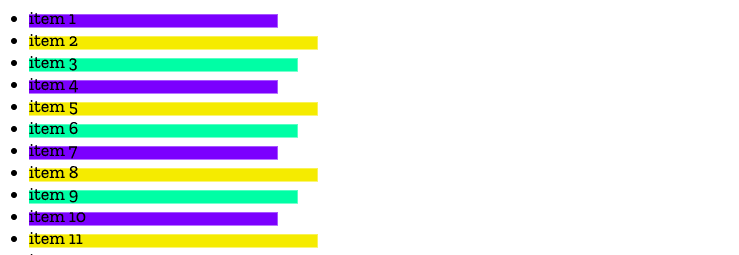

{{DefaultAPISidebar("CSS Painting API")}}{{SeeCompatTable}}

The CSS Painting API — part of the [CSS Houdini](/en-US/docs/Web/API/Houdini_APIs) umbrella of APIs — allows developers to write JavaScript functions that can draw directly into an element's background, border, or content.

## Concepts and usage

Essentially, the CSS Painting API contains functionality allowing developers to create custom values for {{cssxref('image/paint', 'paint()')}}, a CSS {{cssxref('&lt;image&gt;')}} function. You can then apply these values to properties like {{cssxref('background-image')}} to set complex custom backgrounds on an element.

For example:

```css
aside {
  background-image: paint(myPaintedImage);
}
```

The API defines a {{domxref('worklet')}} that can be used to programmatically generate an image that responds to computed style changes. To find out more about how this is used, consult [Using the CSS Painting API](/en-US/docs/Web/API/CSS_Painting_API/Guide).

## Interfaces

- {{domxref('PaintWorkletGlobalScope')}}
  - : The global execution context of the paint worklet.
- {{domxref('PaintRenderingContext2D')}}
  - : The rendering context for the CSS Painting API's rendering context for drawing to the bitmap.
- {{domxref('PaintSize')}}
  - : Represents the size of the output bitmap that the author should draw.

## Examples

The following example creates a list of items with a background image that rotates between three different colors and three widths.
In [a supporting browser](#browser_compatibility) you will see something like the image below.



To achieve this we'll define two custom CSS properties, `--boxColor` and `--widthSubtractor`.

### The paint worklet

The worklet is an external JavaScript file (in this case we've called it `boxbg.js`) which defines a paint {{domxref('worklet')}}.
Using the worklet, we can access CSS properties (and custom properties) of elements:

```js
registerPaint(
  "boxbg",
  class {
    static get contextOptions() {
      return { alpha: true };
    }
    /*
      Retrieve any custom properties (or regular properties,
      such as 'height') defined for the element, and return
      them as an array.
    */
    static get inputProperties() {
      return ["--boxColor", "--widthSubtractor"];
    }

    paint(ctx, size, props) {
      /*
        ctx -> drawing context
        size -> paintSize: width and height
        props -> properties: get() method
      */
      ctx.fillStyle = props.get("--boxColor");
      ctx.fillRect(
        0,
        size.height / 3,
        size.width * 0.4 - props.get("--widthSubtractor"),
        size.height * 0.6,
      );
    }
  },
);
```

We used the `inputProperties()` method in the `registerPaint()` class to get the values of two custom properties set on an element that has `boxbg` applied to it and then used those within our `paint()` function. The `inputProperties()` method can return all properties affecting the element, not just custom properties.

### Using the paint worklet

#### HTML

```html live-sample___example-boxbg
<ul>
  <li>item 1</li>
  <li>item 2</li>
  <li>item 3</li>
  <li>item 4</li>
  <li>item 5</li>
  <li>item 6</li>
  <li>item 7</li>
  <li>item 8</li>
  <li>item 9</li>
  <li>item 10</li>
  <li>item N</li>
</ul>
```

#### CSS

In our CSS, we define the `--boxColor` and `--widthSubtractor` custom properties.

```css live-sample___example-boxbg
body {
  font: 1.2em / 1.2 sans-serif;
}
li {
  background-image: paint(boxbg);
  --boxColor: hsl(55 90% 60%);
}

li:nth-of-type(3n) {
  --boxColor: hsl(155 90% 60%);
  --widthSubtractor: 20;
}

li:nth-of-type(3n + 1) {
  --boxColor: hsl(255 90% 60%);
  --widthSubtractor: 40;
}
```

#### JavaScript

The setup and logic of the paint worklet is in the external script.
To register the worklet, we need to call {{domxref('Worklet.addModule', 'addModule()')}} from our main script:

```js live-sample___example-boxbg
CSS.paintWorklet.addModule(
  "https://mdn.github.io/houdini-examples/cssPaint/intro/worklets/boxbg.js",
);
```

In this example, the worklet is hosted at `https://mdn.github.io/`, but your worklet may be a relative resource like so:

```js
CSS.paintWorklet.addModule("boxbg.js");
```

#### Result

While you can't play with the worklet's script, you can alter the custom property values in DevTools to change the colors and width of the background image.

{{EmbedLiveSample("example-boxbg", "", "300px")}}

## Specifications

{{Specifications}}

## Browser compatibility

{{Compat}}

## See also

- [Using the CSS Painting API](/en-US/docs/Web/API/CSS_Painting_API/Guide)
- [CSS Typed Object Model API](/en-US/docs/Web/API/CSS_Typed_OM_API)
- [Houdini APIs](/en-US/docs/Web/API/Houdini_APIs)
