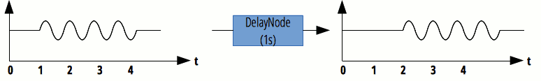

{{APIRef("Web Audio API")}}

The **`DelayNode`** interface represents a [delay-line](https://en.wikipedia.org/wiki/Digital_delay_line); an {{domxref("AudioNode")}} audio-processing module that causes a delay between the arrival of an input data and its propagation to the output.

A `DelayNode` always has exactly one input and one output, both with the same amount of channels.

When creating a graph that has a cycle, it is mandatory to have at least one `DelayNode` in the cycle, or the nodes taking part in the cycle will be muted.

{{InheritanceDiagram}}

<table class="properties">
  <tbody>
    <tr>
      <th scope="row">Number of inputs</th>
      <td><code>1</code></td>
    </tr>
    <tr>
      <th scope="row">Number of outputs</th>
      <td><code>1</code></td>
    </tr>
    <tr>
      <th scope="row">Channel count mode</th>
      <td><code>"max"</code></td>
    </tr>
    <tr>
      <th scope="row">Channel count</th>
      <td><code>2</code> (not used in the default count mode)</td>
    </tr>
    <tr>
      <th scope="row">Channel interpretation</th>
      <td><code>"speakers"</code></td>
    </tr>
  </tbody>
</table>

## Constructor

- {{domxref("DelayNode.DelayNode", "DelayNode()")}}
  - : Creates a new instance of an DelayNode object instance. As an alternative, you can use the {{domxref("BaseAudioContext.createDelay()")}} factory method; see [Creating an AudioNode](/en-US/docs/Web/API/AudioNode#creating_an_audionode).

## Properties

_Inherits properties from its parent, {{domxref("AudioNode")}}._

- {{domxref("DelayNode.delayTime")}} {{ReadOnlyInline}}
  - : An [a-rate](/en-US/docs/Web/API/AudioParam#a-rate) {{domxref("AudioParam")}} representing the amount of delay to apply, specified in seconds.

## Methods

_No specific methods; inherits methods from its parent, {{domxref("AudioNode")}}._

## Example

See [`BaseAudioContext.createDelay()`](/en-US/docs/Web/API/BaseAudioContext/createDelay#example) for example code.

## Specifications

{{Specifications}}

## Browser compatibility

{{Compat}}

## See also

- [Using the Web Audio API](/en-US/docs/Web/API/Web_Audio_API/Using_Web_Audio_API)
