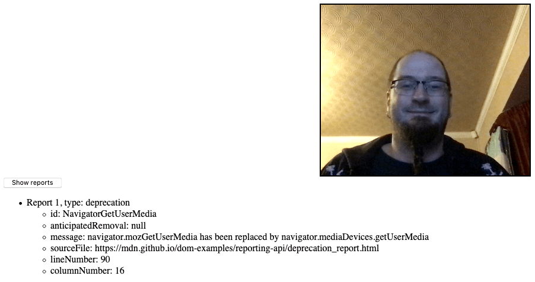

{{APIRef("Reporting API")}}{{SeeCompatTable}}

The `DeprecationReportBody` interface of the [Reporting API](/en-US/docs/Web/API/Reporting_API) represents the body of a deprecation report.

A deprecation report is generated when a deprecated feature (for example a deprecated API method) is used on a document being observed by a {{domxref("ReportingObserver")}}. In addition to the support of this API, receiving useful deprecation warnings relies on browser vendors adding these warnings for deprecated features.

{{InheritanceDiagram}}

## Constructor

An instance of `DeprecationReportBody` is returned as the value of {{domxref("Report.body")}} when {{domxref("Report.Type")}} is `deprecation`. The interface has no constructor.

## Properties

This interface also inherits properties from {{domxref("ReportBody")}}.

- {{domxref("DeprecationReportBody.id")}} {{experimental_inline}}
  - : A string representing the feature or API that is deprecated, for example `NavigatorGetUserMedia`. This can be used to group reports by deprecated feature.
- {{domxref("DeprecationReportBody.anticipatedRemoval")}}
  - : A {{jsxref("Date")}} object (rendered as a string) representing the date when the feature is expected to be removed from the current browser. If the date is not known, this property will return `null`.
- {{domxref("DeprecationReportBody.message")}} {{experimental_inline}}
  - : A string containing a human-readable description of the deprecation, including information such as what newer feature has superseded it, if any. This typically matches the message a browser will display in its DevTools console when a deprecated feature is used, if one is available.
- {{domxref("DeprecationReportBody.sourceFile")}} {{experimental_inline}}
  - : A string containing the path to the source file where the deprecated feature was used, if known, or `null` otherwise.
- {{domxref("DeprecationReportBody.lineNumber")}} {{experimental_inline}}
  - : A number representing the line in the source file in which the deprecated feature was used, if known, or `null` otherwise.
- {{domxref("DeprecationReportBody.columnNumber")}} {{experimental_inline}}
  - : A number representing the column in the source file in which the deprecated feature was used, if known, or `null` otherwise.

## Methods

This interface also inherits methods from {{domxref("ReportBody")}}.

- {{domxref("DeprecationReportBody.toJSON()")}} {{experimental_inline}}
  - : A _serializer_ which returns a JSON representation of the `InterventionReportBody` object.

## Examples

In our [deprecation_report.html](https://mdn.github.io/dom-examples/reporting-api/deprecation_report.html) example, we create a simple reporting observer to observe usage of deprecated features on our web page:

```js
let options = {
  types: ['deprecation'],
  buffered: true
}

let observer = new ReportingObserver((reports, observer) => {
  reportBtn.onclick = () => displayReports(reports);
}, options);
```

We then tell it to start observing reports using {{domxref("ReportingObserver.observe()")}}; this tells the observer to start collecting reports in its report queue, and runs the callback function specified inside the constructor:

```js
observer.observe();
```

Because of the event handler we set up inside the `ReportingObserver()` constructor, we can now click the button to display the report details.



The report details are displayed via the `displayReports()` function, which takes the observer callback's `reports` parameter as its parameter:

```js
function displayReports(reports) {
  const outputElem = document.querySelector('.output');
  const list = document.createElement('ul');
  outputElem.appendChild(list);

  for (let i = 0; i < reports.length; i++) {
    const listItem = document.createElement('li');
    const textNode = document.createTextNode(`Report ${i + 1}, type: ${reports[i].type}`);
    listItem.appendChild(textNode);
    const innerList = document.createElement('ul');
    listItem.appendChild(innerList);
    list.appendChild(listItem);

    for (const key in reports[i].body) {
      const innerListItem = document.createElement('li');
      const keyValue = reports[i].body[key];
      innerListItem.textContent = `${key}: ${keyValue}`;
      innerList.appendChild(innerListItem);
    }
  }
}
```

The `reports` parameter contains an array of all the reports in the observer's report queue. We loop over each report using a basic [`for`](/en-US/docs/Web/JavaScript/Reference/Statements/for) loop, then iterate over each entry of in the report's body (a `DeprecationReportBody` instance) using a [`for...in`](/en-US/docs/Web/JavaScript/Reference/Statements/for...in) structure, displaying each key/value pair inside a list item.

## Specifications

{{Specifications}}

## Browser compatibility

{{Compat}}

## See also

- [Reporting API](/en-US/docs/Web/API/Reporting_API)
- [The Reporting API](https://web.dev/reporting-api/)
