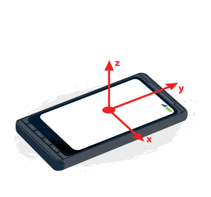
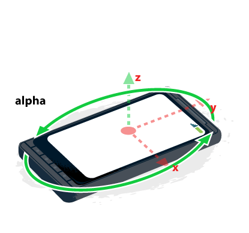
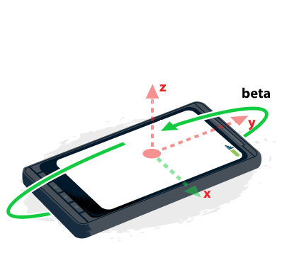
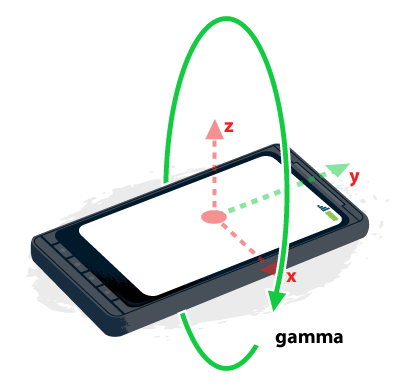

{{DefaultAPISidebar("Device Orientation Events")}}

When using orientation and motion events, it's important to understand what the values you're given by the browser mean. This article provides details about the coordinate systems at play and how you use them.

## About coordinate frames

A **coordinate frame** is a system whereby the orientation of the three axes (X, Y, and Z) are defined in reference to an object. There are two coordinate frames to consider when using orientation and motion events:

### Earth coordinate frame

The Earth coordinate frame is the coordinate frame fixed on the center of the Earth; that is, the axes are aligned based on the pull of gravity and the standard magnetic north orientation. We use upper-case letters ("X", "Y", and "Z") to describe the axes of the Earth coordinate frame.

- The **X** axis follows along the ground plane, perpendicular to the Y axis and positive toward the east (and therefore negative toward the west).
- The **Y** axis follows along the ground plane, and is positive toward true north (that is, the North Pole, not magnetic north) and negative toward true south.
- The **Z** axis is perpendicular to the ground plane; think of it as a line drawn between the device and the center of the Earth. The value of the Z coordinate is positive upward (away from the center of the Earth) and negative downward (toward the center of the Earth).

### Device coordinate frame

The device coordinate frame is the coordination frame fixed on the center of the device. We use lower-case letters ("x", "y", and "z") to describe the axes of the device coordinate frame.

- The **x** axis is in the plane of the screen and is positive toward the right and negative toward the left.
- The **y** axis is in the plane of the screen and is positive toward the top and negative toward the bottom.
- The **z** axis is perpendicular to the screen or keyboard, and is positive extending outward from the screen.

> [!NOTE]
> On a phone or tablet, the orientation of the device is always considered in relation to the standard orientation of the screen; this is the "portrait" orientation on most devices. On a laptop computer, the orientation is considered in relation to the keyboard. If you want to detect changes in device orientation in order to compensate, you can use the [`change`](/en-US/docs/Web/API/ScreenOrientation/change_event) event.

## About rotation

Rotation is described about any given axis in terms of the number of degrees of difference between the device's coordinate frame and the Earth coordinate frame, and is measured in degrees.

### Alpha

Rotation around the z axis — that is, twisting the device — causes the **alpha** rotation angle to change:

The alpha angle is 0° when top of the device is pointed directly toward the Earth's north pole, and increases as the device is rotated counterclockwise. As such, 90° corresponds with pointing west, 180° with south, and 270° with east.

### Beta

Rotation around the x axis — that is, tipping the device away from or toward the user — causes the **beta** rotation angle to change:

The beta angle is 0° when the device's top and bottom are the same distance from the Earth's surface; it increases toward 180° as the device is tipped forward toward the user, and it decreases toward -180° as the device is tipped backward away from the user.

### Gamma

Rotation around the y axis — that is, tilting the device toward the left or right — causes the **gamma** rotation angle to change:

The gamma angle is 0° when the device's left and right sides are the same distance from the surface of the Earth, and increases toward 90° as the device is tipped toward the right, and toward -90° as the device is tipped toward the left.
