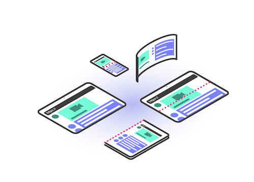
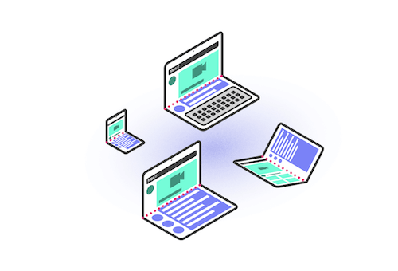

{{DefaultAPISidebar("Device Posture API")}}{{seecompattable}}

The **Device Posture API** allows developers to create user interfaces that adapt to a foldable device's posture and respond to posture changes.

## Concepts and usage

Foldable devices present unique design challenges to developers — they can be used like a regular flat screen or like a book. In addition, some of them feature a single folded screen, and some of them feature two screens with a hinged join in the middle. Care must be taken to ensure that content is not hidden by the physical join, or rendered difficult to read due to close proximity to the central fold.

The Device Posture API defines **postures**, which indicate the current physical folding state of a device. The current available postures are:

- `continuous`
  - : Indicates a flat screen state. Foldable devices are `continuous` while they are flat; either fully opened or fully closed. Non-foldable devices are considered flat and therefore always `continuous` — this includes seamless curved displays and standard desktop, laptop, tablet, and mobile screens.
    
- `folded`
  - : Indicates a folded screen state. Foldable devices are `folded` while used in a book or laptop posture.
    

The Device Posture API includes features enabling you to run scripts and vary layouts depending on current device posture and posture changes.

## CSS features

- {{cssxref("@media/device-posture", "device-posture")}} `@media` feature
  - : Detects the device's current posture.

## Interfaces

- {{domxref("DevicePosture")}}
  - : Represents the device's posture, providing access to the current posture `type` and a `change` event that fires on posture change.

### Extensions to other interfaces

- {{domxref("Navigator.devicePosture")}}
  - : The entry point for the Device Posture API — returns the browser's `DevicePosture` object.

## Examples

You can find a complete example showing all of the features in action in the [Device Posture API demo](https://mdn.github.io/dom-examples/device-posture-api/).

If possible, you should view this on a foldable device. Current browser developer tools enable emulating foldable devices, but don't include emulation of partially folded devices — only fully open or closed — so they will always return `continuous`.

## Specifications

{{Specifications}}

## Browser compatibility

{{Compat}}

## See also

- [Origin trial for Foldable APIs](https://developer.chrome.com/blog/foldable-apis-ot) on developer.chrome.com (2024)
