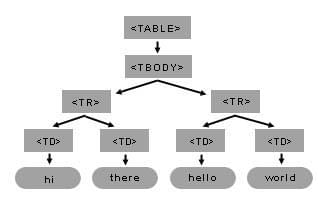

{{DefaultAPISidebar("DOM")}}

In [Anatomy of the DOM](/en-US/docs/Web/API/Document_Object_Model/Anatomy_of_the_DOM), we introduced the shape of the DOM tree. In [Selection and traversal](/en-US/docs/Web/API/Document_Object_Model/Selection_and_traversal_on_the_DOM_tree), we introduced methods for efficient reading of this tree. This guide introduces methods for _modification_ of this tree.

## Creating nodes

When adding new content or building DOM trees from scratch, we need to first create the node before updating its data. Each [node type](/en-US/docs/Web/API/Document_Object_Model/Anatomy_of_the_DOM#the_node_interface_and_its_subclasses) has a different API for creation.

There aren't many reasons to create a new {{domxref("Document")}} node—usually, you just want to replace the contents in the current document. But in case you want to do that, the {{domxref("document.implementation")}} property gives access to a {{domxref("DOMImplementation")}} object, which mainly allows you to create new documents. The {{domxref("DOMImplementation/createHTMLDocument", "document.implementation.createHTMLDocument()")}} method is convenient in that it constructs the full starter tree for a well-formed HTML document, with necessary elements such as {{HTMLElement("html")}}, {{HTMLElement("head")}}, {{HTMLElement("body")}}, and {{HTMLElement("title")}}. It accepts an optional string argument, which is used to populate the content of the {{HTMLElement("title")}} element:

```js
const newDoc = document.implementation.createHTMLDocument("My new document");
console.log(newDoc);
// <!DOCTYPE html>
// <html>
//   <head>
//     <title>My new document</title>
//   </head>
//   <body></body>
// </html>
```

The {{domxref("DOMImplementation/createDocument", "document.implementation.createDocument()")}} method creates an {{domxref("XMLDocument")}}. Instead of using the HTML doctype and `<html>` root element, you can choose your own doctype and root element. Since this guide doesn't talk about XML, we won't use this method ([XML namespaces](/en-US/docs/Web/API/Document_Object_Model/XML_namespaces) discusses this further).

You can also use the {{domxref("Document/Document", "Document()")}} constructor directly to create a new, empty document. It takes no arguments, and results in a {{domxref("Document")}} with no content.

To create {{domxref("DocumentType")}} nodes, you can use {{domxref("DOMImplementation/createDocumentType", "document.implementation.createDocumentType()")}}, passing three arguments corresponding to the [data properties of `DocumentType`](/en-US/docs/Web/API/Document_Object_Model/Anatomy_of_the_DOM#documenttype): `name`, `publicId`, `systemId`. But again, this is rarely needed unless you are creating a full document from scratch.

All other nodes can be created via methods on the {{domxref("Document")}} object. Some of them also have constructors, but using the {{domxref("Document")}} methods works consistently.

| Node type                            | Creation method                                                                                           | Constructor                                                                                                                   |
| ------------------------------------ | --------------------------------------------------------------------------------------------------------- | ----------------------------------------------------------------------------------------------------------------------------- |
| {{domxref("Element")}}               | {{domxref("Document/createElement", "document.createElement(tagName)")}}                                  | N/A                                                                                                                           |
| {{domxref("Text")}}                  | {{domxref("Document/createTextNode", "document.createTextNode(data)")}}                                   | {{domxref("Text/Text", "new Text(data)")}}                                                                                    |
| {{domxref("Comment")}}               | {{domxref("Document/createComment", "document.createComment(data)")}}                                     | {{domxref("Comment/Comment", "new Comment(data)")}}                                                                           |
| {{domxref("CDATASection")}}          | {{domxref("Document/createCDATASection", "document.createCDATASection(data)")}}                           | N/A                                                                                                                           |
| {{domxref("ProcessingInstruction")}} | {{domxref("Document/createProcessingInstruction", "document.createProcessingInstruction(target, data)")}} | {{domxref("ProcessingInstruction/ProcessingInstruction", "new ProcessingInstruction(target, data)")}} {{experimental_inline}} |
| {{domxref("Attr")}}                  | {{domxref("Document/createAttribute", "document.createAttribute(name)")}}                                 | N/A                                                                                                                           |

`createCDATASection()` is only available on XML documents; calling it on an HTML document throws a `NotSupportedError` {{domxref("DOMException")}}.

If you already have an existing node and want to create a copy of it, you can use {{domxref("Node/cloneNode", "node.cloneNode()")}}. It takes an optional boolean argument, `deep`, which indicates whether to clone just the node itself (`false`, the default), or its child nodes recursively as well (`true`).

```js
const original = document.createElement("div");
original.className = "my-class";
original.textContent = "Hello";

const clone = original.cloneNode(true);
console.log(clone.outerHTML); // <div class="my-class">Hello</div>

const shallowClone = original.cloneNode(false);
console.log(shallowClone.outerHTML); // <div class="my-class"></div>
```

But creating a node is just the beginning. Afterwards, you want to add child nodes, set attributes, and finally insert the new node into the document tree. We will look at these steps next.

## Altering element attributes

If you already have an {{domxref("Attr")}} node (either created with {{domxref("Document/createAttribute", "document.createAttribute()")}} or retrieved from an existing element), you can directly set its `value`, and insert it into an element's {{domxref("Element/attributes", "attributes")}} using {{domxref("NamedNodeMap/setNamedItem", "setNamedItem()")}}. It adds the attribute to the element, replacing and returning the existing `Attr` node if an attribute with the same name already exists.

```js
const element = document.createElement("div");
const attr = document.createAttribute("data-example");
attr.value = "my value";
element.attributes.setNamedItem(attr);
console.log(element.outerHTML);
// <div data-example="my value"></div>
```

But there's a catch: if the `Attr` node is already attached to another element, the two elements cannot share it. You must either first detach it using {{domxref("NamedNodeMap/removeNamedItem", "removeNamedItem()")}}, or explicitly clone the attribute.

```js
const element1 = document.createElement("div");
const element2 = document.createElement("div");
const attr = document.createAttribute("data-example");
attr.value = "my value";
element1.attributes.setNamedItem(attr);
// Now attr is attached to element1
element2.attributes.setNamedItem(attr);
// Uncaught DOMException: Attribute already in use

element2.attributes.setNamedItem(attr.cloneNode(true)); // Works fine
// Alternatively:
element2.attributes.setNamedItem(
  element1.attributes.removeNamedItem("data-example"),
);
```

The `setNamedItem` and `removeNamedItem` methods also have their counterparts on `Element`, which are {{domxref("element.setAttributeNode()")}} and {{domxref("element.removeAttributeNode()")}}.

It's a rare case that you have an existing {{domxref("Attr")}} node to work with. More commonly, you just have the attribute's name and value as strings. In that case, you can use {{domxref("element.setAttribute()")}} and {{domxref("element.removeAttribute()")}} directly:

```js
const element = document.createElement("div");
element.setAttribute("data-example", "my value");
console.log(element.outerHTML);
// <div data-example="my value"></div>

element.removeAttribute("data-example");
console.log(element.outerHTML);
// <div></div>
```

There's a convenience method, {{domxref("element.toggleAttribute()")}}, which adds the attribute if it doesn't exist, or removes it if it does. It takes an optional second boolean argument, which if provided forces the attribute to be added (`true`) or removed (`false`).

```js
const element = document.createElement("div");
element.toggleAttribute("data-example"); // Attribute not present, so it is added
console.log(element.outerHTML); // <div data-example=""></div>
element.toggleAttribute("data-example"); // Attribute present, so it is removed
console.log(element.outerHTML); // <div></div>
```

But it's often even more convenient to use [attribute reflection](/en-US/docs/Web/API/Document_Object_Model/Reflected_attributes) instead. The `Element` interface itself defines the {{domxref("Element/id", "id")}} and {{domxref("Element/className", "className")}} properties for manipulating the `id` and `class` attributes. Most standard HTML attributes have corresponding properties on the {{domxref("HTMLElement")}} interface and its subclasses. Similarly, standard SVG attributes are reflected on the {{domxref("SVGElement")}} interface and its subclasses. For example, the [`data-*`](/en-US/docs/Web/HTML/Reference/Global_attributes/data-*) attributes are reflected via the {{domxref("HTMLElement/dataset", "dataset")}} property:

```js
const element = document.createElement("div");
element.dataset.example = "my value";
console.log(element.outerHTML);
// <div data-example="my value"></div>
delete element.dataset.example;
console.log(element.outerHTML);
// <div></div>
```

The attributes that contain a space-separated list of tokens, such as [`class`](/en-US/docs/Web/HTML/Reference/Global_attributes/class) and [`rel`](/en-US/docs/Web/HTML/Reference/Attributes/rel), are reflected by {{domxref("DOMTokenList")}} properties, such as {{domxref("Element/classList", "classList")}} and {{domxref("HTMLLinkElement/relList", "relList")}}. These properties provide convenient methods for adding, removing, toggling, and replacing tokens in the list.

```js
const element = document.createElement("div");
element.classList.add("class1");
element.classList.add("class2");
console.log(element.outerHTML);
// <div class="class1 class2"></div>
element.classList.remove("class1");
console.log(element.outerHTML);
// <div class="class2"></div>
```

## Altering text content

Next, we consider updating the text content of an existing element. You can go the hard way of creating new `Text` nodes and then inserting them into the element children (see [Altering child nodes](#altering_child_nodes)). But if you are starting with an empty element, an easier way is to use the {{domxref("Node/textContent", "textContent")}} property of the {{domxref("Node")}} interface. Setting this property replaces all existing child nodes with a single new `Text` node containing the specified string, or with no nodes if the string is empty.

```js
const element = document.createElement("div");
element.textContent = "Hello, world!";
console.log(element.outerHTML);
// <div>Hello, world!</div>
```

Here's a nice trick: to create an element and initialize its attributes and text content together, you can use the {{jsxref("Object.assign()")}} method, which is equivalent to assigning each of the properties one by one.

```js
const element = Object.assign(document.createElement("div"), {
  id: "greeting",
  className: "message",
  textContent: "Hello, world!",
});
console.log(element.outerHTML);
// <div id="greeting" class="message">Hello, world!</div>
```

Setting `textContent` will remove all of the node's existing contents. If you just want to update one of the child text nodes without removing it, you need to manipulate the data in that specific `Text` node directly. The methods for this are defined on the {{domxref("CharacterData")}} interface, which {{domxref("Text")}} inherits from: {{domxref("CharacterData/appendData", "appendData()")}}, {{domxref("CharacterData/insertData", "insertData()")}}, {{domxref("CharacterData/deleteData", "deleteData()")}}, and {{domxref("CharacterData/replaceData", "replaceData()")}}. `replaceData(offset, count, data)` is the most general of these, allowing you to replace a range of characters with new text. `appendData(data)` is equivalent to `replaceData(length, 0, data)`; `insertData(offset, data)` is equivalent to `replaceData(offset, 0, data)`; and `deleteData(offset, count)` is equivalent to `replaceData(offset, count, "")`.

```js
const element = document.createElement("div");
element.innerHTML = "Hello, <strong>world</strong>!";
const textNode = element.childNodes[0]; // "Hello, "
textNode.replaceData(0, 5, "Hi");
console.log(element.outerHTML);
// <div>Hi, <strong>world</strong>!</div>
```

Because these methods are defined on {{domxref("CharacterData")}}, they also work on other node types that inherit from it, including {{domxref("Comment")}}, {{domxref("CDATASection")}}, and {{domxref("ProcessingInstruction")}}.

## Altering child nodes

The {{domxref("Node")}} interface defines several methods for manipulating the child list. Just like data in a text node, you can insert, append, remove, or replace child nodes, using {{domxref("Node/insertBefore", "insertBefore()")}}, {{domxref("Node/appendChild", "appendChild()")}}, {{domxref("Node/removeChild", "removeChild()")}}, and {{domxref("Node/replaceChild", "replaceChild()")}} respectively.

```js
const parent = document.createElement("div");
const child1 = document.createElement("p");
child1.textContent = "1";
const child2 = document.createElement("p");
child2.textContent = "2";
const child3 = document.createElement("p");
child3.textContent = "3";
parent.appendChild(child1); // <div><p>1</p></div>
parent.appendChild(child2); // <div><p>1</p><p>2</p></div>
parent.removeChild(child1); // <div><p>2</p></div>
parent.replaceChild(child3, child2); // <div><p>3</p></div>
parent.insertBefore(child1, child3); // <div><p>1</p><p>3</p></div>
```

> [!NOTE]
> Removing or replacing a node detaches it from the tree but does not destroy the node object. If you still have a reference to the node, you can continue to modify it and insert it elsewhere, as the example does with `child1` after calling `removeChild()`.

There's another set of more modern methods for adding children: {{domxref("Element/prepend", "prepend()")}}, {{domxref("Element/append", "append()")}}, {{domxref("Element/replaceChildren", "replaceChildren()")}}. Compared to the four methods above, there are three important differences:

1. Instead of being defined on {{domxref("Node")}}, these methods are defined only on the node types that can have children: {{domxref("Element")}}, {{domxref("Document")}}, and {{domxref("DocumentFragment")}}.
2. They can take multiple arguments, allowing multiple children to be inserted at once.
3. In addition to node objects, they can also take strings as arguments, which are automatically converted to `Text` nodes.

```js
const parent = document.createElement("div");
parent.append("world!");
parent.prepend("Hello, ");
console.log(parent.outerHTML);
// <div>Hello, world!</div>
parent.replaceChildren(
  Object.assign(document.createElement("p"), {
    textContent: "This is a new content.",
  }),
);
console.log(parent.outerHTML);
// <div><p>This is a new content.</p></div>
```

To remove all child nodes of an `Element`, you can use `element.textContent = ""`.

Calling any of these methods requires you to already have a reference to the parent node. This may not always be convenient. If you have a reference to a _child_ node, you can still insert new nodes before or after it, replace it, or remove it from its parent, using {{domxref("Element/before", "before()")}}, {{domxref("Element/after", "after()")}}, {{domxref("Element/replaceWith", "replaceWith()")}}, and {{domxref("Element/remove", "remove()")}} respectively.

```js
const parent = document.createElement("div");
const child = document.createElement("p");
child.textContent = "Hello, world!";
parent.appendChild(child);
child.before("Greetings!");
child.after("Thank you!");
console.log(parent.outerHTML); // <div>Greetings!<p>Hello, world!</p>Thank you!</div>
child.replaceWith(" ");
console.log(parent.outerHTML); // <div>Greetings! Thank you!</div>
```

These methods, like `prepend()`, `append()`, and `replaceChildren()`, can also take multiple arguments, and automatically convert strings to `Text` nodes. They are only defined on nodes that can have parents: {{domxref("DocumentType")}}, {{domxref("Element")}}, and {{domxref("CharacterData")}}.

There are two specialized methods defined for {{domxref("Element")}}: {{domxref("Element/insertAdjacentElement", "insertAdjacentElement()")}} and {{domxref("Element/insertAdjacentText", "insertAdjacentText()")}}. These methods also insert a new element or text node relative to an existing element, but take an argument specifying the position relative to the existing element. If it's `"beforebegin"` or `"afterend"`, the new node is inserted as a sibling before or after the existing element (like `before()`/`after()`). If it's `"afterbegin"` or `"beforeend"`, the new node is inserted as the first or last child of the existing element (like `prepend()`/`append()`).

```js
const parent = document.createElement("div");
const child = document.createElement("p");
child.textContent = "Test";
parent.appendChild(child);
child.insertAdjacentText("beforebegin", "text before");
child.insertAdjacentText("afterend", "text after");
child.insertAdjacentElement("afterbegin", document.createElement("strong"));
child.insertAdjacentElement("beforeend", document.createElement("em"));
console.log(parent.outerHTML);
// <div>text before<p><strong></strong>Test<em></em></p>text after</div>
```

If the new child node is already attached to another parent, it is first removed from that parent before being inserted into the new parent. Removing and re-inserting a node resets its state, such as [animation](/en-US/docs/Web/CSS/CSS_animations) and [transition](/en-US/docs/Web/CSS/CSS_transitions) state. The {{domxref("Element/moveBefore", "moveBefore()")}} method can move an already-connected node within the same document without resetting its state. Like `prepend()`, `append()`, and `replaceChildren()`, `moveBefore()` is defined on `Element`, `Document`, and `DocumentFragment`.

At all times, the tree [invariants](/en-US/docs/Glossary/Invariant) introduced in [Anatomy of the DOM](/en-US/docs/Web/API/Document_Object_Model/Anatomy_of_the_DOM) are maintained:

- The child to be inserted cannot be an ancestor of the parent node.
- When calling `node.appendChild(newChild)`, or `node.insertBefore(newChild, referenceChild)`, `node` must be one of the node types that can have children (`Document`, `DocumentFragment`, or `Element`).
- If the parent is a `Document`, then the new child must be an `Element`, `DocumentType`, `ProcessingInstruction`, or `Comment`, or a `DocumentFragment` whose children meet these constraints. Furthermore, only one `Element` and one `DocumentType` node can exist as children, and the `DocumentType` node must come before the `Element` node.
- If the parent is a `DocumentFragment` or `Element`, the new child must be a `DocumentFragment`, `Element`, or `CharacterData` node. Inserting a `DocumentFragment` inserts its children, which must themselves be `Element` or `CharacterData` nodes.
- When calling with a reference child, the reference child must be an existing child of the parent node.

If any of these invariants are violated, a `DOMException` is thrown.

## Merging and splitting text node children

Though this can't happen when parsed from an HTML document, it is possible to have multiple adjacent `Text` node children after some DOM manipulations. These `Text` nodes visually appear as a single block of text, but they are separate nodes in the DOM tree. This can lead to unexpected behavior when manipulating the text content.

The {{domxref("Text/wholeText", "wholeText")}} property of the {{domxref("Text")}} interface returns the concatenated text content of all adjacent `Text` nodes.

```js
const parent = document.createElement("div");
parent.append("Hello, ");
parent.append("world!");
const firstTextNode = parent.childNodes[0];
console.log(firstTextNode.data); // "Hello, "
console.log(firstTextNode.wholeText); // "Hello, world!"
```

You can split a `Text` node into two nodes at a particular position using {{domxref("Text/splitText", "splitText()")}}, which allows you to insert nodes in between. You can also merge adjacent `Text` nodes using {{domxref("Node/normalize", "normalize()")}} on the parent node, which combines all contiguous `Text` nodes into the first one.

```js
const parent = document.createElement("div");
parent.append("Hello, ");
parent.append("world!");
parent.normalize();
console.log(parent.childNodes.length); // 1
console.log(parent.childNodes[0].data); // "Hello, world!"
```

## Using DocumentFragment

We've been mentioning the {{domxref("DocumentFragment")}} node type a lot, but we haven't formally introduced it yet. It is another node type, with {{domxref("Node/nodeType", "nodeType")}} value `Node.DOCUMENT_FRAGMENT_NODE` (`11`). It implements the `Node` interface and has the same children constraints as {{domxref("Element")}}. When a `DocumentFragment` is passed to an insertion method, the fragment itself is not inserted. Instead, its children are inserted in its place, and the `DocumentFragment` is emptied.

You can create a `DocumentFragment` using {{domxref("Document/createDocumentFragment", "document.createDocumentFragment()")}}, or the {{domxref("DocumentFragment/DocumentFragment", "new DocumentFragment()")}} constructor. Here's an example of using it to batch-insert multiple child nodes into an element:

```js
const parent = document.createElement("div");
const fragment = document.createDocumentFragment();
const child1 = document.createElement("p");
child1.textContent = "Child 1";
fragment.appendChild(child1);
const child2 = document.createElement("p");
child2.textContent = "Child 2";
fragment.appendChild(child2);
parent.appendChild(fragment);
console.log(parent.outerHTML);
// <div><p>Child 1</p><p>Child 2</p></div>
console.log(fragment.childNodes.length); // 0
console.log(parent.childNodes.length); // 2
```

As noted in the {{domxref("DocumentFragment")}} documentation, the performance benefit of `DocumentFragment` is overstated—inserting children into a `DocumentFragment` and then inserting the `DocumentFragment` into the document tree is not significantly faster than inserting the children directly into the document tree. The main advantages of using `DocumentFragment` are:

- It allows functions to return multiple nodes as a single object that is readily insertable, unlike an array of nodes.
- {{domxref("ShadowRoot")}} nodes inherit from `DocumentFragment`, so understanding how to work with `DocumentFragment` is necessary for working with [shadow DOM](/en-US/docs/Web/API/Web_components/Using_shadow_DOM), which is beyond the scope of this guide.
- When using the HTML {{HTMLElement("template")}} element, you can declaratively create a reusable `DocumentFragment` in HTML markup:

```html live-sample___template
<template id="my-template">
  <p>Template content 1</p>
  <p>Template content 2</p>
</template>
<div id="container1"></div>
<div id="container2"></div>
```

```js live-sample___template
const template = document.getElementById("my-template");
const container1 = document.getElementById("container1");
const container2 = document.getElementById("container2");

// template.content is a DocumentFragment
container1.appendChild(document.importNode(template.content, true));
container2.appendChild(document.importNode(template.content, true));
```

{{EmbedLiveSample("template", "", 200)}}

## Node connectivity

When a node is created, it is not connected to the document tree, but it is usually _owned_ by a document. You can check whether a node is connected to a document, either directly or through a shadow tree, using the {{domxref("Node/isConnected", "isConnected")}} property of the {{domxref("Node")}} interface.

```js
const element = document.createElement("div");
console.log(element.isConnected); // false
document.body.appendChild(element);
console.log(element.isConnected); // true
```

You can check which document owns a node using the {{domxref("Node/ownerDocument", "ownerDocument")}} property of the {{domxref("Node")}} interface.

- `Document` nodes own themselves, but their `ownerDocument` is `null`.
- Nodes created with methods on a `Document` are owned by that document.
- Nodes created with constructors are owned by the current global `document`.

```js
const doc1 = document.implementation.createHTMLDocument("Doc 1");
const element1 = doc1.createElement("div");
console.log(element1.ownerDocument === doc1); // true
const text1 = new Text("Hello");
console.log(text1.ownerDocument === document); // true
```

To transfer a node between documents, use {{domxref("Document/importNode", "document.importNode()")}} or {{domxref("Document/adoptNode", "document.adoptNode()")}}. `importNode()` creates a copy owned by the calling document, leaving the original node unchanged. Its second argument controls whether descendants are copied: pass `true` for a deep copy, or `{ selfOnly: true }` option to copy only the node itself. `adoptNode()` instead removes the original node from its parent, changes the `ownerDocument` of the node and its descendants, and returns the same node. Neither method inserts the resulting node into the document tree.

> [!NOTE]
> Avoid using `Node.cloneNode()` if the cloned node will be used in another document, because new node is created in the context of the current document. The {{domxref("Node.cloneNode()")}} reference provides more information.

## Example: building an element tree using DOM APIs

We combine the techniques we learned above to create a table and add it to the page. The following figure shows the table object tree structure for the table created in the example.



The basic steps to create the table are:

- Get the document's body element.
- Create all the elements.
- Finally, append each child according to the table structure (as in the above figure).

```js
// creates <table> and <tbody> elements
const myTable = document.createElement("table");
const myTableBody = document.createElement("tbody");

// creating all cells
for (let j = 0; j < 3; j++) {
  // creates a <tr> element
  const myCurrentRow = document.createElement("tr");

  for (let i = 0; i < 4; i++) {
    // creates a <td> element
    const myCurrentCell = document.createElement("td");
    // creates a Text Node
    const currentText = document.createTextNode(
      `cell is row ${j}, column ${i}`,
    );
    // appends the Text Node we created into the cell <td>
    myCurrentCell.appendChild(currentText);
    // appends the cell <td> into the row <tr>
    myCurrentRow.appendChild(myCurrentCell);
  }
  // appends the row <tr> into <tbody>
  myTableBody.appendChild(myCurrentRow);
}

// appends <tbody> into <table>
myTable.appendChild(myTableBody);
// appends <table> into <body>
document.body.appendChild(myTable);
```

## Modifying the DOM tree using HTML DOM and CSSOM

The DOM APIs described above work across document types. Other web platform APIs augment them with operations designed for HTML documents and their presentation.

### Updating inline styles with the CSSOM

The [CSS object model (CSSOM)](/en-US/docs/Web/API/CSS_Object_Model) augments HTML elements with the {{domxref("HTMLElement/style", "style")}} property. It returns a live {{domxref("CSSStyleProperties")}} object that represents the element's inline [`style`](/en-US/docs/Web/HTML/Reference/Global_attributes/style) attribute. You can update individual CSS properties on this object using camel-cased names, such as `backgroundColor`, without replacing the element's other inline styles.

For predefined presentation states, it is often better to define the styles in a stylesheet and use {{domxref("Element/classList", "classList")}} to change the element's classes. The `style` property is useful when an inline value needs to be calculated or changed directly.

In this example, we change the background color of the second paragraph when the button is clicked.

```html live-sample___set-background
<button type="button">Set paragraph background color</button>
<p>First paragraph</p>
<p>Second paragraph</p>
```

```js live-sample___set-background
const button = document.querySelector("button");
const paragraphs = document.querySelectorAll("p");

button.addEventListener("click", () => {
  paragraphs[1].style.backgroundColor = "red";
});
```

{{EmbedLiveSample("set-background")}}

### Parsing and serializing HTML

When content is already available as an HTML string, the HTML DOM provides APIs that invoke the HTML parser instead of requiring you to create every node individually. Getting the {{domxref("Element/innerHTML", "innerHTML")}} property serializes an element's descendants as an HTML string. Setting it parses the supplied markup in the element's context and replaces all of the element's descendants with the resulting nodes.

Like `insertAdjacentElement()`, the {{domxref("Element/insertAdjacentHTML", "insertAdjacentHTML()")}} method also inserts nodes at one of the same four positions: `"beforebegin"`, `"afterbegin"`, `"beforeend"`, or `"afterend"`. It takes raw HTML and parses it to get the nodes to insert. Unlike appending to `innerHTML`, it does not serialize and reparse the element's existing descendants.

```js
const container = document.createElement("div");
container.innerHTML = "<p>Hello, <strong>world</strong>!</p>";
container.insertAdjacentHTML("beforeend", "<p>Welcome!</p>");
console.log(container.outerHTML);
// <div><p>Hello, <strong>world</strong>!</p><p>Welcome!</p></div>
```

`innerHTML` and `insertAdjacentHTML()` are [injection sinks](/en-US/docs/Web/API/Trusted_Types_API#concepts_and_usage). They do not sanitize their input, so passing an attacker-controlled string can enable [cross-site scripting (XSS)](/en-US/docs/Web/Security/Attacks/XSS), for example through event handler attributes in the injected markup.

- If the input is intended to be plain text, use {{domxref("Node/textContent", "textContent")}} or {{domxref("Element/insertAdjacentText", "insertAdjacentText()")}} so it is not parsed as markup.
- If untrusted input must contain markup, sanitize it with a well-maintained sanitizer. You use the [`require-trusted-types-for`](/en-US/docs/Web/HTTP/Reference/Headers/Content-Security-Policy/require-trusted-types-for) Content Security Policy directive to enable [Trusted Types](/en-US/docs/Web/API/Trusted_Types_API), and pass {{domxref("TrustedHTML")}} objects.

### Using specialized HTML DOM APIs

The [HTML DOM API](/en-US/docs/Web/API/HTML_DOM_API) defines the various interfaces for HTML elements. The interfaces for common HTML element trees provide convenience methods that are often more direct and less error-prone than manipulating the generic DOM tree. Similar specialized APIs are available for SVG and MathML elements.

This example builds the exact same table tree as the [Building an element tree using DOM APIs](#example_building_an_element_tree_using_dom_apis) using the methods on {{domxref("HTMLTableElement")}}, {{domxref("HTMLTableRowElement")}}, etc.

```js
const myTable = document.createElement("table");
const myTableBody = myTable.createTBody();

for (let j = 0; j < 3; j++) {
  const myCurrentRow = myTableBody.insertRow();

  for (let i = 0; i < 4; i++) {
    const myCurrentCell = myCurrentRow.insertCell();
    myCurrentCell.textContent = `cell is row ${j}, column ${i}`;
  }
}

document.body.appendChild(myTable);
```

The {{domxref("HTMLTableElement/createTBody", "createTBody()")}} method creates a {{HTMLElement("tbody")}} element and inserts it into the table. Similarly, {{domxref("HTMLTableSectionElement/insertRow", "insertRow()")}} creates and inserts a {{HTMLElement("tr")}} element, and {{domxref("HTMLTableRowElement/insertCell", "insertCell()")}} creates and inserts a {{HTMLElement("td")}} element. These methods return the element they inserted, so the example can immediately update or add children to it.

## Observing DOM changes

Changes to an observed node or its descendants can be detected using the {{domxref("MutationObserver")}} API. This allows you to run custom code in response to nodes being added or removed, attributes changing, or character data being modified. Changes outside the observed target, or outside its descendants when `subtree` is `false`, are not reported.

> [!NOTE]
> Usually, if you are manipulating the DOM yourself, you don't need `MutationObserver` at all because you can just execute code _while_ you update the DOM tree. Only use it if you have external actors working on your DOM tree, like if you writing an extension or you allow users to update the page.

You use an observer in three steps:

- Create an observer by passing a callback to the {{domxref("MutationObserver/MutationObserver", "MutationObserver()")}} constructor.
- Call {{domxref("MutationObserver/observe", "observe()")}} with the node to watch and the kinds of changes to report. Now each time a DOM change happens, the callback runs asynchronously and receives an array of {{domxref("MutationRecord")}} objects.
- Call {{domxref("MutationObserver/disconnect", "disconnect()")}} to stop observing all targets and discard any queued records. The observer can be reused by calling `observe()` again.

```js
const container = document.createElement("div");
document.body.appendChild(container);

const observer = new MutationObserver((records) => {
  for (const record of records) {
    if (record.type === "childList") {
      console.log("Added nodes:", record.addedNodes);
      console.log("Removed nodes:", record.removedNodes);
    } else if (record.type === "attributes") {
      console.log(`${record.attributeName} changed from ${record.oldValue}`);
    } else if (record.type === "characterData") {
      console.log(`Text changed from ${record.oldValue}`);
    }
  }
});

observer.observe(container, {
  childList: true,
  attributes: true,
  characterData: true,
  subtree: true,
  attributeOldValue: true,
  characterDataOldValue: true,
});

const paragraph = document.createElement("p");
container.appendChild(paragraph); // A childList mutation
paragraph.setAttribute("class", "intro"); // An attributes mutation
paragraph.textContent = "Hello"; // A childList mutation
paragraph.firstChild.data = "Welcome"; // A characterData mutation
```

The options passed to `observe()` determine which records are created. The observer must be configured to watch at least one of `childList`, `attributes`, or `characterData`; otherwise, `observe()` throws a `TypeError`.

- `attributes` defaults to `true` if `attributeOldValue` or `attributeFilter` is specified. `attributeOldValue` includes the previous value in {{domxref("MutationRecord/oldValue", "oldValue")}}, `attributeFilter` limits attribute records to the listed attribute names.
- `characterData` defaults to `true` if `characterDataOldValue` is specified. `characterDataOldValue` includes the previous value in {{domxref("MutationRecord/oldValue", "oldValue")}}.

Each mutation record's {{domxref("MutationRecord/type", "type")}} identifies the kind of change. Its {{domxref("MutationRecord/target", "target")}} is the node whose children, attributes, or character data changed.

- For `childList` records, {{domxref("MutationRecord/addedNodes", "addedNodes")}} and {{domxref("MutationRecord/removedNodes", "removedNodes")}} contain the affected nodes, while {{domxref("MutationRecord/previousSibling", "previousSibling")}} and {{domxref("MutationRecord/nextSibling", "nextSibling")}} describe their position.
- For `attributes` records, {{domxref("MutationRecord/attributeName", "attributeName")}} and {{domxref("MutationRecord/attributeNamespace", "attributeNamespace")}} identify the changed attribute.
- For `characterData` records, there are no special properties by default, although you can enable `characterDataOldValue` to observe the `oldValue`.

Call {{domxref("MutationObserver/takeRecords", "takeRecords()")}} to remove and synchronously retrieve records that are queued but have not yet been delivered to the callback.

## Summary

Here are all the features we've introduced so far. With these methods, you can build any DOM tree shape that you desire.

- To create documents: the {{domxref("Document/Document", "Document()")}} constructor, and the {{domxref("DOMImplementation/createHTMLDocument", "createHTMLDocument()")}}, {{domxref("DOMImplementation/createDocument", "createDocument()")}}, and {{domxref("DOMImplementation/createDocumentType", "createDocumentType()")}} methods.
- To create other node types: {{domxref("Document/createElement", "createElement()")}}, {{domxref("Document/createTextNode", "createTextNode()")}}, {{domxref("Document/createComment", "createComment()")}}, {{domxref("Document/createCDATASection", "createCDATASection()")}}, {{domxref("Document/createProcessingInstruction", "createProcessingInstruction()")}}, {{domxref("Document/createAttribute", "createAttribute()")}}, and {{domxref("Document/createDocumentFragment", "createDocumentFragment()")}}, as well as the constructors available for some node types.
- To copy or transfer nodes: {{domxref("Node.cloneNode()")}}, {{domxref("document.importNode()")}}, and {{domxref("document.adoptNode()")}}. Use `cloneNode()` for cloning in the same document, and `document.importNode()` for transferring across documents.
- To modify element attributes: {{domxref("Element/setAttribute", "setAttribute()")}}, {{domxref("Element/removeAttribute", "removeAttribute()")}}, {{domxref("Element/toggleAttribute", "toggleAttribute()")}}, {{domxref("Element/setAttributeNode", "setAttributeNode()")}}, and {{domxref("Element/removeAttributeNode", "removeAttributeNode()")}}, as well as reflected properties such as {{domxref("Element/id", "id")}}, {{domxref("Element/className", "className")}}, and {{domxref("Element/classList", "classList")}}.
- To modify character data: {{domxref("Node/textContent", "textContent")}}, and the {{domxref("CharacterData/appendData", "appendData()")}}, {{domxref("CharacterData/insertData", "insertData()")}}, {{domxref("CharacterData/deleteData", "deleteData()")}}, and {{domxref("CharacterData/replaceData", "replaceData()")}} methods.
- To modify a node's children: {{domxref("Node/insertBefore", "insertBefore()")}}, {{domxref("Node/appendChild", "appendChild()")}}, {{domxref("Node/replaceChild", "replaceChild()")}}, and {{domxref("Node/removeChild", "removeChild()")}}. The newer {{domxref("Element/prepend", "prepend()")}}, {{domxref("Element/append", "append()")}}, and {{domxref("Element/replaceChildren", "replaceChildren()")}} methods can insert multiple nodes and strings.
- To modify a node relative to its parent or siblings: {{domxref("Element/before", "before()")}}, {{domxref("Element/after", "after()")}}, {{domxref("Element/replaceWith", "replaceWith()")}}, {{domxref("Element/remove", "remove()")}}, {{domxref("Element/insertAdjacentElement", "insertAdjacentElement()")}}, and {{domxref("Element/insertAdjacentText", "insertAdjacentText()")}}. The {{domxref("Element/moveBefore", "moveBefore()")}} method moves a node without resetting its state.
- To work with adjacent text nodes: {{domxref("Text/wholeText", "wholeText")}}, {{domxref("Text/splitText", "splitText()")}}, and {{domxref("Node/normalize", "normalize()")}}.
- The {{domxref("DocumentFragment")}} node groups multiple nodes for insertion without itself becoming part of the resulting tree.
- The {{domxref("Node/isConnected", "isConnected")}} and {{domxref("Node/ownerDocument", "ownerDocument")}} properties describe a node's connection to and ownership by a document.
- Downstream HTML DOM and CSSOM APIs provide specialized element interfaces and operations tailored to particular element types.
- To observe DOM changes: the {{domxref("MutationObserver")}} interface and the {{domxref("MutationRecord")}} objects delivered to its callback.
