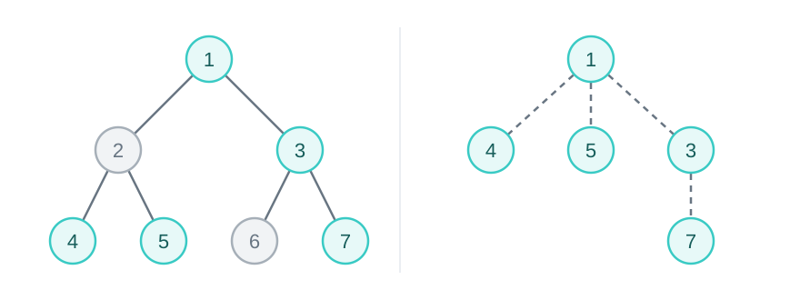

{{DefaultAPISidebar("DOM")}}

In the [Anatomy of the DOM](/en-US/docs/Web/API/Document_Object_Model/Anatomy_of_the_DOM) guide, we introduced properties for navigating between parents, children, and siblings, but manually walking the tree is verbose and error-prone. The DOM provides methods for directly obtaining the reference to an element in the tree by a unique identifier, a class name, a tag name, a CSS selector, and more. It also provides utility functions for iterating over tree nodes.

## Tree traversal: at a high level

The [Anatomy of the DOM](/en-US/docs/Web/API/Document_Object_Model/Anatomy_of_the_DOM) guide introduces the tree structure of the DOM. The tree has a root, and each node has a (possibly empty) list of children. The document root is a {{domxref("Document")}} node, while {{domxref("Element")}} nodes form the backbone of this tree.


There are many ways to [traverse a tree](https://en.wikipedia.org/wiki/Tree_traversal), but the DOM only exposes one order: pre-order DFS, which is called _document order_ or _tree order_. In pseudo-code, pre-order works like this:

```js
function traverseTree(root, visitor) {
  // Visit the root first
  visitor(root);
  for (const child of root.childNodes) {
    // Recursively visit each child in order
    // Each child subtree is completely visited before moving to the next
    traverseTree(child, visitor);
  }
}
```

An element precedes its descendants, and earlier siblings and their descendants precede later siblings. For example, in the tree above, the `Element` nodes listed in tree order are: `HTML`, `HEAD`, `TITLE`, `BODY`, `H1`, `P`.

Selection is just a form of traversal, with the `visitor` being a boolean function that tells us if we are interested in the element.

```js
function selectTree(root, visitor) {
  // visitor successfully matches the root node; return without going further
  if (visitor(root)) return root;
  for (const child of root.childNodes) {
    const result = selectTree(child, visitor);
    // A result is successfully found within the subtree at child
    if (result !== null) return result;
  }
  // No match found anywhere in the subtree at root
  return null;
}

function selectTreeMulti(root, visitor, collection) {
  if (visitor(root)) collection.push(root);
  for (const child of root.childNodes) {
    selectTreeMulti(child, visitor, collection);
  }
  return collection;
}
```

Once you understand these, you already understand a big part of DOM selection and traversal. All that remains is how each specialized DOM method defines its `visitor` function and `collection` object for you.

## Selecting elements by ID, class, or tag name

There are three main ways to identify an element: its [`id`](/en-US/docs/Web/API/Element/id), [`className`](/en-US/docs/Web/API/Element/className), and [`tagName`](/en-US/docs/Web/API/Element/tagName). The {{domxref("Document")}} interface provides three methods to select by these three identifiers: {{domxref("document.getElementById()")}}, {{domxref("document.getElementsByClassName()")}}, and {{domxref("document.getElementsByTagName()")}}. As the names suggest, `getElementById()` returns the reference to a single element (or `null` if no element is found), while `getElementsByClassName()` and `getElementsByTagName()` return collections of elements. The collection is a _live {{domxref("HTMLCollection")}}_; we will discuss this further in [Working with collections](#working_with_collections).

Each element's `id` should be unique within the document (but [shadow DOM](/en-US/docs/Web/API/Document_Object_Model/Shadow_DOM) are separate documents and therefore have their own scopes). As long as you uphold that requirement in your code, you will always get the element you intend with `getElementById()`. However, `id` attributes are used very sparingly because they are hard to be kept globally unique. Therefore, in real applications, you will often find `getElementsByClassName()` and `getElementsByTagName()` (or the [querying methods](#selecting_elements_with_css_selectors) we will introduce soon) more practical.

```html
<div id="container"></div>
<div class="profile big"></div>
```

```js
const containerDiv = document.getElementById("container");
// containerDiv is an HTMLDivElement

const profileDivs = document.getElementsByClassName("profile");
// profileDivs is an HTMLCollection containing an HTMLDivElement

const profileDivs2 = document.getElementsByTagName("div");
// profileDivs2 is an HTMLCollection containing both HTMLDivElements
```

Some notes worth calling out:

- The `getElementById()` method matches IDs case-sensitively. The `getElementsByClassName()` method also matches case-sensitively, except in [quirks mode](/en-US/docs/Web/HTML/Guides/Quirks_mode_and_standards_mode), where matching is ASCII case-insensitive.
- In HTML documents, `getElementsByTagName()` lowercases the argument when matching HTML elements. Non-HTML elements (e.g., SVG) are still matched case-sensitively. In XML documents, all tag-name matching is case-sensitive. Note that the `tagName` of an HTML element in an HTML document is returned in uppercase, but internally it's still stored in lowercase.
- The `class` attribute's value is a space-separated token list, and you can also specify a space-separated list for `getElementsByClassName()`. The `visitor` tests for a subset-of relationship: an element is matched if all of these class names are present on the element (extra class names on the element are also allowed).
- The `getElementsByTagName()` method takes the special `"*"` value to get all elements (i.e., apply no filtering).

If you are familiar with [CSS selectors](/en-US/docs/Web/CSS/Guides/Selectors), these methods are the DOM equivalents of the ID, class, type, and universal selectors:

```css
/* document.getElementById("container") */
#container {
}

/* document.getElementsByClassName("profile") */
.profile {
}

/* document.getElementsByClassName("profile big") */
.profile.big {
}

/* document.getElementsByTagName("div") */
div {
}

/* document.getElementsByTagName("*") */
* {
}
```

The `getElementById()` method is also available on {{domxref("DocumentFragment")}}; the `getElementsByClassName()` and `getElementsByTagName()` methods are also available on {{domxref("Element")}}. Calling the method on a node sets the search root to that node. The calling root is never matched.

## Selecting elements with CSS selectors

You can also directly use CSS selectors to select elements. Two methods are available on {{domxref("Document")}}, {{domxref("DocumentFragment")}}, and {{domxref("Element")}}: {{domxref("document.querySelector()")}} and {{domxref("document.querySelectorAll()")}}. Both methods search descendants, excluding the node on which they are called. The `querySelector()` method returns the first matching element; the `querySelectorAll()` method returns all matching elements in a _static {{domxref("NodeList")}}_. Again, we'll more formally introduce this collection in [Working with collections](#working_with_collections).

The selector methods accept [selectors](/en-US/docs/Web/CSS/Guides/Selectors) to determine what element or elements should be returned. This includes [selector lists](/en-US/docs/Web/CSS/Reference/Selectors/Selector_list) so you can group multiple selectors in a single query.

To select all paragraph (`p`) elements in a document whose classes include `warning` or `note`, you can do the following:

```js
const special = document.querySelectorAll("p.warning, p.note");
```

You can also query by ID. For example:

```js
const el = document.querySelector("#main, #basic, #exclamation");
```

After executing the above code, `el` contains the first element in the document whose ID is one of `main`, `basic`, or `exclamation`. The order of selectors in the list does not give one ID priority over another. An element that matches more than one selector appears only once in the result of `querySelectorAll()`.

[Pseudo-classes](/en-US/docs/Web/CSS/Reference/Selectors/Pseudo-classes), such as `:checked` and `:first-child`, can be used in queries. To protect the user's privacy, some pseudo-classes are not supported or behave differently. For example, {{cssxref(":visited")}} will return no matches and {{cssxref(":link")}} is treated as {{cssxref(":any-link")}}. Only elements can be selected, so [pseudo-elements](/en-US/docs/Web/CSS/Reference/Selectors/Pseudo-elements), such as `::before`, do not produce matching DOM elements.

The `querySelector` methods are basically supersets of the previously introduced `getElementBy` methods. Anything you can implement with the latter, you can achieve similar results with the former:

```js
document.getElementById("container");
// Is equivalent to:
document.querySelector("#container");

document.getElementsByClassName("profile big");
// Is equivalent to:
document.querySelectorAll(".profile.big");

document.getElementsByTagName("div");
// Is equivalent to:
document.querySelectorAll("div");
```

There are only two things to watch out for:

- The `getElementsByClassName()` and `getElementsByTagName()` methods return live collections, while `querySelectorAll()` returns a static collection (see [Live and static collections](#live_and_static_collections)). Usually, the static collection's behavior is what you want.
- The selector string must be valid CSS selector syntax; otherwise, the method throws a `SyntaxError` {{domxref("DOMException")}}. An HTML ID or class name is not necessarily a valid CSS identifier. Use {{domxref("CSS/escape_static", "CSS.escape()")}} when inserting such a value into an ID or class selector:

  ```js
  const id = "item:42";
  const item = document.querySelector(`#${CSS.escape(id)}`);
  // document.getElementById(id) needs no escaping.
  ```

Calling `querySelector()` or `querySelectorAll()` on an element limits the returned elements to its descendants, but the selector is applied in the context of the entire document. For example, given this HTML:

```html
<div>
  <section id="main">
    <p class="note">A direct child.</p>
    <div>
      <p class="note">A nested paragraph.</p>
    </div>
  </section>
</div>
```

A selector like `div p` still matches the first note, because this `p` is indeed nested in a `div`, although that `div` is outside of the search root. Use {{cssxref(":scope")}} so that the selector is only applied within the search root:

```js
const main = document.getElementById("main");
const allNotes = main.querySelectorAll("div p"); // Both paragraphs
const childNote = main.querySelectorAll(":scope div p"); // Only the second
const childNote2 = main.querySelectorAll(":scope > p"); // Only the first
```

The {{domxref("Element.matches()")}} method tests if an element matches the selector string, so `querySelector()` works like the `selectTree` function with `element.matches` passed as the `visitor` function (despite many technical differences).

You can also search _up_ using the {{domxref("Element.closest()")}} method. This tests the element itself, then its parent element, and so on toward the root, until it finds an ancestor element that matches the given selector.

Using the same HTML:

```js
const innerNote = document.querySelector("#main div p.note");
console.log(innerNote.closest("section").id); // "main"
```

## Working with collections

We already introduced two types of collections: _live {{domxref("HTMLCollection")}}_ as returned by `getElementsByClassName()` and `getElementsByTagName()`, and _static {{domxref("NodeList")}}_ as returned by `querySelectorAll()`. A `NodeList` can contain any type of node, while an `HTMLCollection` contains only elements (but the elements don't actually have to be HTML elements). You are perhaps already familiar with the {{domxref("Node.childNodes")}} property, which is also a `NodeList`. The `NodeList` returned by `querySelectorAll()` contains only elements because that method selects elements.

Both interfaces are [array-like](/en-US/docs/Web/JavaScript/Reference/Global_Objects/Array#array-like_objects), meaning that they have a `length` property and support indexed access. They also support [iteration](/en-US/docs/Web/JavaScript/Reference/Iteration_protocols).

```js
const paragraphs = document.querySelectorAll("p");
console.log(paragraphs.length);
console.log(paragraphs[0]);

for (const para of paragraphs) {
  // ...
}
```

However, they are not real {{jsxref("Array")}} objects, so they lack methods like {{jsxref("Array.prototype.map()")}}. If you need these methods, you can convert them to arrays, using [spread syntax](/en-US/docs/Web/JavaScript/Reference/Operators/Spread_syntax) or {{jsxref("Array.from()")}}:

```js
const paragraphs = [...document.querySelectorAll("p")];
const paragraphs2 = Array.from(document.querySelectorAll("p"));

const texts = paragraphs.map((p) => p.textContent);
```

The `NodeList` and `HTMLCollection` interfaces, along with many other array-like interfaces on the web, were an [attempt to create an unmodifiable list](https://stackoverflow.com/questions/74630989/why-use-domstringlist-rather-than-an-array/74641156#74641156). They don't provide any way to modify them, and modifying the converted arrays does not affect the original list.

{{domxref("HTMLCollection")}} is not just a list; it's also a key-value map that allows lookup by the elements' ID or HTML elements' `name`. You can either use {{domxref("HTMLCollection/namedItem", "namedItem()")}} or directly access them as properties (as long as they don't collide with existing property names of the `HTMLCollection`).

```js
const sections = document.getElementsByTagName("section");
const main = sections.namedItem("main");
const main2 = sections["main"];
```

The interfaces provide some additional convenience methods:

- Both interfaces provide an {{domxref("NodeList/item", "item()")}} method, which works like indexed access. The main difference is that it returns `null` when the index is out of range, whereas indexed access returns `undefined`; it also applies different input conversion rules.
- {{domxref("NodeList")}} provides {{domxref("NodeList/forEach", "forEach()")}}, {{domxref("NodeList/entries", "entries()")}}, {{domxref("NodeList/keys", "keys()")}}, and {{domxref("NodeList/values", "values()")}}. They work in the exact same way as the `Array` methods, so if you just need these methods, you don't have to convert it to an `Array`.

### Live and static collections

The `HTMLCollection` objects returned by `getElementsByTagName()` and `getElementsByClassName()` are _live_. Essentially, the collection doesn't store anything upfront; it just remembers the root element and the query. When you actually try to retrieve its length or an element in it, the collection then performs the actual traversal on the current DOM tree. (This may work differently in a real browser due to optimizations.) Therefore, if you save the collection and then update the DOM tree, the collection now reflects the latest DOM tree.

```js
const container = document.createElement("div");
const paragraph = document.createElement("p");
paragraph.className = "note";
container.append(paragraph);

const liveList = container.getElementsByClassName("note");
console.log(liveList.length); // 1

paragraph.classList.remove("note");
console.log(liveList.length); // 0
```

On the other hand, the `NodeList` object returned by `querySelectorAll()` is _static_, meaning that it's a snapshot of the tree's state at the time of the method call. A static list preserves its membership, not the state of the nodes: it still refers to the original node objects.

```js
const container = document.createElement("div");
const paragraph = document.createElement("p");
paragraph.className = "note";
container.append(paragraph);

const staticList = container.querySelectorAll(".note");
console.log(staticList.length); // 1

paragraph.classList.remove("note");
console.log(staticList.length); // 1
console.log(staticList[0].className); // ""
```

Usually, a static list is what you want. You almost always want to convert the collections to arrays anyway to use the array methods, at which point the collection is no longer live. Also, if you change a live collection while iterating over it, its indices and length can change, creating unintended [concurrent modifications](/en-US/docs/Web/JavaScript/Reference/Global_Objects/Array#mutating_initial_array_in_iterative_methods):

```js
const notes = document.getElementsByClassName("note");
for (const note of notes) {
  // This simultaneously removes this element from the collection, shifting
  // all later elements, so the next iteration doesn't visit the next element
  note.classList.remove("note");
}
```

To fix this, iterate over a snapshot, such as an array created with `Array.from(notes)` or a static list obtained with `querySelectorAll(".note")`. Alternatively, defer mutations that change the collection's membership or order until after iteration. You can still keep a reference to the live collection to observe later updates.

## Traversing nodes

Selector methods can be used to iterate over elements, like this:

```js
for (const descendant of element.querySelectorAll("*")) {
  // Visit every single descendant element in this subtree
}
```

However, this is quite limited: you cannot visit non-elements like text or comments, and you cannot avoid visiting a particular subtree without writing complicated selectors. The DOM provides two interfaces for general traversal: {{domxref("NodeIterator")}} and {{domxref("TreeWalker")}}. Create these objects using {{domxref("Document/createNodeIterator", "document.createNodeIterator()")}} or {{domxref("Document/createTreeWalker", "document.createTreeWalker()")}}. Both methods take the same three arguments:

- `root`: The node at which the traversal is rooted.
- `whatToShow` {{optional_inline}}: Specifies which node types to return. A node that's not shown can still have descendants that are shown. It defaults to `NodeFilter.SHOW_ALL`.
- `filter` {{optional_inline}}: A function, or an object with an `acceptNode(node)` method. The function can decide if a node should be skipped, and if so, whether its descendants should be skipped too (only for `TreeWalker`). It defaults to `null`, meaning no additional filtering.

Both objects expose these settings through their read-only `root`, `whatToShow`, and `filter` properties.

The `NodeFilter` interface provides constants for `whatToShow`.

| Constant                                 | Shown nodes                          |
| ---------------------------------------- | ------------------------------------ |
| `NodeFilter.SHOW_ALL`                    | All                                  |
| `NodeFilter.SHOW_ATTRIBUTE`              | {{domxref("Attr")}}                  |
| `NodeFilter.SHOW_CDATA_SECTION`          | {{domxref("CDATASection")}}          |
| `NodeFilter.SHOW_COMMENT`                | {{domxref("Comment")}}               |
| `NodeFilter.SHOW_DOCUMENT`               | {{domxref("Document")}}              |
| `NodeFilter.SHOW_DOCUMENT_FRAGMENT`      | {{domxref("DocumentFragment")}}      |
| `NodeFilter.SHOW_DOCUMENT_TYPE`          | {{domxref("DocumentType")}}          |
| `NodeFilter.SHOW_ELEMENT`                | {{domxref("Element")}}               |
| `NodeFilter.SHOW_PROCESSING_INSTRUCTION` | {{domxref("ProcessingInstruction")}} |
| `NodeFilter.SHOW_TEXT`                   | {{domxref("Text")}}                  |

> [!NOTE]
> The `NodeFilter.SHOW_ATTRIBUTE` constant is only effective when the root is an attribute node. Since the parent of any `Attr` node is
> always `null`, {{DOMXref("TreeWalker.nextNode()")}} and {{DOMXref("TreeWalker.previousNode()")}} will never return an `Attr` node. To
> traverse `Attr` nodes, use {{DOMXref("Element.attributes")}} instead.

All these constants are bitmasks, so you can combine constants with the [bitwise OR operator](/en-US/docs/Web/JavaScript/Reference/Operators/Bitwise_OR) (`|`) to include multiple node types, such as `NodeFilter.SHOW_ELEMENT | NodeFilter.SHOW_TEXT` to include both element and text nodes.

A node that doesn't pass `whatToShow` is never passed to the `filter` function. However, it may still have descendants that are visited.

The `filter` function (or its `acceptNode()` method) is called when traversal evaluates a candidate node whose type matches `whatToShow`. Descendants of a rejected `TreeWalker` subtree may never reach the filter. The filter must return one of these constants:

- `NodeFilter.FILTER_ACCEPT`: causes the node to be actually returned.
- `NodeFilter.FILTER_SKIP`: causes the node to be skipped, but its descendants are still considered.
- `NodeFilter.FILTER_REJECT`: for `TreeWalker`, causes the node and all its descendants to be skipped; for `NodeIterator`, behaves like `FILTER_SKIP`.

For example, the following iterates over all non-whitespace text nodes:

```js
const iterator = document.createNodeIterator(
  document.body,
  NodeFilter.SHOW_TEXT,
  (node) =>
    node.data.trim() ? NodeFilter.FILTER_ACCEPT : NodeFilter.FILTER_SKIP,
);
```

### Iterating in tree order with NodeIterator

A {{domxref("NodeIterator")}} visits nodes in tree order with {{domxref("NodeIterator/nextNode", "nextNode()")}} and in reverse tree order with {{domxref("NodeIterator/previousNode", "previousNode()")}}. Each call returns a node accepted by the filter, or `null` if there is no such node in that direction.

Continuing the preceding example, you can continuously move forward in tree order and log each text node:

```js
let node;
while ((node = iterator.nextNode())) {
  console.log(node.data);
}
```

Abstractly, `NodeIterator` works as if it keeps a list of nodes that passed the filter, sorted in tree order (it doesn't actually store that). The iterator tracks a position immediately between two nodes in that list, exposed as {{domxref("NodeIterator/referenceNode", "referenceNode")}} and {{domxref("NodeIterator/pointerBeforeReferenceNode", "pointerBeforeReferenceNode")}}. The `nextNode()` method returns the node immediately to the right of that position, while `previousNode()` returns the node immediately to its left. Initially, {{domxref("NodeIterator/referenceNode", "referenceNode")}} is the root and {{domxref("NodeIterator/pointerBeforeReferenceNode", "pointerBeforeReferenceNode")}} is `true`, so the first call to `nextNode()` returns the root if it passes the filters, while the first call to `previousNode()` returns `null` because there's nothing to the left. After a successful `nextNode()` call, the `referenceNode` is the returned node and `pointerBeforeReferenceNode` is `false`; vice versa for `previousNode()`. Consequently, reversing direction returns the same node again if it still passes the filters.

### Navigating the filtered tree with TreeWalker

{{domxref("NodeIterator")}} exposes the filtered nodes as a linear collection, which is convenient for iteration but does not preserve the tree structure. A {{domxref("TreeWalker")}} lets you navigate the relationships between nodes in a filtered view of the tree.

Abstractly, `TreeWalker` works as if it keeps a _tree_ of nodes that passed the filter, such that for every node in the filtered view, its direct children are its descendants on the original tree if there's no intervening node that also passes the filter. Remember that `NodeFilter.FILTER_SKIP` skips a node but allows its descendants, while `NodeFilter.FILTER_REJECT` skips a node and all its descendants.



Its {{domxref("TreeWalker/currentNode", "currentNode")}} property starts at the root, even if the root does not pass the filters. Unlike a `NodeIterator`, calling `nextNode()` starts searching after this current node, so the root itself is never returned on the first call.

The following methods move `currentNode` around the filtered view. If no such node is found, they return `null` and leave `currentNode` unchanged: {{domxref("TreeWalker/parentNode", "parentNode()")}}, {{domxref("TreeWalker/firstChild", "firstChild()")}}, {{domxref("TreeWalker/lastChild", "lastChild()")}}, {{domxref("TreeWalker/previousSibling", "previousSibling()")}}, {{domxref("TreeWalker/nextSibling", "nextSibling()")}}.

Note that the filtered view might not be a single tree if the root does not pass the filter. Use {{domxref("TreeWalker/previousNode", "previousNode()")}} and {{domxref("TreeWalker/nextNode", "nextNode()")}} to find the previous/next passing node in tree order, which may belong to a different filtered tree. These methods also return `null` and leave `currentNode` unchanged if no such node is found.

Unlike an iterator's `referenceNode`, `currentNode` is writable. You can save it and assign it back later, or reset the walker to its root with `walker.currentNode = walker.root`. Assignment does not apply the filters or check that the node is within the root's subtree, so keep it within that subtree when you want traversal to remain there.

For example, given this HTML:

```html
<article id="article">
  <p>Read <strong>this</strong> paragraph.</p>
  <aside data-skip><p>Ignore this note.</p></aside>
  <p>Read this paragraph too.</p>
</article>
```

This walker collects non-whitespace text nodes while excluding subtrees marked with `data-skip`:

```js
const article = document.getElementById("article");
const walker = document.createTreeWalker(
  article,
  NodeFilter.SHOW_ELEMENT | NodeFilter.SHOW_TEXT,
  (node) => {
    if (node.nodeType === Node.ELEMENT_NODE) {
      return node.hasAttribute("data-skip")
        ? NodeFilter.FILTER_REJECT
        : NodeFilter.FILTER_SKIP;
    }
    return node.data.trim() ? NodeFilter.FILTER_ACCEPT : NodeFilter.FILTER_SKIP;
  },
);

const parts = [];
let node;
while ((node = walker.nextNode())) {
  parts.push(node.data);
}
console.log(parts.join(""));
// "Read this paragraph.Read this paragraph too."
```

`SHOW_ELEMENT` is necessary even though we only collect text, because it lets the filter inspect and reject elements with `data-skip`. With only `SHOW_TEXT`, those elements would be skipped before the filter gets called, and their text would still be visited. Because `NodeIterator` has no concept of the tree structure, there's no way to exclude entire subtrees.

## Summary

Here are all the features useful for selecting elements in the DOM tree or traversing the nodes:

- To select elements by ID, class, or tag name: {{domxref("Document/getElementById", "getElementById()")}} (also available on `DocumentFragment`), {{domxref("Document/getElementsByClassName", "getElementsByClassName()")}}, and {{domxref("Document/getElementsByTagName", "getElementsByTagName()")}} (both also available on `Element`).
- To select elements with CSS selectors: {{domxref("Element/querySelector", "querySelector()")}} for the first match, or {{domxref("Element/querySelectorAll", "querySelectorAll()")}} for all matches. Both also available on `DocumentFragment` and `Element`.
- To test an element or search its ancestors: {{domxref("Element/matches", "matches()")}} and {{domxref("Element/closest", "closest()")}}.
- The {{domxref("NodeList")}} and {{domxref("HTMLCollection")}} interfaces are array-like collections of nodes/elements providing `length`, indexed access, iteration, and `item()`. `NodeList` also provides `forEach()`, `entries()`, `keys()`, and `values()`. `HTMLCollection` provides {{domxref("HTMLCollection/namedItem", "namedItem()")}} and named property access.
- {{domxref("document.createNodeIterator()")}} creates a {{domxref("NodeIterator")}} that traverses nodes sequentially, using its {{domxref("NodeIterator/nextNode", "nextNode()")}}/{{domxref("NodeIterator/previousNode", "previousNode()")}} methods. Its position is exposed through {{domxref("NodeIterator/referenceNode", "referenceNode")}} and {{domxref("NodeIterator/pointerBeforeReferenceNode", "pointerBeforeReferenceNode")}}.
- {{domxref("document.createTreeWalker()")}} creates a {{domxref("TreeWalker")}} that traverses nodes in the filtered tree view, using its `parentNode()`, `firstChild()`/`lastChild()`, `previousSibling()`/`nextSibling()`, and `previousNode()`/`nextNode()` methods. Its position is exposed through {{domxref("TreeWalker/currentNode", "currentNode")}}.
- The `NodeFilter.SHOW_*` bitmasks select node types, and a filter function or `acceptNode()` method returns `FILTER_ACCEPT`, `FILTER_SKIP`, or `FILTER_REJECT`. Only `TreeWalker` uses `FILTER_REJECT` to prune subtrees.

## See also

- [Anatomy of the DOM](/en-US/docs/Web/API/Document_Object_Model/Anatomy_of_the_DOM)
- [CSS Selectors](/en-US/docs/Web/CSS/Guides/Selectors)
- {{domxref("Element.querySelector()")}}
- {{domxref("Element.querySelectorAll()")}}
- {{domxref("Document.querySelector()")}}
- {{domxref("Document.querySelectorAll()")}}
- {{domxref("NodeIterator")}}
- {{domxref("TreeWalker")}}
- [DOM Standard: Traversal](https://dom.spec.whatwg.org/#traversal)
- [Selectors specification](https://drafts.csswg.org/selectors/)
