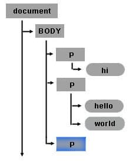
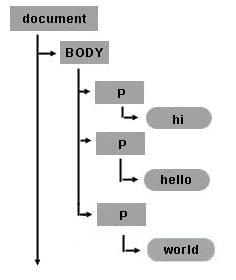

{{DefaultAPISidebar("DOM")}}

This article is an overview of some powerful, fundamental DOM level 1 methods and how to use them from JavaScript. You will learn how to create, access and control, and remove HTML elements dynamically. The DOM methods presented here are not specific to HTML; they also apply to XML. The demonstrations provided here will work fine in any modern browser.

> [!NOTE]
> The DOM methods presented here are part of the Document Object Model (Core) level 1 specification. DOM level 1 includes both methods for generic document access and manipulation (DOM 1 Core) as well as methods specific to HTML documents (DOM 1 HTML).

## Creating an HTML table dynamically

### Example

In this example we add a new table to the page when a button is clicked.

#### HTML

```html
<input type="button" value="Generate a table" onclick="generateTable()" />
```

#### JavaScript

```js
function generateTable() {
  // creates a <table> element and a <tbody> element
  const tbl = document.createElement("table");
  const tblBody = document.createElement("tbody");

  // creating all cells
  for (let i = 0; i < 2; i++) {
    // creates a table row
    const row = document.createElement("tr");

    for (let j = 0; j < 2; j++) {
      // Create a <td> element and a text node, make the text
      // node the contents of the <td>, and put the <td> at
      // the end of the table row
      const cell = document.createElement("td");
      const cellText = document.createTextNode(`cell in row ${i}, column ${j}`);
      cell.appendChild(cellText);
      row.appendChild(cell);
    }

    // add the row to the end of the table body
    tblBody.appendChild(row);
  }

  // put the <tbody> in the <table>
  tbl.appendChild(tblBody);
  // appends <table> into <body>
  document.body.appendChild(tbl);
  // sets the border attribute of tbl to '2'
  tbl.setAttribute("border", "2");
}
```

```css hidden
table {
  margin: 1rem auto;
}

td {
  padding: 0.5rem;
}
```

#### Result

{{ EmbedLiveSample('Example') }}

### Explanation

Note the order in which we created the elements and the text node:

1. First we created the `<table>` element.
2. Next, we created the `<tbody>` element, which is a child of the `<table>` element.
3. Next, we used a loop to create the `<tr>` elements, which are children of the `<tbody>` element.
4. For each `<tr>` element, we used a loop to create the `<td>` elements, which are children of `<tr>` elements.
5. For each `<td>` element, we then created the text node with the table cell's text.

Once we have created the `<table>`, `<tbody>`, `<tr>`, and `<td>` elements, and then the text node, we then append each object to its parent in the opposite order:

1. First, we attach each text node to its parent `<td>` element using

   ```js
   cell.appendChild(cellText);
   ```

2. Next, we attach each `<td>` element to its parent `<tr>` element using

   ```js
   row.appendChild(cell);
   ```

3. Next, we attach each `<tr>` element to the parent `<tbody>` element using

   ```js
   tblBody.appendChild(row);
   ```

4. Next, we attach the `<tbody>` element to its parent `<table>` element using

   ```js
   tbl.appendChild(tblBody);
   ```

5. Next, we attach the `<table>` element to its parent `<body>` element using

   ```js
   document.body.appendChild(tbl);
   ```

Remember this technique. You will use it frequently in programming for the W3C DOM. First, you create elements from the top down; then you attach the children to the parents from the bottom up.

Here's the HTML markup generated by the JavaScript code:

```html
<table border="2">
  <tbody>
    <tr>
      <td>cell is row 0 column 0</td>
      <td>cell is row 0 column 1</td>
    </tr>
    <tr>
      <td>cell is row 1 column 0</td>
      <td>cell is row 1 column 1</td>
    </tr>
  </tbody>
</table>
```

Here's the DOM object tree generated by the code for the `<table>` element and its child elements:


You can build this table and its internal child elements by using just a few DOM methods. Remember to keep in mind the tree model for the structures you are planning to create; this will make it easier to write the necessary code. In the `<table>` tree of Figure 1 the element `<table>` has one child: the element `<tbody>`. `<tbody>` has two children. Each `<tbody>`'s child (`<tr>`) has two children (`<td>`). Finally, each `<td>` has one child: a text node.

## Setting the background color of a paragraph

### Example

In this example we change the background color of a paragraph when a button is clicked.

#### HTML

```html
<body>
  <input
    type="button"
    value="Set paragraph background color"
    onclick="setBackground()" />
  <p>hi</p>
  <p>hello</p>
</body>
```

#### JavaScript

```js
function setBackground() {
  // now, get all the p elements in the document
  const paragraphs = document.getElementsByTagName("p");

  // get the second paragraph from the list
  const secondParagraph = paragraphs[1];

  // set the inline style
  secondParagraph.style.background = "red";
}
```

#### Result

{{ EmbedLiveSample('Example_2') }}

### Explanation

`getElementsByTagName(tagNameValue)` is a method available in any DOM {{domxref("Element")}} or the root {{domxref("Document")}} element. When called, it returns an array with all of the element's descendants matching the tag name. The first element of the list is located at position `[0]` in the array.

We've performed following steps:

1. First, we get all the `p` elements in the document:

   ```js
   const paragraphs = document.getElementsByTagName("p");
   ```

2. Then we get the second paragraph element from the list of `p` elements:

   ```js
   const secondParagraph = paragraphs[1];
   ```

   

3. Finally, we set background color to red using the {{domxref("HTMLElement.style", "style")}} property of the {{domxref("HTMLParagraphElement", "paragraph")}} object:

   ```js
   secondParagraph.style.background = "red";
   ```

### Creating TextNodes with document.createTextNode("..")

Use the document object to invoke the `createTextNode` method and create your text node. You just need to pass the text content. The return value is an object that represents the text node.

```js
myTextNode = document.createTextNode("world");
```

This means that you have created a node of the type `TEXT_NODE` (a piece of text) whose text data is `"world"`, and `myTextNode` is your reference to this node object. To insert this text into your HTML page, you need to make this text node a child of some other node element.

### Inserting Elements with appendChild(..)

So, by calling `secondParagraph.appendChild(node_element)`, you are making the element a new child of the second `<p>` element.

```js
secondParagraph.appendChild(myTextNode);
```

After testing this sample, note that the words hello and world are together: helloworld. So visually, when you see the HTML page it seems like the two text nodes hello and world are a single node, but remember that in the document model, there are two nodes. The second node is a new node of type `TEXT_NODE`, and it is the second child of the second `<p>` tag. The following figure shows the recently created Text Node object inside the document tree.


> **Note:** `createTextNode()` and `appendChild()` is a simple way to include white space between the words _hello_ and _world_. Another important note is that the `appendChild` method will append the child after the last child, just like the word _world_ has been added after the word _hello_. So if you want to append a text node between _hello_ and _world_, you will need to use `insertBefore` instead of `appendChild`.

### Creating New Elements with the document object and the createElement(..) method

You can create new HTML elements or any other element you want with `createElement`. For example, if you want to create a new `<p>` element as a child of the `<body>` element, you can use the `myBody` in the previous example and append a new element node. To create a node call `document.createElement("tagname")`. For example:

```js
myNewPTagNode = document.createElement("p");
myBody.appendChild(myNewPTagNode);
```



### Removing nodes with the removeChild(..) method

Nodes can be removed. The following code removes text node `myTextNode` (containing the word "world") from the second `<p>` element, `secondParagraph`.

```js
secondParagraph.removeChild(myTextNode);
```

Text node `myTextNode` (containing the word "world") still exists. The following code attaches `myTextNode` to the recently created `<p>` element, `myNewPTagNode`.

```js
myNewPTagNode.appendChild(myTextNode);
```

The final state for the modified object tree looks like this:



## Creating a table dynamically (back to Sample1.html)

For the rest of this article we will continue working with sample1.html. The following figure shows the table object tree structure for the table created in the sample.

### Reviewing the HTML Table structure


### Creating element nodes and inserting them into the document tree

The basic steps to create the table in sample1.html are:

- Get the body object (first item of the document object).
- Create all the elements.
- Finally, append each child according to the table structure (as in the above figure). The following source code is a commented version for the sample1.html.

> [!NOTE]
> At the end of the `start` function, there is a new line of code. The table's `border` property was set using another DOM method, `setAttribute()`. `setAttribute()` has two arguments: the attribute name and the attribute value. You can set any attribute of any element using the `setAttribute` method.

```html
<html lang="en">
  <head>
    <title>
      Sample code - Traversing an HTML Table with JavaScript and DOM Interfaces
    </title>
    <script>
      function start() {
        // get the reference for the body
        const myBody = document.getElementsByTagName("body")[0];

        // creates <table> and <tbody> elements
        const myTable = document.createElement("table");
        const myTableBody = document.createElement("tbody");

        // creating all cells
        for (let j = 0; j < 3; j++) {
          // creates a <tr> element
          const myCurrentRow = document.createElement("tr");

          for (let i = 0; i < 4; i++) {
            // creates a <td> element
            const myCurrentCell = document.createElement("td");
            // creates a Text Node
            const currentText = document.createTextNode(
              `cell is row ${j}, column ${i}`,
            );
            // appends the Text Node we created into the cell <td>
            myCurrentCell.appendChild(currentText);
            // appends the cell <td> into the row <tr>
            myCurrentRow.appendChild(myCurrentCell);
          }
          // appends the row <tr> into <tbody>
          myTableBody.appendChild(myCurrentRow);
        }

        // appends <tbody> into <table>
        myTable.appendChild(myTableBody);
        // appends <table> into <body>
        myBody.appendChild(myTable);
        // sets the border attribute of myTable to 2;
        myTable.setAttribute("border", "2");
      }
    </script>
  </head>
  <body onload="start()"></body>
</html>
```

## Manipulating the table with DOM and CSS

### Getting a text node from the table

This example introduces two new DOM attributes. First it uses the `childNodes` attribute to get the list of child nodes of myCell. The `childNodes` list includes all child nodes, regardless of what their name or type is. Like `getElementsByTagName()`, it returns a list of nodes.

The differences are that (a) `getElementsByTagName()` only returns elements of the specified tag name; and (b) `childNodes` includes all descendants at any level, not just immediate children.

Once you have the returned list, use `[x]` method to retrieve the desired child item. This example stores in `myCellText` the text node of the second cell in the second row of the table.

Then, to display the results in this example, it creates a new text node whose content is the data of `myCellText`, and appends it as a child of the `<body>` element.

> [!NOTE]
> If your object is a text node, you can use the data attribute and retrieve the text content of the node.

```js
myBody = document.getElementsByTagName("body")[0];
myTable = myBody.getElementsByTagName("table")[0];
myTableBody = myTable.getElementsByTagName("tbody")[0];
myRow = myTableBody.getElementsByTagName("tr")[1];
myCell = myRow.getElementsByTagName("td")[1];

// first item element of the childNodes list of myCell
myCellText = myCell.childNodes[0];

// content of currentText is the data content of myCellText
currentText = document.createTextNode(myCellText.data);
myBody.appendChild(currentText);
```

### Getting an attribute value

At the end of sample1 there is a call to `setAttribute` on the `myTable` object. This call was used to set the border property of the table. To retrieve the value of the attribute, use the `getAttribute` method:

```js
myTable.getAttribute("border");
```

### Hiding a column by changing style properties

Once you have the object in your JavaScript variable, you can set `style` properties directly. The following code is a modified version of sample1.html in which each cell of the second column is hidden and each cell of the first column is changed to have a red background. Note that the `style` property was set directly.

```html
<html lang="en">
  <body onload="start()"></body>
  <script>
    function start() {
      const myBody = document.getElementsByTagName("body")[0];
      const myTable = document.createElement("table");
      const myTableBody = document.createElement("tbody");

      for (let row = 0; row < 2; row++) {
        const myCurrentRow = document.createElement("tr");
        for (let col = 0; col < 2; col++) {
          const myCurrentCell = document.createElement("td");
          const currentText = document.createTextNode(`cell is: ${row}${col}`);
          myCurrentCell.appendChild(currentText);
          myCurrentRow.appendChild(myCurrentCell);
          // set the cell background color
          // if the column is 0. If the column is 1 hide the cell
          if (col === 0) {
            myCurrentCell.style.background = "rgb(255 0 0)";
          } else {
            myCurrentCell.style.display = "none";
          }
        }
        myTableBody.appendChild(myCurrentRow);
      }
      myTable.appendChild(myTableBody);
      myBody.appendChild(myTable);
    }
  </script>
</html>
```
