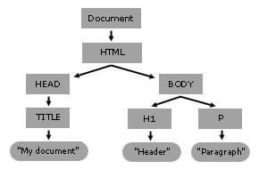

{{DefaultAPISidebar("DOM")}}

The _Document Object Model_ (DOM) is an API for manipulating DOM trees of HTML and XML documents (among other tree-like documents). This API is at the root of the description of a page and serves as a base for scripting on the web.

## What is a DOM tree?

A **DOM tree** is a [tree structure](https://en.wikipedia.org/wiki/Tree_structure) whose nodes represent an HTML or XML document's contents. Each HTML or XML document has a DOM tree representation. For example, consider the following document:

```html
<html lang="en">
  <head>
    <title>My Document</title>
  </head>
  <body>
    <h1>Header</h1>
    <p>Paragraph</p>
  </body>
</html>
```

It has a DOM tree that looks like this:



Although the above tree is similar to the above document's DOM tree, it's not identical, as [the actual DOM tree preserves whitespace](/en-US/docs/Web/API/Document_Object_Model/Whitespace).

When a web browser parses an HTML document, it builds a DOM tree and then uses it to display the document.

## What does the Document API do?

The Document API, also sometimes called the DOM API, allows you to modify a DOM tree in _any way you want_. It enables you to create any HTML or XML document from scratch or to change any contents of a given HTML or XML document. Web page authors can edit the DOM of a document using JavaScript to access the `document` property of the global object. This `document` object implements the {{domxref("Document")}} interface.

## A simple example

Suppose the author wants to change the header of the above document and write two paragraphs instead of one. The following script would do the job:

### HTML

```html
<html lang="en">
  <head>
    <title>My Document</title>
  </head>
  <body>
    <input type="button" value="Change this document." onclick="change()" />
    <h2>Header</h2>
    <p>Paragraph</p>
  </body>
</html>
```

### JavaScript

```js
function change() {
  // document.getElementsByTagName("h2") returns a NodeList of the <h2>
  // elements in the document, and the first is number 0:
  const header = document.getElementsByTagName("h2").item(0);

  // The firstChild of the header is a Text node:
  header.firstChild.data = "A dynamic document";

  // Now header is "A dynamic document".

  // Access the first paragraph
  const para = document.getElementsByTagName("p").item(0);
  para.firstChild.data = "This is the first paragraph.";

  // Create a new Text node for the second paragraph
  const newText = document.createTextNode("This is the second paragraph.");

  // Create a new Element to be the second paragraph
  const newElement = document.createElement("p");

  // Put the text in the paragraph
  newElement.appendChild(newText);

  // Put the paragraph on the end of the document by appending it to
  // the body (which is the parent of para)
  para.parentNode.appendChild(newElement);
}
```

{{ EmbedLiveSample('A_simple_example', 800, 300) }}

## How can I learn more?

Now that you are familiar with the basic concepts of the DOM, you may want to learn about the more about fundamental features of the Document API by reading [how to traverse an HTML table with JavaScript and DOM interfaces](/en-US/docs/Web/API/Document_Object_Model/Traversing_an_HTML_table_with_JavaScript_and_DOM_Interfaces).

## See also

- The [Document Object Model](/en-US/docs/Web/API/Document_Object_Model) (DOM).
