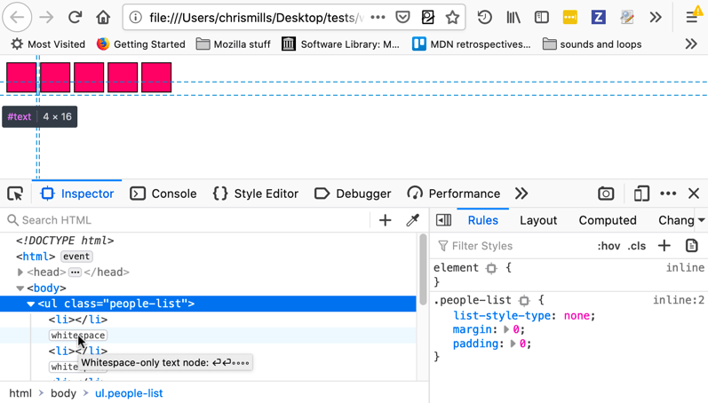

{{DefaultAPISidebar("DOM")}}

The presence of whitespace in the [DOM](/en-US/docs/Web/API/Document_Object_Model) can cause layout problems and make manipulation of the content tree difficult in unexpected ways, depending on where it is located. This article explores when difficulties can occur, and looks at what can be done to mitigate resulting problems.

## What is whitespace?

Whitespace is any string of text composed only of spaces, tabs or line breaks (to be precise, CRLF sequences, carriage returns or line feeds). These characters allow you to format your code in a way that will make it easily readable by yourself and other people. In fact, much of our source code is full of these whitespace characters, and we only tend to get rid of it in a production build step to reduce code download sizes.

### HTML largely ignores whitespace?

In the case of HTML, whitespace is largely ignored — whitespace in between words is treated as a single character, and whitespace at the start and end of elements and outside elements is ignored. Take the following minimal example:

```html
<!DOCTYPE html>

  <h1>      Hello      World!     </h1>
```

This source code contains a couple of line feeds after the `DOCTYPE` and a bunch of space characters before, after, and inside the `<h1>` element, but the browser doesn't seem to care at all and just shows the words "Hello World!" as if these characters didn't exist at all:

{{EmbedLiveSample('HTML_largely_ignores_whitespace')}}

This is so that whitespace characters don't impact the layout of your page. Creating space around and inside elements is the job of CSS.

### What _does_ happen to whitespace?

They don't just disappear, however.

Any whitespace characters that are outside of HTML elements in the original document are represented in the DOM. This is needed internally so that the editor can preserve formatting of documents. This means that:

- There will be some text nodes that contain only whitespace, and
- Some text nodes will have whitespace at the beginning or end.

Take the following document, for example:

```html
<!DOCTYPE html>
<html lang="en-US">
<head>
  <meta charset="UTF-8">
  <title>My Document</title>
</head>
<body>
  <h1>Header</h1>
  <p>
    Paragraph
  </p>
</body>
</html>
```

The DOM tree for this looks like so:


Conserving whitespace characters in the DOM is useful in many ways, but there are certain places where this makes certain layouts more difficult to implement, and causes problems for developers who want to iterate through nodes in the DOM. We'll look at these, and some solutions, later on.

### How does CSS process whitespace?

Most whitespace characters are ignored, not all of them are. In the earlier example one of the spaces between "Hello" and "World!" still exists when the page is rendered in a browser. There are rules in the browser engine that decide which whitespace characters are useful and which aren't — these are specified at least in part in [CSS Text Module Level 3](https://www.w3.org/TR/css-text-3/), and especially the parts about the [CSS `white-space` property](https://www.w3.org/TR/css-text-3/#white-space-property) and [whitespace processing details](https://www.w3.org/TR/css-text-3/#white-space-processing), but we also offer an easier explanation below.

#### Example

Let's take another example. To make it easier, we've added a comment that shows all spaces with ◦, all tabs with ⇥ , and all line breaks with ⏎:

This example:

```html
<h1>   Hello
        <span> World!</span>   </h1>

<!--
<h1>◦◦◦Hello◦⏎
⇥⇥⇥⇥<span>◦World!</span>⇥◦◦</h1>
-->
```

is rendered in the browser like so:

{{EmbedLiveSample('Example')}}

#### Explanation

The `<h1>` element contains only inline elements. In fact it contains:

- A text node (consisting of some spaces, the word "Hello" and some tabs).
- An inline element (the `<span>`, which contains a space, and the word "World!").
- Another text node (consisting only of tabs and spaces).

Because of this, it establishes what is called an [inline formatting context](/en-US/docs/Web/CSS/Inline_formatting_context). This is one of the possible layout rendering contexts that browser engines work with.

Inside this context, whitespace character processing can be summarized as follows:

1. First, all spaces and tabs immediately before and after a line break are ignored so, if we take our example markup from before and apply this first rule, we get:

    ```html
    <h1>◦◦◦Hello⏎
    <span>◦World!</span>⇥◦◦</h1>
    ```

2. Next, all tab characters are handled as space characters, so the example becomes:

    ```html
    <h1>◦◦◦Hello⏎
    <span>◦World!</span>◦◦◦</h1>
    ```

3. Next, line breaks are converted to spaces:

    ```html
    <h1>◦◦◦Hello◦<span>◦World!</span>◦◦◦</h1>
    ```

4. After that, any space immediately following another space (even across two separate inline elements) is ignored, so we end up with:

    ```html
    <h1>◦Hello◦<span>World!</span>◦</h1>
    ```

5. And finally, sequences of spaces at the beginning and end of an element are removed, so we finally get this:

    ```html
    <h1>Hello◦<span>World!</span></h1>
    ```

This is why people visiting the web page will see the phrase "Hello World!" nicely written at the top of the page, rather than a weirdly indented "Hello" followed but an even more weirdly indented "World!" on the line below that.

> **Note:** [Firefox DevTools](https://firefox-source-docs.mozilla.org/devtools-user/index.html) have supported highlighting text nodes since version 52, making it easier to see exactly what nodes whitespace characters are contained within. Pure whitespace nodes are marked with a "whitespace" label.

### Whitespace in block formatting contexts

Above we just looked at elements that contain inline elements, and inline formatting contexts. If an element contains at least one block element, then it instead establishes what is called a [block formatting context](/en-US/docs/Web/Guide/CSS/Block_formatting_context).

Within this context, whitespace is treated very differently.

#### Example

Let's take a look at an example to explain how. We've marked the whitespace characters as before.

We have 3 text nodes that contain only whitespace, one before the first `<div>`, one between the 2 `<divs>`, and one after the second `<div>`.

```html
<body>
  <div>  Hello  </div>

   <div>  World!   </div>
</body>

<!--
<body>⏎
⇥<div>◦◦Hello◦◦</div>⏎
⏎
◦◦◦<div>◦◦World!◦◦</div>◦◦⏎
</body>
-->
```

This renders like so:

{{EmbedLiveSample('Example_2')}}

#### Explanation

We can summarize how the whitespace here is handled as follows (the may be some slight differences in exact behavior between browsers, but this basically works):

1. Because we're inside a block formatting context, everything must be a block, so our 3 text nodes also become blocks, just like the 2 `<div>`s. Blocks occupy the full width available and are stacked on top of each other, which means that we end up with a layout composed of this list of blocks:

    ```html
    <block>⏎⇥</block>
    <block>◦◦Hello◦◦</block>
    <block>⏎◦◦◦</block>
    <block>◦◦World!◦◦</block>
    <block>◦◦⏎</block>
    ```

2. This is then simplified further by applying the processing rules for whitespace in inline formatting contexts to these blocks:

    ```html
    <block></block>
    <block>Hello</block>
    <block></block>
    <block>World!</block>
    <block></block>
    ```

3. The 3 empty blocks we now have are not going to occupy any space in the final layout, because they don't contain anything, so we'll end up with only 2 blocks taking up space in the page. People viewing the web page see the words "Hello" and "World!" on 2 separate lines as you'd expect 2 `<div>`s to be laid out. The browser engine has essentially ignored all of the whitespace that was added in the source code.

## Spaces in between inline and inline-block elements

Let's move on to look at a few issues that can arise due to whitespace, and what can be done about them. First of all, we'll look at what happens with spaces in between inline and inline-block elements. In fact, we saw this already in our very first example, when we described how whitespace is processed inside inline formatting contexts.

We said that there were rules to ignore most characters but that word-separating characters remain. When you're only dealing with block-level elements such as `<p>` that only contain inline elements such as `<em>`, `<strong>`, `<span>`, etc., you don't normally care about this because the extra whitespace that does make it to the layout is helpful to separate the words in the sentence.

It gets more interesting however when you start using `inline-block` elements. These elements behave like inline elements on the outside, and blocks on the inside, and are often used to display more complex pieces of UI than just text, side-by-side on the same line, for example navigation menu items.

Because they are blocks, many people expect that they will behave as such, but really they don't. If there is formatting whitespace between adjacent inline elements, this will result in space in the layout, just like the spaces between words in text.

### Example

Consider this example (again, we've included an HTML comment that shows the whitespace characters in the HTML):

```css
.people-list {
  list-style-type: none;
  margin: 0;
  padding: 0;
}

.people-list li {
  display: inline-block;
  width: 2em;
  height: 2em;
  background: #f06;
  border: 1px solid;
}
```

```html
<ul class="people-list">

    <li></li>

    <li></li>

    <li></li>

    <li></li>

    <li></li>

  </ul>

<!--
<ul class="people-list">⏎

◦◦<li></li>⏎

◦◦<li></li>⏎

◦◦<li></li>⏎

◦◦<li></li>⏎

◦◦<li></li>⏎

</ul>
-->
```

This renders as follows:

{{EmbedLiveSample('Example_3')}}

You probably don't want the gaps in between the blocks — depending on the use case (is this a list of avatars, or horizontal nav buttons?), you probably want the element sides flush with each other, and to be able to control any spacing yourself.

The Firefox DevTools HTML Inspector will highlight text nodes, and also show you exactly what area the elements are taking up — useful if you are wondering what is causing the problem, and are maybe thinking you've got some extra margin in there or something!



### Solutions

There are a few ways of getting around this problem:

Use [Flexbox](/en-US/docs/Learn/CSS/CSS_layout/Flexbox) to create the horizontal list of items instead of trying an `inline-block` solution. This handles everything for you, and is definitely the preferred solution:

```css
ul {
  list-style-type: none;
  margin: 0;
  padding: 0;
  display: flex;
}
```

If you need to rely on `inline-block`, you could set the [`font-size`](/en-US/docs/Web/CSS/font-size) of the list to 0. This only works if your blocks are not sized with ems (based on the `font-size`, so the block size would also end up being 0). rems would be a good choice here:

```css
ul {
  font-size: 0;
  /* … */
}

li {
  display: inline-block;
  width: 2rem;
  height: 2rem;
  /* … */
}
```

Or you could set negative margin on the list items:

```css
li {
  display: inline-block;
  width: 2rem;
  height: 2rem;
  margin-right: -0.25rem;
}
```

You can also solve this problem by putting your list items all on the same line in the source, which causes the whitespace nodes to not be created in the first place:

```html
<li></li><li></li><li></li><li></li><li></li>
```

## DOM traversal and whitespace

When trying to do [DOM](/en-US/docs/Web/API/Document_Object_Model) manipulation in JavaScript, you can also encounter problems because of whitespace nodes. For example, if you have a reference to a parent node and want to affect its first element child using [`Node.firstChild`](/en-US/docs/Web/API/Node/firstChild), if there is a rogue whitespace node just after the opening parent tag you will not get the result you are expecting. The text node would be selected instead of the element you want to affect.

As another example, if you have a certain subset of elements that you want to do something to based on whether they are empty (have no child nodes) or not, you could check whether each element is empty using something like [`Node.hasChildNodes()`](/en-US/docs/Web/API/Node/hasChildNodes), but again, if any target elements contain text nodes, you could end up with false results.

## Whitespace helper functions

The JavaScript code below defines several functions that make it easier to deal with whitespace in the DOM:

```js
/**
 * Throughout, whitespace is defined as one of the characters
 *  "\t" TAB \u0009
 *  "\n" LF  \u000A
 *  "\r" CR  \u000D
 *  " "  SPC \u0020
 *
 * This does not use JavaScript's "\s" because that includes non-breaking
 * spaces (and also some other characters).
 */

/**
 * Determine whether a node's text content is entirely whitespace.
 *
 * @param nod  A node implementing the |CharacterData| interface (i.e.,
 *             a |Text|, |Comment|, or |CDATASection| node
 * @return     True if all of the text content of |nod| is whitespace,
 *             otherwise false.
 */
function is_all_ws(nod) {
  return !(/[^\t\n\r ]/.test(nod.textContent));
}

/**
 * Determine if a node should be ignored by the iterator functions.
 *
 * @param nod  An object implementing the DOM1 |Node| interface.
 * @return     true if the node is:
 *                1) A |Text| node that is all whitespace
 *                2) A |Comment| node
 *             and otherwise false.
 */

function is_ignorable(nod) {
  return (nod.nodeType === 8) || // A comment node
         (nod.nodeType === 3 && is_all_ws(nod)); // a text node, all ws
}

/**
 * Version of |previousSibling| that skips nodes that are entirely
 * whitespace or comments.  (Normally |previousSibling| is a property
 * of all DOM nodes that gives the sibling node, the node that is
 * a child of the same parent, that occurs immediately before the
 * reference node.)
 *
 * @param sib  The reference node.
 * @return     Either:
 *               1) The closest previous sibling to |sib| that is not
 *                  ignorable according to |is_ignorable|, or
 *               2) null if no such node exists.
 */
function node_before(sib) {
  while ((sib = sib.previousSibling)) {
    if (!is_ignorable(sib)) {
      return sib;
    }
  }
  return null;
}

/**
 * Version of |nextSibling| that skips nodes that are entirely
 * whitespace or comments.
 *
 * @param sib  The reference node.
 * @return     Either:
 *               1) The closest next sibling to |sib| that is not
 *                  ignorable according to |is_ignorable|, or
 *               2) null if no such node exists.
 */
function node_after(sib) {
  while ((sib = sib.nextSibling)) {
    if (!is_ignorable(sib)) {
      return sib;
    }
  }
  return null;
}

/**
 * Version of |lastChild| that skips nodes that are entirely
 * whitespace or comments.  (Normally |lastChild| is a property
 * of all DOM nodes that gives the last of the nodes contained
 * directly in the reference node.)
 *
 * @param sib  The reference node.
 * @return     Either:
 *               1) The last child of |sib| that is not
 *                  ignorable according to |is_ignorable|, or
 *               2) null if no such node exists.
 */
function last_child(par) {
  let res = par.lastChild;
  while (res) {
    if (!is_ignorable(res)) {
      return res;
    }
    res = res.previousSibling;
  }
  return null;
}

/**
 * Version of |firstChild| that skips nodes that are entirely
 * whitespace and comments.
 *
 * @param sib  The reference node.
 * @return     Either:
 *               1) The first child of |sib| that is not
 *                  ignorable according to |is_ignorable|, or
 *               2) null if no such node exists.
 */
function first_child(par) {
  let res = par.firstChild;
  while (res) {
    if (!is_ignorable(res)) {
      return res;
    }
    res = res.nextSibling;
  }
  return null;
}

/**
 * Version of |data| that doesn't include whitespace at the beginning
 * and end and normalizes all whitespace to a single space.  (Normally
 * |data| is a property of text nodes that gives the text of the node.)
 *
 * @param txt  The text node whose data should be returned
 * @return     A string giving the contents of the text node with
 *             whitespace collapsed.
 */
function data_of(txt) {
  let data = txt.textContent;
  data = data.replace(/[\t\n\r ]+/g, " ");
  if (data[0] === " ") {
    data = data.substring(1, data.length);
  }
  if (data[data.length - 1] === " ") {
    data = data.substring(0, data.length - 1);
  }
  return data;
}
```

### Example

The following code demonstrates the use of the functions above. It iterates over the children of an element (whose children are all elements) to find the one whose text is `"This is the third paragraph"`, and then changes the class attribute and the contents of that paragraph.

```js
let cur = first_child(document.getElementById("test"));
while (cur) {
  if (data_of(cur.firstChild) === "This is the third paragraph.") {
    cur.className = "magic";
    cur.firstChild.textContent = "This is the magic paragraph.";
  }
  cur = node_after(cur);
}
```
