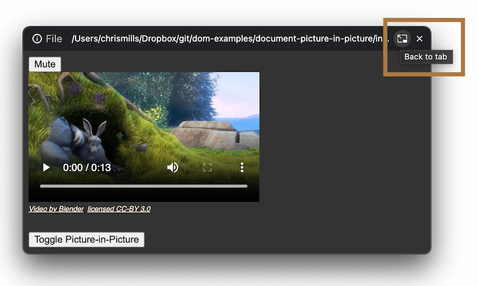

{{APIRef("Document Picture-in-Picture API")}}{{SeeCompatTable}}{{SecureContext_Header}}

The **`requestWindow()`** method of the
{{domxref("DocumentPictureInPicture")}} interface opens the Picture-in-Picture window for the current main browsing context. It returns a {{jsxref("Promise")}} that fulfills with a {{domxref("Window")}} instance representing the browsing context inside the Picture-in-Picture window.

The `requestWindow()` method requires [transient activation](/en-US/docs/Glossary/Transient_activation), i.e. it must be invoked in response to a user action such as a mouse click or button press.

## Syntax

```js-nolint
requestWindow()
requestWindow(options)
```

### Parameters

- `options` {{optional_inline}}

  - : An options object containing the following properties:

    - `disallowReturnToOpener` {{optional_inline}}

      - : A boolean value. When set to `true`, this option hints to the browser that it should not display a UI control that enables the user to return to the originating tab and close the Picture-in-Picture window. Defaults to `false`.

        For example, in Chrome's implementation of this feature, the provided UI control is a "back to tab" button in the Picture-in-Picture window's top bar:

        

    - `height` {{optional_inline}}
      - : A non-negative number representing the height to set for the Picture-in-Picture window's viewport, in pixels. Defaults to `0`.
    - `preferInitialWindowPlacement` {{optional_inline}}

      - : A boolean value, which defaults to `false`. When set to `true`, it causes the Picture-in-Picture window to always appear back at the position and size it initially opened at, when it is closed and then reopened. By contrast, if `preferInitialWindowPlacement` is `false` the Picture-in-Picture window's size and position will be remembered when closed and reopened — it will reopen at its previous position and size, for example as set by the user.

    - `width` {{optional_inline}}
      - : A non-negative number representing the width to set for the Picture-in-Picture window's viewport, in pixels. Defaults to `0`.

> [!NOTE]
> If one of `height` or `width` is specified, the other one must be too, otherwise an error is thrown. If both values are not specified, specified as 0, or set too large, the browser will clamp or ignore the values as appropriate to provide a reasonable user experience. The clamped size will vary depending on implementation, display size, and other factors.

### Return value

A {{jsxref("Promise")}} that fulfills with a {{domxref("Window")}} object instance representing the browsing context inside the Picture-in-Picture window.

### Exceptions

- `NotSupportedError` {{domxref("DOMException")}}
  - : Thrown if the API has been explicitly disabled (for example via browser settings).
- `NotAllowedError` {{domxref("DOMException")}}
  - : Thrown if:
    - `requestWindow()` is not called from a top-level `window` object.
    - `requestWindow()` is called from the `window` object of the Picture-in-Picture window (i.e. {{domxref("DocumentPictureInPicture.window")}}).
    - `requestWindow()` is called without {{Glossary("Transient_activation", "transient activation")}}.
- `RangeError` {{domxref("DOMException")}}
  - : Thrown if only one of `height` and `width` are set, or if `height` and `width` are set with negative values.

## Examples

```js
const videoPlayer = document.getElementById("player");

// ...

// Open a Picture-in-Picture window with all options set
const pipWindow = await window.documentPictureInPicture.requestWindow({
  width: videoPlayer.clientWidth,
  height: videoPlayer.clientHeight,
  disallowReturnToOpener: true,
  preferInitialWindowPlacement: true,
});

// ...
```

## Specifications

{{Specifications}}

## Browser compatibility

{{Compat}}

## See also

- {{domxref("Document Picture-in-Picture API", "Document Picture-in-Picture API", "", "nocode")}}
- [Using the Document Picture-in-Picture API](/en-US/docs/Web/API/Document_Picture-in-Picture_API/Using)
