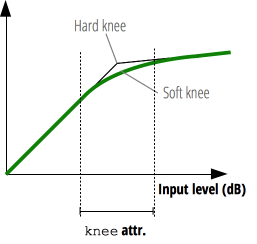

{{ APIRef("Web Audio API") }}

The `knee` property of the {{ domxref("DynamicsCompressorNode") }} interface is a [k-rate](/en-US/docs/Web/API/AudioParam#k-rate) {{domxref("AudioParam")}} containing a decibel value representing the range above the threshold where the curve smoothly transitions to the compressed portion.

The `knee` property's default value is `30` and it can be set between `0` and `40`.



## Value

An {{domxref("AudioParam")}}.

> **Note:** Though the {{domxref("AudioParam")}} returned is read-only, the value it represents is not.

## Examples

```js
const audioCtx = new AudioContext();
const compressor = audioCtx.createDynamicsCompressor();
compressor.knee.value = 40;
```

See [`BaseAudioContext.createDynamicsCompressor()`](/en-US/docs/Web/API/BaseAudioContext/createDynamicsCompressor#example) for more complete example code.

## Specifications

{{Specifications}}

## Browser compatibility

{{Compat}}

## See also

- [Using the Web Audio API](/en-US/docs/Web/API/Web_Audio_API/Using_Web_Audio_API)
