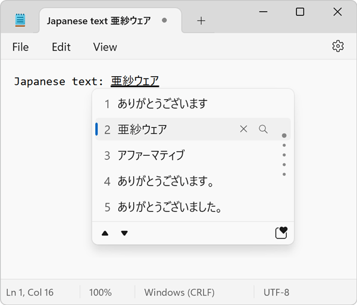

{{APIRef("EditContext API")}}{{SeeCompatTable}}

The `textformatupdate` event of the {{domxref("EditContext")}} interface fires when composition using a {{glossary("Input Method Editor")}} (IME) window is happening.

The event is fired when the IME decides that certain parts of the text being composed should be formatted differently to indicate the composition state.

The following screenshot shows an example of text being written in the Notepad app on Windows, by using the Japanese IME. The text is formatted with a thick underline to indicate that it's been composed from one of the IME's suggestions.



As a web developer, you should listen for the `textformatupdate` event and update the formatting of the text displayed in your editable region accordingly.

## Syntax

Use the event name in methods like {{domxref("EventTarget.addEventListener", "addEventListener()")}}, or set an event handler property.

```js
addEventListener("textformatupdate", (event) => {});

ontextformatupdate = (event) => {};
```

## Event type

A {{domxref("TextFormatUpdateEvent")}}. Inherits from {{domxref("Event")}}.

## Event properties

_In addition to the properties listed below, properties from the parent interface, {{domxref("Event")}}, are available._

- {{domxref('TextFormatUpdateEvent.getTextFormats')}}
  - : Returns the list of text formats that the IME window wants to apply to the text.

## Examples

### Rendering IME composition text formatting

In the following example, the `textformatupdate` event is used to update the formatting of the text in the editable region. Note that the event listener callback in this example is only called when using an IME window, or other platform-specific editing UI surfaces, to compose text.

```html
<canvas id="editor-canvas"></canvas>
```

```js
const TEXT_X = 10;
const TEXT_Y = 10;

const canvas = document.getElementById("editor-canvas");
const ctx = canvas.getContext("2d");

const editContext = new EditContext();
canvas.editContext = editContext;

editContext.addEventListener("textformatupdate", (e) => {
  // Clear the canvas.
  ctx.clearRect(0, 0, canvas.width, canvas.height);

  // Render the text.
  ctx.fillText(editContext.text, TEXT_X, TEXT_Y);

  // Get the text formats that the IME window wants to apply.
  const formats = e.getTextFormats();

  // Iterate over the text formats
  for (const format of formats) {
    const { rangeStart, rangeEnd, underlineStyle, underlineThickness } = format;

    const underlineXStart = ctx.measureText(
      editContext.text.substring(0, rangeStart),
    ).width;
    const underlineXEnd = ctx.measureText(
      editContext.text.substring(0, rangeEnd),
    ).width;
    const underlineY = TEXT_Y + 3;

    // For brevity, this example only draws a simple underline.
    // You should use the underlineStyle and underlineThickness values to draw the underline.

    ctx.beginPath();
    ctx.moveTo(TEXT_X + underlineXStart, underlineY);
    ctx.lineTo(TEXT_X + underlineXEnd, underlineY);
    ctx.stroke();
  }
});
```

## Specifications

{{Specifications}}

## Browser compatibility

{{Compat}}
