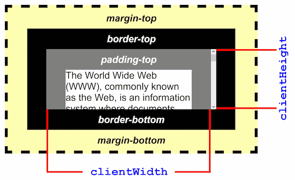

{{APIRef("DOM")}}

The **`Element.clientWidth`** property is zero for inline
elements and elements with no CSS; otherwise, it's the inner width of an element in
pixels. It includes padding but excludes borders, margins, and vertical scrollbars (if
present).

When `clientWidth` is used on the root element (the
`<html>` element), (or on `<body>` if the document is
in quirks mode), the viewport's width (excluding any scrollbar) is returned. [This is a special case of `clientWidth`](https://www.w3.org/TR/2016/WD-cssom-view-1-20160317/#dom-element-clientwidth).

> **Note:** This property will round the value to an integer. If you need
> a fractional value, use {{ domxref("element.getBoundingClientRect()") }}.

## Value

A number.

## Examples

## Specifications

{{Specifications}}

### Notes

`clientWidth` was first introduced in the MS IE DHTML object model.

## Browser compatibility

{{Compat}}

## See also

- {{domxref("HTMLElement.offsetWidth")}}
- {{domxref("Element.scrollWidth")}}
- [Determining the dimensions of elements](/en-US/docs/Web/API/CSS_Object_Model/Determining_the_dimensions_of_elements)
