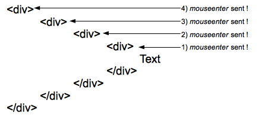
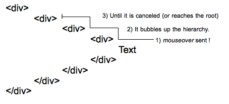

{{APIRef}}

The **`mouseenter`** event is fired at an {{domxref("Element")}} when a pointing device (usually a mouse) is initially moved so that its hotspot is within the element at which the event was fired.

## Syntax

Use the event name in methods like {{domxref("EventTarget.addEventListener", "addEventListener()")}}, or set an event handler property.

```js
addEventListener('mouseenter', (event) => {});

onmouseenter = (event) => { };
```

## Event type

A {{domxref("MouseEvent")}}. Inherits from {{domxref("Event")}}.

{{InheritanceDiagram("MouseEvent")}}

## Event properties

_This interface also inherits properties of its parents, {{domxref("UIEvent")}} and {{domxref("Event")}}._

- {{domxref("MouseEvent.altKey")}} {{ReadOnlyInline}}
  - : Returns `true` if the <kbd>alt</kbd> key was down when the mouse event was fired.
- {{domxref("MouseEvent.button")}} {{ReadOnlyInline}}
  - : The button number that was pressed (if applicable) when the mouse event was fired.
- {{domxref("MouseEvent.buttons")}} {{ReadOnlyInline}}
  - : The buttons being pressed (if any) when the mouse event was fired.
- {{domxref("MouseEvent.clientX")}} {{ReadOnlyInline}}
  - : The X coordinate of the mouse pointer in local (DOM content) coordinates.
- {{domxref("MouseEvent.clientY")}} {{ReadOnlyInline}}
  - : The Y coordinate of the mouse pointer in local (DOM content) coordinates.
- {{domxref("MouseEvent.ctrlKey")}} {{ReadOnlyInline}}
  - : Returns `true` if the <kbd>control</kbd> key was down when the mouse event was fired.
- {{domxref("MouseEvent.layerX")}} {{Non-standard_inline}} {{ReadOnlyInline}}
  - : Returns the horizontal coordinate of the event relative to the current layer.
- {{domxref("MouseEvent.layerY")}} {{Non-standard_inline}} {{ReadOnlyInline}}
  - : Returns the vertical coordinate of the event relative to the current layer.
- {{domxref("MouseEvent.metaKey")}} {{ReadOnlyInline}}
  - : Returns `true` if the <kbd>meta</kbd> key was down when the mouse event was fired.
- {{domxref("MouseEvent.movementX")}} {{ReadOnlyInline}}
  - : The X coordinate of the mouse pointer relative to the position of the last {{domxref("Element/mousemove_event", "mousemove")}} event.
- {{domxref("MouseEvent.movementY")}} {{ReadOnlyInline}}
  - : The Y coordinate of the mouse pointer relative to the position of the last {{domxref("Element/mousemove_event", "mousemove")}} event.
- {{domxref("MouseEvent.offsetX")}} {{ReadOnlyInline}}
  - : The X coordinate of the mouse pointer relative to the position of the padding edge of the target node.
- {{domxref("MouseEvent.offsetY")}} {{ReadOnlyInline}}
  - : The Y coordinate of the mouse pointer relative to the position of the padding edge of the target node.
- {{domxref("MouseEvent.pageX")}} {{ReadOnlyInline}}
  - : The X coordinate of the mouse pointer relative to the whole document.
- {{domxref("MouseEvent.pageY")}} {{ReadOnlyInline}}
  - : The Y coordinate of the mouse pointer relative to the whole document.
- {{domxref("MouseEvent.relatedTarget")}} {{ReadOnlyInline}}
  - : The secondary target for the event, if there is one.
- {{domxref("MouseEvent.screenX")}} {{ReadOnlyInline}}
  - : The X coordinate of the mouse pointer in global (screen) coordinates.
- {{domxref("MouseEvent.screenY")}} {{ReadOnlyInline}}
  - : The Y coordinate of the mouse pointer in global (screen) coordinates.
- {{domxref("MouseEvent.shiftKey")}} {{ReadOnlyInline}}
  - : Returns `true` if the <kbd>shift</kbd> key was down when the mouse event was fired.
- {{domxref("MouseEvent.mozPressure")}} {{non-standard_inline()}} {{deprecated_inline}} {{ReadOnlyInline}}
  - : The amount of pressure applied to a touch or tablet device when generating the event; this value ranges between `0.0` (minimum pressure) and `1.0` (maximum pressure).
    Instead of using this deprecated (and non-standard) property, you should use {{domxref("PointerEvent")}} and look at its {{domxref("PointerEvent.pressure", "pressure")}} property.
- {{domxref("MouseEvent.mozInputSource")}} {{non-standard_inline()}} {{ReadOnlyInline}}
  - : The type of device that generated the event (one of the `MOZ_SOURCE_*` constants).
    This lets you, for example, determine whether a mouse event was generated by an actual mouse or by a touch event (which might affect the degree of accuracy with which you interpret the coordinates associated with the event).
- {{domxref("MouseEvent.webkitForce")}} {{non-standard_inline()}} {{ReadOnlyInline}}
  - : The amount of pressure applied when clicking
- {{domxref("MouseEvent.x")}} {{ReadOnlyInline}}
  - : Alias for {{domxref("MouseEvent.clientX")}}.
- {{domxref("MouseEvent.y")}} {{ReadOnlyInline}}
  - : Alias for {{domxref("MouseEvent.clientY")}}

## Usage notes

Though similar to {{domxref("Element/mouseover_event", "mouseover")}}, `mouseenter` differs in that it doesn't [bubble](/en-US/docs/Web/API/Event/bubbles) and it isn't sent to any descendants when the pointer is moved from one of its descendants' physical space to its own physical space.

#### Behavior of `mouseenter` events:


One `mouseenter` event is sent to each element of the hierarchy when entering them. Here 4 events are sent to the four elements of the hierarchy when the pointer reaches the text.

#### Behavior of `mouseover` events:


A single `mouseover` event is sent to the deepest element of the DOM tree, then it bubbles up the hierarchy until it is canceled by a handler or reaches the root.

With deep hierarchies, the number of `mouseover` events sent can be quite huge and cause significant performance problems. In such cases, it is better to listen for `mouseenter` events.

Combined with the corresponding `mouseleave` (which is fired at the element when the mouse exits its content area), the `mouseenter` event acts in a very similar way to the CSS {{cssxref(':hover')}} pseudo-class.

## Examples

The [`mouseover`](/en-US/docs/Web/API/Element/mouseover_event#example) documentation has an example illustrating the difference between `mouseover` and `mouseenter`.

### mouseenter

The following trivial example uses the `mouseenter` event to change the border on the `div` when the mouse enters the space allotted to it. It then adds an item to the list with the number of the `mouseenter` or `mouseleave` event.

#### HTML

```html
<div id='mouseTarget'>
 <ul id="unorderedList">
  <li>No events yet!</li>
 </ul>
</div>
```

#### CSS

Styling the `div` to make it more visible.

```css
#mouseTarget {
  box-sizing: border-box;
  width:15rem;
  border:1px solid #333;
}
```

#### JavaScript

```js
let enterEventCount = 0;
let leaveEventCount = 0;
const mouseTarget = document.getElementById('mouseTarget');
const unorderedList = document.getElementById('unorderedList');

mouseTarget.addEventListener('mouseenter', (e) => {
  mouseTarget.style.border = '5px dotted orange';
  enterEventCount++;
  addListItem(`This is mouseenter event ${enterEventCount}.`);
});

mouseTarget.addEventListener('mouseleave', (e) => {
  mouseTarget.style.border = '1px solid #333';
  leaveEventCount++;
  addListItem(`This is mouseleave event ${leaveEventCount}.`);
});

function addListItem(text) {
  // Create a new text node using the supplied text
  const newTextNode = document.createTextNode(text);

  // Create a new li element
  const newListItem = document.createElement("li");

  // Add the text node to the li element
  newListItem.appendChild(newTextNode);

  // Add the newly created list item to list
  unorderedList.appendChild(newListItem);
}
```

### Result

{{EmbedLiveSample('mouseenter')}}

## Specifications

{{Specifications}}

## Browser compatibility

{{Compat}}

## See also

- [Introduction to events](/en-US/docs/Learn/JavaScript/Building_blocks/Events)
- {{domxref("Element/mousedown_event", "mousedown")}}
- {{domxref("Element/mouseup_event", "mouseup")}}
- {{domxref("Element/mousemove_event", "mousemove")}}
- {{domxref("Element/click_event", "click")}}
- {{domxref("Element/dblclick_event", "dblclick")}}
- {{domxref("Element/mouseover_event", "mouseover")}}
- {{domxref("Element/mouseout_event", "mouseout")}}
- {{domxref("Element/mouseenter_event", "mouseenter")}}
- {{domxref("Element/mouseleave_event", "mouseleave")}}
- {{domxref("Element/contextmenu_event", "contextmenu")}}
