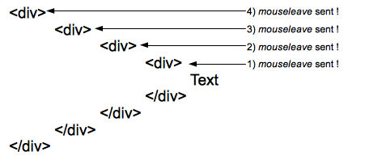
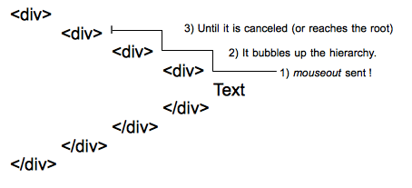

{{APIRef}}

The **`mouseleave`** event is fired at an {{domxref("Element")}} when the cursor of a pointing device (usually a mouse) is moved out of it.

`mouseleave` and {{domxref("Element/mouseout_event", "mouseout")}} are similar but differ in that `mouseleave` does not bubble and `mouseout` does. This means that `mouseleave` is fired when the pointer has exited the element _and_ all of its descendants, whereas `mouseout` is fired when the pointer leaves the element _or_ leaves one of the element's descendants, because of bubbling (even if the pointer is still within the element). Other than that, leave and out events for the same situation are dispatched at the same time, if appropriate.

The `mouseleave` and `mouseout` events will not be triggered when the element is replaced or removed from the DOM.

Note that "moving out of an element" refers to the element's position in the DOM tree, not to its visual position. For example, if two sibling elements are positioned so one is placed inside the other, then moving from the outer element into the inner element will trigger `mouseleave` on the outer element, even though the pointer is still in the bounds of the outer element.

## Syntax

Use the event name in methods like {{domxref("EventTarget.addEventListener", "addEventListener()")}}, or set an event handler property.

```js
addEventListener("mouseleave", (event) => {});

onmouseleave = (event) => {};
```

## Event type

A {{domxref("MouseEvent")}}. Inherits from {{domxref("UIEvent")}} and {{domxref("Event")}}.

{{InheritanceDiagram("MouseEvent")}}

## Event properties

_This interface also inherits properties of its parents, {{domxref("UIEvent")}} and {{domxref("Event")}}._

- {{domxref("MouseEvent.altKey")}} {{ReadOnlyInline}}
  - : Returns `true` if the <kbd>alt</kbd> key was down when the mouse event was fired.
- {{domxref("MouseEvent.button")}} {{ReadOnlyInline}}
  - : The button number that was pressed (if applicable) when the mouse event was fired.
- {{domxref("MouseEvent.buttons")}} {{ReadOnlyInline}}
  - : The buttons being pressed (if any) when the mouse event was fired.
- {{domxref("MouseEvent.clientX")}} {{ReadOnlyInline}}
  - : The X coordinate of the mouse pointer in [viewport coordinates](/en-US/docs/Web/CSS/CSSOM_view/Coordinate_systems#viewport).
- {{domxref("MouseEvent.clientY")}} {{ReadOnlyInline}}
  - : The Y coordinate of the mouse pointer in [viewport coordinates](/en-US/docs/Web/CSS/CSSOM_view/Coordinate_systems#viewport).
- {{domxref("MouseEvent.ctrlKey")}} {{ReadOnlyInline}}
  - : Returns `true` if the <kbd>control</kbd> key was down when the mouse event was fired.
- {{domxref("MouseEvent.layerX")}} {{Non-standard_inline}} {{ReadOnlyInline}}
  - : Returns the horizontal coordinate of the event relative to the current layer.
- {{domxref("MouseEvent.layerY")}} {{Non-standard_inline}} {{ReadOnlyInline}}
  - : Returns the vertical coordinate of the event relative to the current layer.
- {{domxref("MouseEvent.metaKey")}} {{ReadOnlyInline}}
  - : Returns `true` if the <kbd>meta</kbd> key was down when the mouse event was fired.
- {{domxref("MouseEvent.movementX")}} {{ReadOnlyInline}}
  - : The X coordinate of the mouse pointer relative to the position of the last {{domxref("Element/mousemove_event", "mousemove")}} event.
- {{domxref("MouseEvent.movementY")}} {{ReadOnlyInline}}
  - : The Y coordinate of the mouse pointer relative to the position of the last {{domxref("Element/mousemove_event", "mousemove")}} event.
- {{domxref("MouseEvent.offsetX")}} {{ReadOnlyInline}}
  - : The X coordinate of the mouse pointer relative to the position of the padding edge of the target node.
- {{domxref("MouseEvent.offsetY")}} {{ReadOnlyInline}}
  - : The Y coordinate of the mouse pointer relative to the position of the padding edge of the target node.
- {{domxref("MouseEvent.pageX")}} {{ReadOnlyInline}}
  - : The X coordinate of the mouse pointer relative to the whole document.
- {{domxref("MouseEvent.pageY")}} {{ReadOnlyInline}}
  - : The Y coordinate of the mouse pointer relative to the whole document.
- {{domxref("MouseEvent.relatedTarget")}} {{ReadOnlyInline}}
  - : The secondary target for the event, if there is one.
- {{domxref("MouseEvent.screenX")}} {{ReadOnlyInline}}
  - : The X coordinate of the mouse pointer in [screen coordinates](/en-US/docs/Web/CSS/CSSOM_view/Coordinate_systems#screen).
- {{domxref("MouseEvent.screenY")}} {{ReadOnlyInline}}
  - : The Y coordinate of the mouse pointer in [screen coordinates](/en-US/docs/Web/CSS/CSSOM_view/Coordinate_systems#screen).
- {{domxref("MouseEvent.shiftKey")}} {{ReadOnlyInline}}
  - : Returns `true` if the <kbd>shift</kbd> key was down when the mouse event was fired.
- {{domxref("MouseEvent.mozInputSource")}} {{non-standard_inline()}} {{ReadOnlyInline}}
  - : The type of device that generated the event (one of the `MOZ_SOURCE_*` constants).
    This lets you, for example, determine whether a mouse event was generated by an actual mouse or by a touch event (which might affect the degree of accuracy with which you interpret the coordinates associated with the event).
- {{domxref("MouseEvent.webkitForce")}} {{non-standard_inline()}} {{ReadOnlyInline}}
  - : The amount of pressure applied when clicking.
- {{domxref("MouseEvent.x")}} {{ReadOnlyInline}}
  - : Alias for {{domxref("MouseEvent.clientX")}}.
- {{domxref("MouseEvent.y")}} {{ReadOnlyInline}}
  - : Alias for {{domxref("MouseEvent.clientY")}}.

### Behavior of `mouseleave` events



One `mouseleave` event is sent to each element of the hierarchy when leaving them. Here four events are sent to the four elements of the hierarchy when the pointer moves from the text to an area outside of the most outer div represented here.

### Behavior of `mouseout` events



One single `mouseout` event is sent to the deepest element of the DOM tree, then it bubbles up the hierarchy until it is canceled by a handler or reaches the root.

## Examples

The [`mouseout`](/en-US/docs/Web/API/Element/mouseout_event#examples) documentation has an example illustrating the difference between `mouseout` and `mouseleave`.

### mouseleave

The following trivial example uses the `mouseenter` event to change the border on the `<div>` when the mouse enters the space allotted to it. It then adds an item to the list with the number of the `mouseenter` or `mouseleave` event.

#### HTML

```html
<div id="mouseTarget">
  <ul id="unorderedList">
    <li>No events yet!</li>
  </ul>
</div>
```

#### CSS

Styling the `<div>` to make it more visible.

```css
#mouseTarget {
  box-sizing: border-box;
  width: 15rem;
  border: 1px solid #333;
}
```

#### JavaScript

```js
let enterEventCount = 0;
let leaveEventCount = 0;
const mouseTarget = document.getElementById("mouseTarget");
const unorderedList = document.getElementById("unorderedList");

mouseTarget.addEventListener("mouseenter", (e) => {
  mouseTarget.style.border = "5px dotted orange";
  enterEventCount++;
  addListItem(`This is mouseenter event ${enterEventCount}.`);
});

mouseTarget.addEventListener("mouseleave", (e) => {
  mouseTarget.style.border = "1px solid #333";
  leaveEventCount++;
  addListItem(`This is mouseleave event ${leaveEventCount}.`);
});

function addListItem(text) {
  // Create a new text node using the supplied text
  const newTextNode = document.createTextNode(text);

  // Create a new li element
  const newListItem = document.createElement("li");

  // Add the text node to the li element
  newListItem.appendChild(newTextNode);

  // Add the newly created list item to list
  unorderedList.appendChild(newListItem);
}
```

#### Result

{{EmbedLiveSample('mouseleave')}}

## Specifications

{{Specifications}}

## Browser compatibility

{{Compat}}

## See also

- [Learn: Introduction to events](/en-US/docs/Learn_web_development/Core/Scripting/Events)
- {{domxref("Element/mousedown_event", "mousedown")}}
- {{domxref("Element/mouseup_event", "mouseup")}}
- {{domxref("Element/mousemove_event", "mousemove")}}
- {{domxref("Element/click_event", "click")}}
- {{domxref("Element/dblclick_event", "dblclick")}}
- {{domxref("Element/mouseover_event", "mouseover")}}
- {{domxref("Element/mouseout_event", "mouseout")}}
- {{domxref("Element/mouseenter_event", "mouseenter")}}
- {{domxref("Element/contextmenu_event", "contextmenu")}}
- {{domxref("Element/pointerleave_event", "pointerleave")}}
