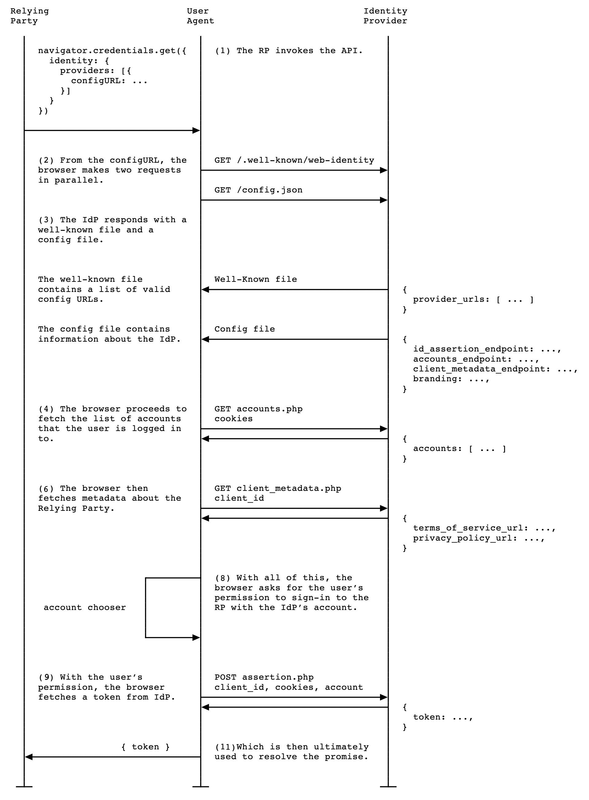

{{DefaultAPISidebar("FedCM API")}}

This article describes the process by which a relying party (RP) can use the [Federated Credential Management (FedCM) API](/en-US/docs/Web/API/FedCM_API) to perform a federated sign-in via an identity provider (IdP).

## Calling the get() method

RPs can call {{domxref("CredentialsContainer.get", "navigator.credentials.get()")}} with an `identity` option to request that a user signs in to the RP with an existing IdP account that they are already signed in to on the browser. The IdP identifies the RP by its `clientId`, which was issued by the IdP to the RP in a separate process that is specific to the IdP. The IdP identifies the specific user using credentials (cookies) provided to the browser on login.

The method returns a promise that fulfills with an {{domxref("IdentityCredential")}} object if the user identity is successfully validated by the IdP. This object contains a token that includes user identity information that has been signed with the IdP's {{glossary("digital certificate")}}.

The RP sends the token to its server to validate the certificate, and on success can use the (now trusted) identity information in the token to sign them into their service (starting a new session), sign them up to their service if they are a new user, etc.

If the user has never signed into the IdP or is logged out, the `get()` method rejects with an error and the RP can direct the user to the IdP login page to sign in or create an account.

> [!NOTE]
> The exact structure and content of the validation token is opaque to the FedCM API, and to the browser. The IdP decides on the syntax and usage of it, and the RP needs to follow the instructions provided by the IdP (see [Verify the Google ID token on your server side](https://developers.google.com/identity/gsi/web/guides/verify-google-id-token), for example) to make sure they are using it correctly.

A typical request might look like this:

```js
async function signIn() {
  const identityCredential = await navigator.credentials.get({
    identity: {
      context: "signup",
      providers: [
        {
          configURL: "https://accounts.idp.example/config.json",
          clientId: "********",
          nonce: "******",
          loginHint: "user1@example.com",
        },
      ],
    },
  });
}
```

The `identity.providers` property takes an array containing a single object specifying the path to an IdP config file (`configURL`) and the RP's client identifier (`clientId`) issued by the IdP.

> [!NOTE]
> Currently FedCM only allows the API to be invoked with a single IdP, i.e. the `identity.providers` array has to have a length of 1. To offer users a choice of identity provider, the RP will need to call `get()` separately for each. This may change in the future.

The example above also includes a couple of optional features:

- `identity.context` specifies the context in which the user is authenticating with FedCM. For example, is it a first-time signup for this account, or a sign-in with an existing account? The browser uses this information to vary the text in its FedCM UI to better suit the context.
- The `nonce` property provides a random nonce value that ensures the response is issued for this specific request, preventing {{glossary("replay attack", "replay attacks")}}.
- The `loginHint` property provides a hint about the account option(s) the browser should present for user sign-in. This hint is matched against the `login_hints` values that the IdP provides from the [accounts list endpoint](/en-US/docs/Web/API/FedCM_API/IDP_integration#the_accounts_list_endpoint).

The browser requests the IdP config file and carries out the sign-in flow detailed below. For more information on the kind of interaction a user might expect from the browser-supplied UI, see [Sign in to the relying party with the identity provider](https://developers.google.com/privacy-sandbox/cookies/fedcm#sign-in).

## FedCM sign-in flow

There are three parties involved in the sign-in flow — the RP app, the browser itself, and the IdP. The following diagram summarizes what is happening visually.



The flow is as follows:

1. The RP invokes {{domxref("CredentialsContainer.get", "navigator.credentials.get()")}} to start off the sign-in flow.

2. From the `configURL` provided in the `get()` call, the browser requests two files:

   1. The well-known file (`/.well-known/web-identity`), available from `/.well-known/web-identity` at the [eTLD+1](https://web.dev/articles/same-site-same-origin#site) of the `configURL`.
   2. The [IdP config file](/en-US/docs/Web/API/FedCM_API/IDP_integration#provide_a_config_file_and_endpoints) (`/config.json`), available at the `configURL`.

   These are both [`GET`](/en-US/docs/Web/HTTP/Methods/GET) requests, which don't have cookies and don't follow redirects. This effectively prevents the IdP from learning who made the request and which RP is attempting to connect.

   All requests sent from the browser via FedCM include a `{{httpheader("Sec-Fetch-Dest")}}: webidentity` header to prevent {{glossary("CSRF")}} attacks. All IdP endpoints must confirm this header is included.

3. The IdP responds with the requested well-known file and `config.json` files. The browser validates the config file URL in the `get()` request against the list of valid config URLs inside the well-known file.

4. If the browser has the [IdP's login status](/en-US/docs/Web/API/FedCM_API/IDP_integration#update_login_status_using_the_login_status_api) set to `"logged-in"`, it makes a credentialed request (i.e. with a cookie that identifies the user that is signed in) to the [`accounts_endpoint`](/en-US/docs/Web/API/FedCM_API/IDP_integration#the_accounts_list_endpoint) inside the IdP config file for the user's account details. This is a `GET` request with cookies, but without a `client_id` parameter or the {{httpheader("Origin")}} header. This effectively prevents the IdP from learning which RP the user is trying to sign in to. As a result, the list of accounts returned is RP-agnostic.

   > [!NOTE]
   > If the IdP login status is `"logged-out"`, the `get()` call rejects with a `NetworkError` {{domxref("DOMException")}} and does not make a request to the IdP's `accounts_endpoint`. In this case it is up to the developer to handle the flow, for example by prompting the user to go and sign in to a suitable IdP. Note that there may be some delay in the rejection to avoid leaking the IdP login status to the RP.

5. The IdP responds with the account information requested from the `accounts_endpoint`. This is an array of all accounts associated with the user's IdP cookies for any RPs associated with the IdP.

6. {{optional_inline}} If included in the IdP config file, the browser makes an uncredentialed request to the [`client_metadata_endpoint`](/en-US/docs/Web/API/FedCM_API/IDP_integration#the_client_metadata_endpoint) for the location of the RP terms of service and privacy policy pages. This is a `GET` request sent with the `clientId` passed into the `get()` call as a parameter, without cookies.

7. {{optional_inline}} The IdP responds with the URLs requested from the `client_metadata_endpoint`.

8. The browser uses the information obtained by the previous two requests to create the UI asking the user to choose an account to sign in to the RP with (in the case where there is more than one available). The UI also asks the user for permission to sign in to the RP using their chosen federated IdP account.

   > [!NOTE]
   > At this stage, if the user has previously authenticated with a federated RP account in the current browser instance (i.e. created a new account with the RP or signed into the RP's website using an existing account), they may be able to **auto-reauthenticate**, depending on what the [`mediation`](/en-US/docs/Web/API/CredentialsContainer/get#mediation) option is set to in the `get()` call. If so the user will be signed in automatically without entering their credentials, as soon as `get()` is invoked. See the [Auto-reauthentication](#auto-reauthentication) section for more details.

9. If the user grants permission to do so, the browser makes a credentialed request to the [`id_assertion_endpoint`](/en-US/docs/Web/API/FedCM_API/IDP_integration#the_id_assertion_endpoint) to request a validation token from the IdP for the selected account.

   The credentials are sent in an HTTP [`POST`](/en-US/docs/Web/HTTP/Methods/POST) request with cookies and a content type of `application/x-www-form-urlencoded`.

   If the call fails, an error payload is returned as explained in [ID assertion error responses](/en-US/docs/Web/API/FedCM_API/IDP_integration#id_assertion_error_responses) and the promise returned by `get()` will reject with the error.

10. The IdP checks that the account ID sent by the RP matches the ID for the account that is already signed in, and that the `Origin` matches the origin of the RP, which will have been registered in advance with the IdP. If everything looks good, it responds with the requested validation token.

    > [!NOTE]
    > The origin of the RP will be registered with the IdP in a completely separate process when the RP first integrates with the IdP. This process will be specific to each IdP.

11. When the flow is complete, the `get()` promise resolves with an {{domxref("IdentityCredential")}} object, which provides further RP functionality. Most notably, this object contains a token that the RP can verify comes from the IdP (using a certificate) and that contains trusted information about the signed in user. Once the RP validates the token, they can use the contained information to sign the user in and start a new session, sign them up to their service, etc. The format and structure of the token depends on the IdP and has nothing to do with the FedCM API (the RP needs to follow the IdP's instructions).

## Auto-reauthentication

FedCM auto-reauthentication lets users reauthenticate automatically when they try to sign in to an RP again after their initial authentication using FedCM. "Initial authentication" refers to when the user creates an account or signs into the RP's website via the FedCM sign-in dialog for the first time on the RP site, on the same browser instance.

After the initial authentication, auto-reauthentication can be used to sign into the RP website again automatically, without needing to show the user a "Continue as..." confirmation prompt. If the user has recently granted permission to allow federated sign-in to occur with a particular account, there's no privacy or security benefit to immediately enforcing another explicit user confirmation.

Auto-reauthentication behavior is controlled by the [`mediation`](/en-US/docs/Web/API/CredentialsContainer/get#mediation) option in the `get()` call:

```js
async function signIn() {
  const identityCredential = await navigator.credentials.get({
    identity: {
      providers: [
        {
          configURL: "https://accounts.idp.example/config.json",
          clientId: "********",
        },
      ],
    },
    mediation: "optional", // this is the default
  });

  // isAutoSelected is true if auto-reauthentication occurred.
  const isAutoSelected = identityCredential.isAutoSelected;
}
```

Auto-reauthentication can occur if `mediation` is set to `optional` or `silent`.

With these `mediation` options, auto-reauthentication will occur under the following conditions:

- FedCM is available to use. For example, the user has not disabled FedCM either globally or in the RP's settings.
- The user has only used one account to sign into the RP website on this browser via FedCM.
- The user is signed into the IdP with that account.
- Auto-reauthentication didn't happen within the last 10 minutes. This restriction is put into place to stop users being auto-reauthenticated immediately after they sign out — which would make for a pretty confusing user experience.
- The RP hasn't called {{domxref("CredentialsContainer.preventSilentAccess", "preventSilentAccess()")}} after the previous sign in. This can be used by an RP to explicitly disable auto-reauthentication if desired.

When these conditions are met, an attempt to automatically reauthenticate the user starts as soon as the `get()` is invoked. If auto-reauthentication is successful, the user will log into the RP site again, without being shown a confirmation prompt, using the same IdP account and validated token as they did before.

If auto-reauthentication fails, the behavior depends on the `mediation` value that was chosen:

- `optional`: the user _will_ be shown the dialog box and asked for confirmation again. As a result, this option tends to make sense to use on a page where a user journey is not in mid-flow, such an RP sign-in page.
- `silent`: The `get()` promise will reject and the developer will need to handle guiding the user back to the sign-in page to start the process again. This option makes sense on pages where a user journey is in flow and you need to keep them signed in until completion, for example the pages of a checkout flow on an e-commerce website.

> [!NOTE]
> The {{domxref("IdentityCredential.isAutoSelected")}} property provides an indication of whether the federated sign-in was carried out using auto-reauthentication. This is helpful to evaluate the API performance and improve UX accordingly. Also, when it's unavailable, the user may be prompted to sign in with explicit user mediation, which is a `get()` call with `mediation: required`.

## See also

- [Federated Credential Management API](https://developers.google.com/privacy-sandbox/cookies/fedcm) on developers.google.com (2023)
