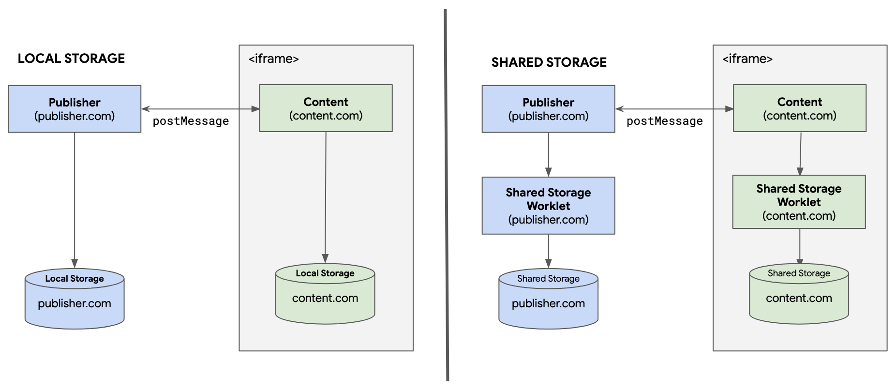
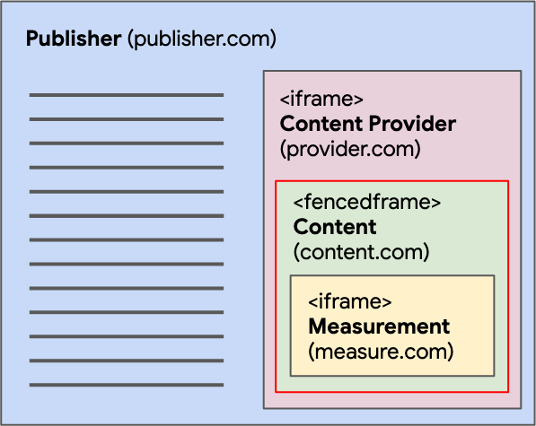
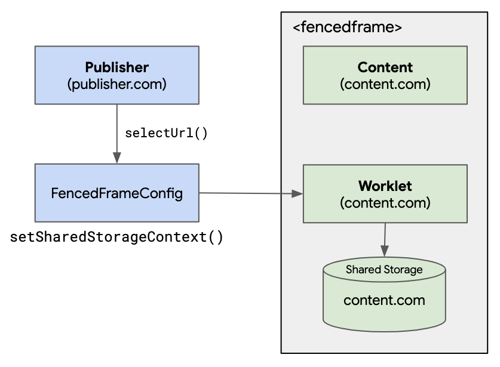

{{DefaultAPISidebar("Fenced Frame API")}}

This article provides information on how communication differs between an embedder and content embedded inside different types of frame (i.e. an {{htmlelement("iframe")}} and a {{htmlelement("fencedframe")}}), and how passed data can be stored.

## How to communicate between the embedder and an `<iframe>`



When the third-party code is embedded in an `<iframe>`, the `<iframe>` and the embedder can send messages freely to each other to request data to be written into their client-side [shared storage](/en-US/docs/Web/API/Shared_Storage_API). The embedder can send a request to that `<iframe>` to write data into its own third-party storage with a cross-document communication channel using {{domxref("Window.postMessage()")}}. The third party can also send `postMessage()` requests to the embedder.

From the `<iframe>`, you can listen to a [`message`](/en-US/docs/Web/API/Window/message_event) event that comes from the embedder. When the embedder dispatches a message to the `<iframe>` using `postMessage()`, the `<iframe>` can take that data and store it in its own client-side shared storage. Conversely, the `<iframe>` can dispatch a message that the embedder can listen to, and respond by writing data into its shared storage.

## How to communicate between the embedder and a `<fencedframe>`

Fenced frames are intended to be used for cases such as displaying targeted ads selected via the [Protected Audience API](https://developers.google.com/privacy-sandbox/private-advertising/protected-audience) and {{domxref("WindowSharedStorage.selectURL()")}}. Communicating between `<fencedframe>`s and other pages outside the `<fencedframe>` on the page is intentionally limited, but one method of communication between the embedder and shared storage worklets does exist — {{domxref("FencedFrameConfig.setSharedStorageContext()")}}.

> [!NOTE]
> Within the same `<fencedframe>` tree, communication between frames is allowed. For example, a root `<fencedframe>` can send a message to a child `<iframe>` in its own tree, and a child `<iframe>` can send a message to the parent `<fencedframe>`.

Let's look at a more complex example that uses a Select URL output gate operation to render an ad in a `<fencedframe>`.



In this example, a publisher asks a third-party content provider to render some content on the page. The content chosen with {{domxref("WindowSharedStorage.selectURL()")}} is rendered in a `<fencedframe>`, and the content contains an `<iframe>` from a measurement provider. Note that a publisher can represent any entity that is embedding a third-party `<fencedframe>`. Also, a measurement provider represents any nested third-party code running in a `<fencedframe>` of a different third party.

To pass data into a `<fencedframe>` to be used in a shared storage worklet, the embedder can set the data in a {{domxref("FencedFrameConfig")}}. That value will be available as {{domxref("WorkletSharedStorage.context")}} inside the shared storage worklet. This data is not available outside a worklet, and can only be accessed inside a secure and private environment that a shared storage worklet provides.



When a `selectURL()` call returns a `FencedFrameConfig`, the frame embedder can pass in data by calling `setSharedStorageContext(data)`:

```js
const fencedFrameConfig = await window.sharedStorage.selectURL(
  "creative-rotation",
  urls,
  {
    // …
    resolveToConfig: true,
  },
);

fencedFrameConfig.setSharedStorageContext("some-data");

// Navigate the fenced frame to the config.
document.getElementById("my-fenced-frame").config = fencedFrameConfig;
```

`setSharedStorageContext(data)` must be called on the `fencedFrameConfig` before the intended `<fencedframe>` element recipient has its `config` attribute set to `fencedFrameConfig`, as this triggers the frame to navigate.

Inside a shared storage worklet, `WorkletSharedStorage.context` can then be accessed to retrieve the data:

```js
class ReportingOperation {
  async run() {
    sharedStorage.set("some-data-from-embedder", sharedStorage.context);
  }
}
register("send-report", ReportingOperation);
```
