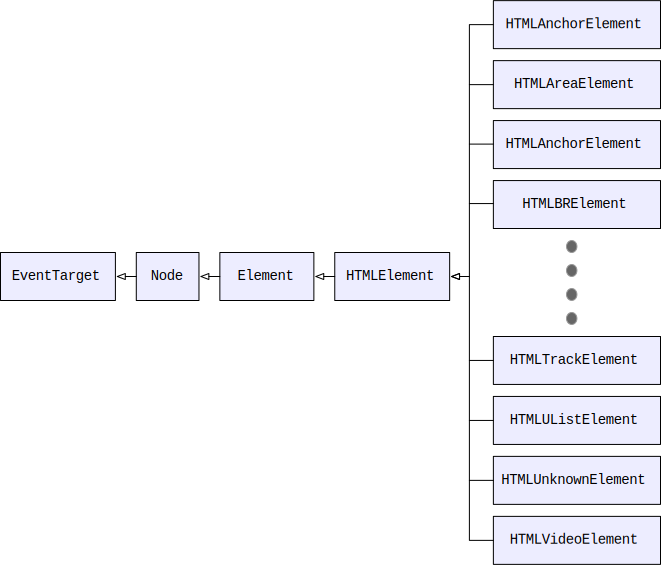

{{DefaultAPISidebar("HTML DOM")}}

The **HTML DOM API** is made up of the interfaces that define the functionality of each of the {{Glossary("element", "elements")}} in {{Glossary("HTML")}}, as well as any supporting types and interfaces they rely upon.

The functional areas included in the HTML DOM API include:

- Access to and control of HTML elements via the {{Glossary("DOM")}}.
- Access to and manipulation of form data.
- Interacting with the contents of 2D images and the context of an HTML {{HTMLElement("canvas")}}, for example to draw on top of them.
- Management of media connected to the HTML media elements ({{HTMLElement("audio")}} and {{HTMLElement("video")}}).
- Dragging and dropping of content on webpages.
- Access to the browser navigation history
- Supporting and connective interfaces for other APIs such as [Web Components](/en-US/docs/Web/API/Web_components), {{DOMxRef("Web_Storage_API", "Web Storage", "", "1")}}, {{DOMxRef("Web_Workers_API", "Web Workers", "", "1")}}, {{DOMxRef("WebSockets_API", "WebSocket", "", "1")}}, and {{DOMxRef("Server-sent_events", "Server-sent events", "", "1")}}.

## HTML DOM concepts and usage

In this article, we'll focus on the parts of the HTML DOM that involve engaging with HTML elements. Discussion of other areas, such as {{DOMxRef("HTML_Drag_and_Drop_API", "Drag and Drop", "", "1")}}, {{DOMxRef("WebSockets_API", "WebSockets", "", "1")}}, {{DOMxRef("Web_Storage_API", "Web Storage", "", "1")}}, etc. can be found in the documentation for those APIs.

### Structure of an HTML document

The Document Object Model ({{Glossary("DOM")}}) is an architecture that describes the structure of a {{domxref("document")}}; each document is represented by an instance of the interface {{domxref("Document")}}. A document, in turn, consists of a hierarchical tree of **nodes**, in which a node is a fundamental record representing a single object within the document (such as an element or text node).

Nodes may be strictly organizational, providing a means for grouping other nodes together or for providing a point at which a hierarchy can be constructed; other nodes may represent visible components of a document. Each node is based on the {{domxref("Node")}} interface, which provides properties for getting information about the node as well as methods for creating, deleting, and organizing nodes within the DOM.

Nodes don't have any concept of including the content that is actually displayed in the document. They're empty vessels. The fundamental notion of a node that can represent visual content is introduced by the {{domxref("Element")}} interface. An `Element` object instance represents a single element in a document created using either HTML or an {{glossary("XML")}} vocabulary such as {{glossary("SVG")}}.

For example, consider a document with two elements, one of which has two more elements nested inside it:


While the {{domxref("Document")}} interface is defined as part of the {{DOMxRef("Document_Object_Model", "DOM", "", "1")}} specification, the HTML specification significantly enhances it to add information specific to using the DOM in the context of a web browser, as well as to using it to represent HTML documents specifically.

Among the things added to `Document` by the HTML standard are:

- Support for accessing various information provided by the {{Glossary("HTTP")}} headers when loading the page, such as the {{DOMxRef("Document/location", "location", "", "1")}} from which the document was loaded, {{DOMxRef("Document/cookie", "cookies", "", "1")}}, {{DOMxRef("Document/lastModified", "modification date", "", "1")}}, {{DOMxRef("Document/referrer", "referring site", "", "1")}}, and so forth.
- Access to lists of elements in the document's {{HTMLElement("head")}} block and {{DOMxRef("Document/body", "body", "", "1")}}, as well as lists of the {{DOMxRef("Document/images", "images", "", "1")}}, {{DOMxRef("Document/links", "links", "", "1")}}, {{DOMxRef("Document/scripts", "scripts", "", "1")}}, etc. contained in the document.
- Support for interacting with the user by examining {{DOMxRef("Document/hasFocus", "focus", "", "1")}} and by executing commands on [editable content](/en-US/docs/Web/HTML/Global_attributes/contenteditable).
- Event handlers for document events defined by the HTML standard to allow access to {{DOMxRef("MouseEvent", "mouse", "", "1")}} and {{DOMxRef("KeyboardEvent", "keyboard", "", "1")}} events, {{DOMxRef("HTML_Drag_and_Drop_API", "drag and drop", "", "1")}}, {{DOMxRef("HTMLMediaElement", "media control", "", "1")}}, and more.
- Event handlers for events that can be delivered to both elements and documents; these presently include only {{DOMxRef("HTMLElement/copy_event", "copy", "", "1")}}, {{DOMxRef("HTMLElement/cut_event", "cut", "", "1")}}, and {{DOMxRef("HTMLElement/paste_event", "paste", "", "1")}} actions.

### HTML element interfaces

The `Element` interface has been further adapted to represent HTML elements specifically by introducing the {{domxref("HTMLElement")}} interface, which all more specific HTML element classes inherit from. This expands the `Element` class to add HTML-specific general features to the element nodes. Properties added by `HTMLElement` include for example {{domxref("HTMLElement.hidden", "hidden")}} and {{domxref("HTMLElement.innerText", "innerText")}}.

An {{Glossary("HTML")}} document is a DOM tree in which each of the nodes is an HTML element, represented by the {{domxref("HTMLElement")}} interface. The `HTMLElement` class, in turn, implements `Node`, so every element is also a node (but not the other way around). This way, the structural features implemented by the {{domxref("Node")}} interface are also available to HTML elements, allowing them to be nested within each other, created and deleted, moved around, and so forth.

The `HTMLElement` interface is generic, however, providing only the functionality common to all HTML elements such as the element's ID, its coordinates, the HTML making up the element, information about scroll position, and so forth.

In order to expand upon the functionality of the core `HTMLElement` interface to provide the features needed by a specific element, the `HTMLElement` class is subclassed to add the needed properties and methods. For example, the {{HTMLElement("canvas")}} element is represented by an object of type {{domxref("HTMLCanvasElement")}}. `HTMLCanvasElement` augments the `HTMLElement` type by adding properties such as {{domxref("HTMLCanvasElement.height", "height")}} and methods like {{domxref("HTMLCanvasElement.getContext", "getContext()")}} to provide canvas-specific features.

The overall inheritance for HTML element classes looks like this:



As such, an element inherits the properties and methods of all of its ancestors. For example, consider a {{HTMLElement("a")}} element, which is represented in the DOM by an object of type {{domxref("HTMLAnchorElement")}}. The element, then, includes the anchor-specific properties and methods described in that class's documentation, but also those defined by {{domxref("HTMLElement")}} and {{domxref("Element")}}, as well as from {{domxref("Node")}} and, finally, {{domxref("EventTarget")}}.

Each level defines a key aspect of the utility of the element. From `Node`, the element inherits concepts surrounding the ability for the element to be contained by another element, and to contain other elements itself. Of special importance is what is gained by inheriting from `EventTarget`: the ability to receive and handle events such as mouse clicks, play and pause events, and so forth.

There are elements that share commonalities and thus have an additional intermediary type. For example, the {{HTMLElement("audio")}} and {{HTMLElement("video")}} elements both present audiovisual media. The corresponding types, {{domxref("HTMLAudioElement")}} and {{domxref("HTMLVideoElement")}}, are both based upon the common type {{domxref("HTMLMediaElement")}}, which in turn is based upon {{domxref("HTMLElement")}} and so forth. `HTMLMediaElement` defines the methods and properties held in common between audio and video elements.

These element-specific interfaces make up the majority of the HTML DOM API, and are the focus of this article. To learn more about the actual structure of the {{DOMxRef("Document_Object_Model", "DOM", "", "1")}}, see {{DOMxRef("Document_Object_Model/Introduction", "Introduction to the DOM", "", "1")}}.

## HTML DOM target audience

The features exposed by the HTML DOM are among the most commonly-used APIs in a web developer's toolkit.
All but the most simple web applications will use some features of the HTML DOM.

## HTML DOM API interfaces

The majority of the interfaces that comprise the HTML DOM API map almost one-to-one to individual HTML elements, or to a small group of elements with similar functionality. In addition, the HTML DOM API includes a few interfaces and types to support the HTML element interfaces.

### HTML element interfaces

These interfaces represent specific HTML elements (or sets of related elements which have the same properties and methods associated with them).

- {{DOMxRef("HTMLAnchorElement")}}
- {{DOMxRef("HTMLAreaElement")}}
- {{DOMxRef("HTMLAudioElement")}}
- {{DOMxRef("HTMLBaseElement")}}
- {{DOMxRef("HTMLBodyElement")}}
- {{DOMxRef("HTMLBRElement")}}
- {{DOMxRef("HTMLButtonElement")}}
- {{DOMxRef("HTMLCanvasElement")}}
- {{DOMxRef("HTMLDataElement")}}
- {{DOMxRef("HTMLDataListElement")}}
- {{DOMxRef("HTMLDetailsElement")}}
- {{DOMxRef("HTMLDialogElement")}}
- {{DOMxRef("HTMLDirectoryElement")}}
- {{DOMxRef("HTMLDivElement")}}
- {{DOMxRef("HTMLDListElement")}}
- {{DOMxRef("HTMLElement")}}
- {{DOMxRef("HTMLEmbedElement")}}
- {{DOMxRef("HTMLFieldSetElement")}}
- {{DOMxRef("HTMLFormElement")}}
- {{DOMxRef("HTMLHRElement")}}
- {{DOMxRef("HTMLHeadElement")}}
- {{DOMxRef("HTMLHeadingElement")}}
- {{DOMxRef("HTMLHtmlElement")}}
- {{DOMxRef("HTMLIFrameElement")}}
- {{DOMxRef("HTMLImageElement")}}
- {{DOMxRef("HTMLInputElement")}}
- {{DOMxRef("HTMLLabelElement")}}
- {{DOMxRef("HTMLLegendElement")}}
- {{DOMxRef("HTMLLIElement")}}
- {{DOMxRef("HTMLLinkElement")}}
- {{DOMxRef("HTMLMapElement")}}
- {{DOMxRef("HTMLMediaElement")}}
- {{DOMxRef("HTMLMenuElement")}}
- {{DOMxRef("HTMLMetaElement")}}
- {{DOMxRef("HTMLMeterElement")}}
- {{DOMxRef("HTMLModElement")}}
- {{DOMxRef("HTMLObjectElement")}}
- {{DOMxRef("HTMLOListElement")}}
- {{DOMxRef("HTMLOptGroupElement")}}
- {{DOMxRef("HTMLOptionElement")}}
- {{DOMxRef("HTMLOutputElement")}}
- {{DOMxRef("HTMLParagraphElement")}}
- {{DOMxRef("HTMLPictureElement")}}
- {{DOMxRef("HTMLPreElement")}}
- {{DOMxRef("HTMLProgressElement")}}
- {{DOMxRef("HTMLQuoteElement")}}
- {{DOMxRef("HTMLScriptElement")}}
- {{DOMxRef("HTMLSelectElement")}}
- {{DOMxRef("HTMLSlotElement")}}
- {{DOMxRef("HTMLSourceElement")}}
- {{DOMxRef("HTMLSpanElement")}}
- {{DOMxRef("HTMLStyleElement")}}
- {{DOMxRef("HTMLTableCaptionElement")}}
- {{DOMxRef("HTMLTableCellElement")}}
- {{DOMxRef("HTMLTableColElement")}}
- {{DOMxRef("HTMLTableElement")}}
- {{DOMxRef("HTMLTableRowElement")}}
- {{DOMxRef("HTMLTableSectionElement")}}
- {{DOMxRef("HTMLTemplateElement")}}
- {{DOMxRef("HTMLTextAreaElement")}}
- {{DOMxRef("HTMLTimeElement")}}
- {{DOMxRef("HTMLTitleElement")}}
- {{DOMxRef("HTMLTrackElement")}}
- {{DOMxRef("HTMLUListElement")}}
- {{DOMxRef("HTMLUnknownElement")}}
- {{DOMxRef("HTMLVideoElement")}}

#### Deprecated HTML Element Interfaces

- {{DOMxRef("HTMLMarqueeElement")}} {{deprecated_inline}}

#### Obsolete HTML Element Interfaces

- {{DOMxRef("HTMLFontElement")}} {{deprecated_inline}}
- {{DOMxRef("HTMLFrameElement")}} {{deprecated_inline}}
- {{DOMxRef("HTMLFrameSetElement")}} {{deprecated_inline}}
- {{DOMxRef("HTMLIsIndexElement")}} {{deprecated_inline}}
- {{DOMxRef("HTMLMenuItemElement")}} {{deprecated_inline}}

### Web app and browser integration interfaces

These interfaces offer access to the browser window and document that contain the HTML, as well as to the browser's state, available plugins (if any), and various configuration options.

- {{DOMxRef("BarProp")}}
- {{DOMxRef("Navigator")}}
- {{DOMxRef("Window")}}

#### Deprecated web app and browser integration interfaces

- {{DOMxRef("External")}} {{deprecated_inline}}

#### Obsolete web app and browser integration interfaces

- {{DOMxRef("ApplicationCache")}} {{deprecated_inline}}
- {{DOMxRef("Plugin")}} {{deprecated_inline}}
- {{DOMxRef("PluginArray")}} {{deprecated_inline}}

### Form support interfaces

These interfaces provide structure and functionality required by the elements used to create and manage forms, including the {{HTMLElement("form")}} and {{HTMLElement("input")}} elements.

- {{DOMxRef("FormDataEvent")}}
- {{DOMxRef("HTMLFormControlsCollection")}}
- {{DOMxRef("HTMLOptionsCollection")}}
- {{DOMxRef("RadioNodeList")}}
- {{DOMxRef("ValidityState")}}

### Canvas and image interfaces

These interfaces represent objects used by the Canvas API as well as the {{HTMLElement("img")}} element and {{HTMLElement("picture")}} elements.

- {{DOMxRef("CanvasGradient")}}
- {{DOMxRef("CanvasPattern")}}
- {{DOMxRef("CanvasRenderingContext2D")}}
- {{DOMxRef("ImageBitmap")}}
- {{DOMxRef("ImageBitmapRenderingContext")}}
- {{DOMxRef("ImageData")}}
- {{DOMxRef("OffscreenCanvas")}}
- {{DOMxRef("OffscreenCanvasRenderingContext2D")}}
- {{DOMxRef("Path2D")}}
- {{DOMxRef("TextMetrics")}}

### Media interfaces

The media interfaces provide HTML access to the contents of the media elements: {{HTMLElement("audio")}} and {{HTMLElement("video")}}.

- {{DOMxRef("AudioTrack")}}
- {{DOMxRef("AudioTrackList")}}
- {{DOMxRef("MediaError")}}
- {{DOMxRef("TextTrack")}}
- {{DOMxRef("TextTrackCue")}}
- {{DOMxRef("TextTrackCueList")}}
- {{DOMxRef("TextTrackList")}}
- {{DOMxRef("TimeRanges")}}
- {{DOMxRef("TrackEvent")}}
- {{DOMxRef("VideoTrack")}}
- {{DOMxRef("VideoTrackList")}}

### Drag and drop interfaces

These interfaces are used by the [HTML Drag and Drop API](/en-US/docs/Web/API/HTML_Drag_and_Drop_API) to represent individual draggable (or dragged) items, groups of dragged or draggable items, and to handle the drag and drop process.

- {{DOMxRef("DataTransfer")}}
- {{DOMxRef("DataTransferItem")}}
- {{DOMxRef("DataTransferItemList")}}
- {{DOMxRef("DragEvent")}}

### Page history interfaces

The History API interfaces let you access information about the browser's history, as well as to shift the browser's current tab forward and backward through that history.

- {{DOMxRef("BeforeUnloadEvent")}}
- {{DOMxRef("HashChangeEvent")}}
- {{DOMxRef("History")}}
- {{DOMxRef("Location")}}
- {{DOMxRef("PageRevealEvent")}}
- {{DOMxRef("PageSwapEvent")}}
- {{DOMxRef("PageTransitionEvent")}}
- {{DOMxRef("PopStateEvent")}}

### Web Components interfaces

These interfaces are used by the [Web Components API](/en-US/docs/Web/API/Web_components) to create and manage the available [custom elements](/en-US/docs/Web/API/Web_components/Using_custom_elements).

- {{DOMxRef("CustomElementRegistry")}}

### Miscellaneous and supporting interfaces

These supporting object types are used in a variety of ways in the HTML DOM API. In addition, {{domxref("PromiseRejectionEvent")}} represents the event delivered when a {{Glossary("JavaScript")}} {{jsxref("Promise")}} is rejected.

- {{DOMxRef("DOMStringList")}}
- {{DOMxRef("DOMStringMap")}}
- {{DOMxRef("ErrorEvent")}}
- {{DOMxRef("HTMLAllCollection")}}
- {{DOMxRef("MimeType")}}
- {{DOMxRef("MimeTypeArray")}}
- {{DOMxRef("PromiseRejectionEvent")}}

### Interfaces belonging to other APIs

Several interfaces are technically defined in the HTML specification while actually being part of other APIs.

#### Web storage interfaces

The {{DOMxRef("Web_Storage_API", "Web Storage API", "", "1")}} provides the ability for websites to store data either temporarily or permanently on the user's device for later re-use.

- {{DOMxRef("Storage")}}
- {{DOMxRef("StorageEvent")}}

#### Web Workers interfaces

These interfaces are used by the {{DOMxRef("Web_Workers_API", "Web Workers API", "", "1")}} both to establish the ability for workers to interact with an app and its content, but also to support messaging between windows or apps.

- {{DOMxRef("BroadcastChannel")}}
- {{DOMxRef("DedicatedWorkerGlobalScope")}}
- {{DOMxRef("MessageChannel")}}
- {{DOMxRef("MessageEvent")}}
- {{DOMxRef("MessagePort")}}
- {{DOMxRef("SharedWorker")}}
- {{DOMxRef("SharedWorkerGlobalScope")}}
- {{DOMxRef("Worker")}}
- {{DOMxRef("WorkerGlobalScope")}}
- {{DOMxRef("WorkerLocation")}}
- {{DOMxRef("WorkerNavigator")}}

#### WebSocket interfaces

These interfaces, defined by the HTML specification, are used by the {{DOMxRef("WebSockets_API", "WebSockets API", "", "1")}}.

- {{DOMxRef("CloseEvent")}}
- {{DOMxRef("WebSocket")}}

#### Server-sent events interfaces

The {{domxref("EventSource")}} interface represents the source which sent or is sending {{DOMxRef("Server-sent_events", "server-sent events", "", "1")}}.

- {{DOMxRef("EventSource")}}

## Examples

In this example, an {{HTMLElement("input")}} element's {{domxref("Element/input_event", "input")}} event is monitored in order to update the state of a form's "submit" button based on whether or not a given field currently has a value.

### JavaScript

```js
const nameField = document.getElementById("userName");
const sendButton = document.getElementById("sendButton");

sendButton.disabled = true;
// [note: this is disabled since it causes this article to always load with this example focused and scrolled into view]
//nameField.focus();

nameField.addEventListener("input", (event) => {
  const elem = event.target;
  const valid = elem.value.length !== 0;

  if (valid && sendButton.disabled) {
    sendButton.disabled = false;
  } else if (!valid && !sendButton.disabled) {
    sendButton.disabled = true;
  }
});
```

This code uses the {{domxref("Document")}} interface's {{domxref("Document.getElementById", "getElementById()")}} method to get the DOM object representing the {{HTMLElement("input")}} elements whose IDs are `userName` and `sendButton`. With these, we can access the properties and methods that provide information about and grant control over these elements.

The {{domxref("HTMLInputElement")}} object for the "Send" button's {{domxref("HTMLInputElement.disabled", "disabled")}} property is set to `true`, which disables the "Send" button so it can't be clicked. In addition, the user name input field is made the active focus by calling the {{domxref("HTMLElement/focus", "focus()")}} method it inherits from {{domxref("HTMLElement")}}.

Then {{domxref("EventTarget.addEventListener", "addEventListener()")}} is called to add a handler for the `input` event to the user name input. This code looks at the length of the current value of the input; if it's zero, then the "Send" button is disabled if it's not already disabled. Otherwise, the code ensures that the button is enabled.

With this in place, the "Send" button is always enabled whenever the user name input field has a value, and disabled when it's empty.

### HTML

The HTML for the form looks like this:

```html
<p>Please provide the information below. Items marked with "*" are required.</p>
<form action="" method="get">
  <p>
    <label for="userName" required>Your name:</label>
    <input type="text" id="userName" /> (*)
  </p>
  <p>
    <label for="userEmail">Email:</label>
    <input type="email" id="userEmail" />
  </p>
  <input type="submit" value="Send" id="sendButton" />
</form>
```

### Result

{{EmbedLiveSample("Examples", 640, 300)}}

## Specifications

{{Specifications}}

## Browser compatibility

{{Compat}}

## See also

### References

- [HTML elements reference](/en-US/docs/Web/HTML/Element)
- [HTML attribute reference](/en-US/docs/Web/HTML/Attributes)
- {{DOMxRef("Document_Object_Model", "Document Object Model (DOM)", "", "1")}} reference

### Guides

- [Manipulating documents](/en-US/docs/Learn/JavaScript/Client-side_web_APIs/Manipulating_documents): A beginner's guide to manipulating the DOM.
