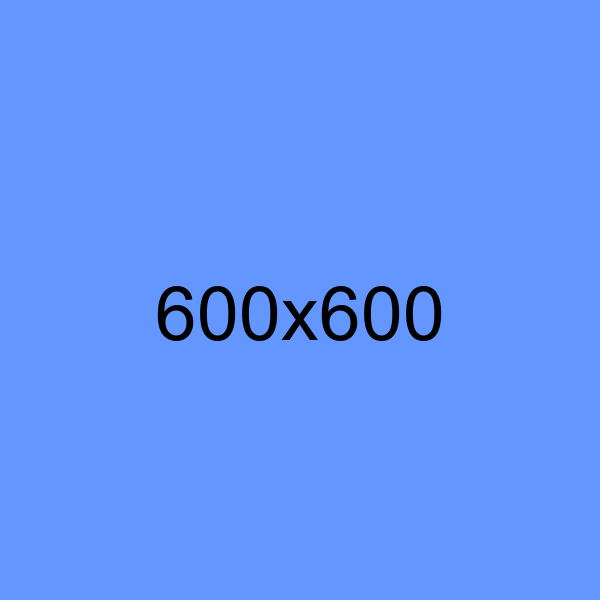

{{APIRef("HTML DOM")}}

The **`sizes`** property of the {{domxref("HTMLImageElement")}} interface allows you to specify the layout width of the [image](/en-US/docs/Web/HTML/Reference/Elements/img) for each of a list of [media queries](/en-US/docs/Web/CSS/Guides/Media_queries), or `auto` for lazy-loaded images to allow the browser to automatically select an image to display based on the layout size of the element.
This allows the browser to choose between different images specified in the element {{domxref("HTMLImageElement/srcset", "srcset")}} to match different media conditions — even images with different orientations or aspect ratios.

The `sizes` property reflects the `` element's [`sizes`](/en-US/docs/Web/HTML/Reference/Elements/img#sizes) content attribute.
It can only be present when `srcset` uses width descriptors.

## Value

A string containing that is can be the `auto` keyword (optionally followed by any number of _source sizes_), or one or more _source sizes_.

See the [`sizes`](/en-US/docs/Web/HTML/Reference/Elements/img#sizes) attribute in the HTML `` reference for more information.

## Examples

### Selecting an image to fit window width

In this example, a blog-like layout is created, displaying some text and an image for which three size points are specified, depending on the width of the window.
Three versions of the image are also available, with their widths specified. The browser takes all of this information and selects an image and width that best meets the specified values.

How exactly the images are used may depend upon the browser and the pixel density of the user's display.

Buttons at the bottom of the example let you actually modify the `sizes` property slightly, switching the largest of the three widths for the image between 40em and 50em.

#### HTML

```html
<article>
  <h1>An amazing headline</h1>
  <div class="test"></div>
  <p>
    This is even more amazing content text. It's really spectacular. And
    fascinating. Oh, it's also clever and witty. Award-winning stuff, I'm sure.
  </p>
  
  <p>
    Then there's even more amazing stuff to say down here. Can you believe it? I
    sure can't.
  </p>

  <button id="break40">Last Width: 40em</button>
  <button id="break50">Last Width: 50em</button>
</article>
```

#### CSS

```css
article {
  margin: 1em;
  max-width: 60em;
  min-width: 20em;
  border: 4em solid #880e4f;
  border-radius: 7em;
  padding: 1.5em;
  font:
    16px "Open Sans",
    "Verdana",
    "Helvetica",
    "Arial",
    sans-serif;
}

article img {
  display: block;
  max-width: 100%;
  border: 1px solid #888888;
  box-shadow: 0 0.5em 0.3em #888888;
  margin-bottom: 1.25em;
}
```

#### JavaScript

The JavaScript code handles the two buttons that let you toggle the third width option between 40em and 50em; this is done by handling the {{domxref("Element.click_event", "click")}} event, using the JavaScript string {{jsxref("String.replace", "replace()")}} method to replace the relevant portion of the `sizes` string.

```js
const image = document.querySelector("article img");
const break40 = document.getElementById("break40");
const break50 = document.getElementById("break50");

break40.addEventListener(
  "click",
  () => (image.sizes = image.sizes.replace(/50em,/, "40em,")),
);

break50.addEventListener(
  "click",
  () => (image.sizes = image.sizes.replace(/40em,/, "50em,")),
);
```

#### Result

The page is best {{LiveSampleLink('Selecting an image to fit window width', 'viewed in its own window')}}, so you can adjust the sizes fully, and the example is not constrained by its containing frame.

1. Enable the developer tools and change the width of the page — you should see the image change size at the sizes media query trigger points: 480px (30em), and 800px (50em).
2. Set the width between 50em (800px) and 60em (960px) so that the last media query is selected. Then alternately press each of the buttons and note how the layout size of the image is changed.

{{EmbedLiveSample("Selecting an image to fit window width", "", 1050)}}

### Automatic image selection for lazy loaded images

This example demonstrates how setting the `sizes` value to `auto` affects the selection of the image to load from the [`srcset`](/en-US/docs/Web/HTML/Reference/Elements/img#srcset) when {{htmlelement("img")}} elements are lazy-loaded.
It also allows you to see the effect of changing the size of a container on the loaded image.

#### HTML

In order to demonstrate the effect of lazy loading the images need to be initially hidden from the {{glossary("visual viewport")}}, and then scrolled into view.
This is achieved by having an outer `scroll-container` {{htmlelement("div")}} that nests `spacer` and `demo-wrap` containers.
The images are contained inside the `demo-wrap` container, which is pushed out of the visual viewport by the height set on the `spacer` container.

The three {{htmlelement("img")}} elements have different `alt` attribute values, but are otherwise identical:

- `srcset` defines three images and indicates that they are 600px, 400px, and 200px wide.
- `src` specifies the image that will be used if `srcset` is not supported or it can't be parsed.
  We use the largest image in the `srcset` as this will almost always downscale better than the smallest image will upscale.
- `loading` is `lazy`.
- `sizes` is `auto`.
  This tells the browser to select the image that is most appropriate based on the layout information it has at the time the image intersects with the visual viewport.

The three images are constrained within containers that are sized to select different images.

```html
<div id="scroll-container">
  Scroll down to display images
  <div id="spacer"></div>
  <div id="demo-wrap">
    <div class="img-container img-container--sm" id="resizable">
      <div class="img-square">
        
      </div>
      <div class="label"><strong>Container width: 100px</strong></div>
    </div>

    <div class="img-container img-container--md">
      <div class="img-square">
        
      </div>
      <div class="label"><strong>Container width: 200px</strong></div>
    </div>

    <div class="img-container img-container--lg">
      <div class="img-square">
        
      </div>
      <div class="label"><strong>Container width: 400px</strong></div>
    </div>
  </div>
</div>
```

```html hidden
<div id="controls">
  <label for="slider">First image width:</label>
  <input type="range" id="slider" min="100" max="700" value="100" step="1" />
  <input type="number" id="number" min="100" max="700" value="100" step="1" />
  <span>px</span>
</div>
```

```html hidden
<pre id="log"></pre>
```

```js hidden
const logElement = document.querySelector("#log");
function log(text) {
  logElement.innerText = `${logElement.innerText}${text}\n`;
  logElement.scrollTop = logElement.scrollHeight;
}
```

```css hidden
#log {
  height: 100px;
  overflow: scroll;
  padding: 0.5rem;
  border: 1px solid black;
}
```

#### CSS

Here we show the CSS classes that set the size of the different image containers.

```css hidden
#scroll-container {
  height: 400px;
  overflow-y: scroll;
  border: 2px solid #ccc;
}
#spacer {
  height: 600px;
}
#demo-wrap {
  display: flex;
  gap: 16px;
  flex-wrap: wrap;
  align-items: flex-start;
  padding: 16px;
}
.img-container {
  border: 2px solid #ccc;
  overflow: hidden;
}
.img-square {
  width: 100%;
  aspect-ratio: 1 / 1;
  overflow: hidden;
}
.img-square img {
  width: 100%;
  height: 100%;
  object-fit: cover;
  display: block;
}
.label {
  font-size: 13px;
  padding: 6px 10px;
  background: #f5f5f5;
}
```

```css hidden
#controls {
  display: flex;
  align-items: center;
  gap: 10px;
  margin-bottom: 10px;
}
#number {
  width: 60px;
}
```

```css
.img-container--sm {
  width: 100px;
}
.img-container--md {
  width: 200px;
}
.img-container--lg {
  width: 400px;
}
```

```js hidden
const slider = document.getElementById("slider");
const number = document.getElementById("number");
const resizable = document.getElementById("resizable");
const resizableImg = resizable.querySelector("img");
const resizableLabel = resizable.querySelector(".label strong");

function setSize(px) {
  px = Math.min(700, Math.max(100, px));
  resizable.style.width = px + "px";
  resizableImg.sizes = px + "px"; // update sizes so browser can pick new srcset candidate
  resizableLabel.textContent = px + "px";
  slider.value = px;
  number.value = px;
}

slider.addEventListener("input", () => setSize(parseInt(slider.value)));
number.addEventListener("input", () => setSize(parseInt(number.value)));

// Logging
const images = document.querySelectorAll(".img-square img");

images.forEach((img) => {
  if (img.complete) {
    log(`Already cached: ${img.currentSrc} (${img.offsetWidth}px)`);
  }
  img.addEventListener("load", () => {
    log(`Loaded: ${img.currentSrc} (${img.offsetWidth}px container)`);
  });
});

const observer = new IntersectionObserver(
  (entries) => {
    entries.forEach((entry) => {
      if (entry.isIntersecting) {
        const img = entry.target;
        log(`Entered viewport: ${img.alt}`);
        observer.unobserve(img);
      }
    });
  },
  {
    root: document.getElementById("scroll-container"),
    rootMargin: "0px",
    threshold: 0.1,
  },
);

images.forEach((img) => observer.observe(img));
```

The remaining CSS and the JavaScript that powers the slider, logging, and so on, are not shown (if you are interested in examining these, select "Play" to view the whole example in the interactive playground).

#### Result

Scroll the frame to display the three images.
The browser should have selected a different image for each based on the different width constraints.
You can use the slider to modify the size of the container for the first image.
Note that the browser may or may not select a new image to display as the size of the container changes as implementations are not required to react to dynamic changes.

{{EmbedLiveSample("Automatic image selection for lazy loaded images", "", 600)}}

The log provides information when a `load` event fires for each image, and when an image intersects the visible viewport.
Note that the images are lazy-loaded, so the `load` event should be fired just before the image enters the viewport.
Also note that the `load` event also fires as you modify the container size for the first image, indicating when the browser has recalculated the layout (not necessarily that a new image has been loaded).

## Specifications

{{Specifications}}

## Browser compatibility

{{Compat}}

## See also

- [Media queries](/en-US/docs/Web/CSS/Guides/Media_queries)
- [Using media queries](/en-US/docs/Web/CSS/Guides/Media_queries/Using)
- [HTML images](/en-US/docs/Learn_web_development/Core/Structuring_content/HTML_images)
- [Responsive images](/en-US/docs/Web/HTML/Guides/Responsive_images)
- [Using the `srcset` and `sizes` attributes](/en-US/docs/Web/HTML/Reference/Elements/img#using_the_srcset_and_sizes_attributes)
- {{domxref("HTMLImageElement.currentSrc")}}
- {{domxref("HTMLImageElement.src")}}
- {{domxref("HTMLImageElement.srcset")}}
