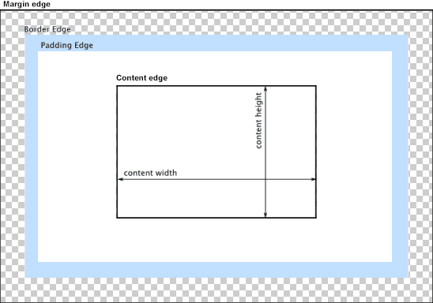

{{APIRef("HTML DOM")}}

The read-only {{domxref("HTMLImageElement")}} property
**`x`** indicates the x-coordinate of the
{{HTMLElement("img")}} element's left border edge relative to the root element's
origin.

The `x` and {{domxref("HTMLImageElement.y", "y")}} properties are only valid
for an image if its {{cssxref("display")}} property has the computed value
`table-column` or `table-column-group`. In other words: it has
either of those values set explicitly on it, or it has inherited it from a containing
element, or by being located within a column described by either {{HTMLElement("col")}}
or {{HTMLElement("colgroup")}}.

## Value

An integer value indicating the distance in pixels from the left edge of the element's
nearest root element and the left edge of the {{HTMLElement("img")}} element's border
box. The nearest root element is the outermost {{HTMLElement("html")}} element that
contains the image. If the image is in an {{HTMLElement("iframe")}}, its `x`
is relative to that frame.

In the diagram below, the left border edge is the left edge of the blue padding area.
So the value returned by `x` would be the distance from that point to the
left edge of the content area.



> **Note:** The `x` property is only valid if the computed
> value of the image's {{cssxref("display")}} property is either
> `table-column` or `table-column-group`; in other words, either
> of those are set directly on the {{HTMLElement("img")}} or they're inherited from a
> containing element or by being located within a column described by either
> {{HTMLElement("col")}} or {{HTMLElement("colgroup")}}.

## Example

The example below demonstrates the use of the `HTMLImageElement` properties
{{domxref("HTMLImageElement.x", "x")}} and {{domxref("HTMLImageElement.y", "y")}}.

### HTML

In this example, we see a table showing information about users of a website,
including their user ID, their full name, and their avatar image.

```html
<table id="userinfo">
  <colgroup>
    <col span="2" class="group1">
    <col>
  </colgroup>
  <tr>
    <th>UserID</th>
    <th>Name</th>
    <th>Avatar</th>
  </tr>
  <tr>
    <td>12345678</td>
    <td>Johnny Rocket</td>
    <td></td>
  </th>
</table>
<pre id="log">
</pre>
```

### JavaScript

The JavaScript code that fetches the image from the table and looks up its
`x` and `y` values is below.

```js
let logBox = document.querySelector("pre");
let tbl = document.getElementById("userinfo");

let log = (msg) => {
  logBox.innerHTML += `${msg}<br>`;
};

let cell = tbl.rows[1].cells[2];
let image = cell.querySelector("img");

log(`Image's global X: ${image.x}`);
log(`Image's global Y: ${image.y}`);
```

This uses the {{HTMLElement("table")}}'s {{domxref("HTMLTableElement.rows", "rows")}}
property to get a list of the rows in the table, from which it looks up row 1 (which,
being a zero-based index, means the second row from the top). Then it looks at that
{{HTMLElement("tr")}} (table row) element's {{domxref("HTMLTableRowElement.cells",
  "cells")}} property to get a list of the cells in that row. The third cell is taken from
that row (once again, specifying 2 as the zero-based offset).

From there, we can get the `` element itself from the cell by
calling {{domxref("Element.querySelector", "querySelector()")}} on the
{{domxref("HTMLTableCellElement")}} representing that cell.

Finally, we can look up and display the values of the `HTMLImageElement`'s
`x` and `y` properties.

### CSS

The CSS defining the appearance of the table:

```css
.group1 {
  background-color: #d7d9f2;
}

table {
  border-collapse: collapse;
  border: 2px solid rgb(100, 100, 100);
  font-family: sans-serif;
}

td,
th {
  border: 1px solid rgb(100, 100, 100);
  padding: 10px 14px;
}

td > img {
  max-width: 4em;
}
```

### Result

The resulting table looks like this:

{{EmbedLiveSample("Example", 600, 200)}}

## Specifications

{{Specifications}}

## Browser compatibility

{{Compat}}
