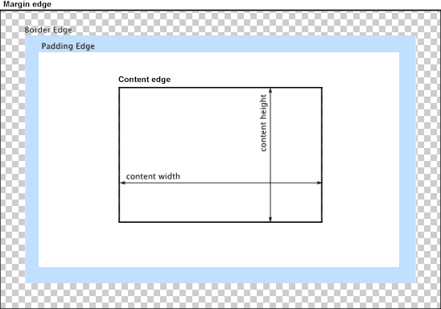

{{APIRef("HTML DOM")}}

The read-only **`y`** property of the {{domxref("HTMLImageElement")}} interface indicates the y-coordinate of the {{HTMLElement("img")}} element's top border edge relative to the root element's origin.

The {{domxref("HTMLImageElement.x", "x")}} and `y` properties are only valid for an image if its {{cssxref("display")}} property has the computed value `table-column` or `table-column-group`. In other words: it has either of those values set explicitly on it, or it has inherited it from a containing element, or by being located within a column described by either {{HTMLElement("col")}} or {{HTMLElement("colgroup")}}.

## Value

An integer value indicating the distance in pixels from the top edge of the element's nearest root element to the top edge of the {{HTMLElement("img")}} element's border box. The nearest root element is the outermost {{HTMLElement("html")}} element that contains the image. If the image is in an {{HTMLElement("iframe")}}, its `y` is relative to that frame.

In the diagram below, the top border edge is the top edge of the blue padding area. So the value returned by `y` would be the distance from that point to the top edge of the content area.

## Example

See [`HTMLImageElement.x`](/en-US/docs/Web/API/HTMLImageElement/x#example) for example code that demonstrates the use of the `HTMLImageElement.y` (and `HTMLImageElement.x`).

## Specifications

{{Specifications}}

## Browser compatibility

{{Compat}}

## See also

- {{cssxref("display")}}
- {{HTMLElement("col")}}
- {{HTMLElement("colgroup")}}
- {{domxref("HTMLImageElement.x")}}
