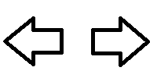

{{ApiRef("HTML DOM")}}

The **`areas`** read-only property of the {{domxref("HTMLMapElement")}} interface returns a collection of {{HTMLElement("area")}} elements associated with the {{HTMLElement("map")}} element.

## Value

A {{domxref("HTMLCollection")}} object of {{domxref("HTMLAreaElement")}} elements.

## Example

```html
<map id="image-map">
  <area shape="circle" coords="50,50,35" alt="left arrow" />
  <area shape="circle" coords="150,50,35" alt="right arrow" />
</map>

<output></output>
```

```css hidden
output {
  display: block;
}
```

```js
const mapElement = document.getElementById("image-map");
const outputElement = document.querySelector("output");

for (const area of mapElement.areas) {
  area.addEventListener("click", (event) => {
    outputElement.textContent = `You clicked on the ${area.alt} area.\n\n`;
  });
}
```

### Results

{{EmbedLiveSample("Example",100,150)}}

## Specifications

{{Specifications}}

## Browser compatibility

{{Compat}}

## See also

- {{domxref("HTMLAreaElement")}}
- {{domxref("HTMLImageElement.useMap")}}
