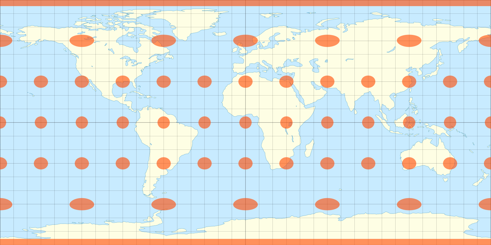
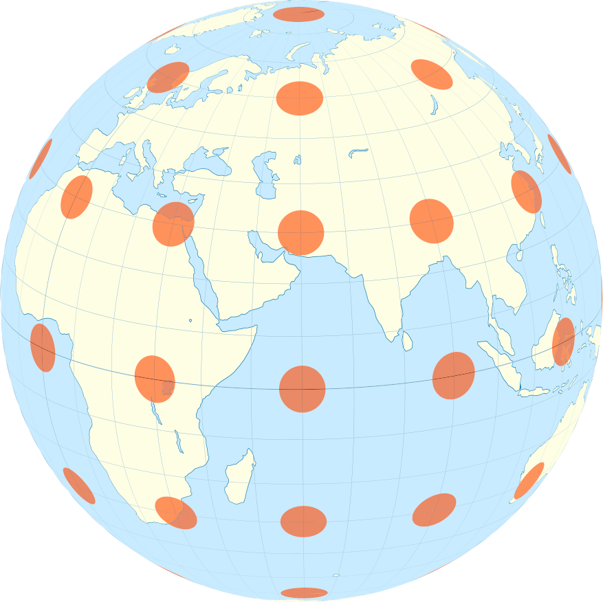

{{APIRef("HTML DOM")}}

The **`environmentMap`** property reflects the
[`environmentmap`](/en-US/docs/Web/HTML/Reference/Elements/model#environmentmap)
HTML attribute, and represents the {{glossary("URL")}} of the image file
providing the lighting information for a given model, interpreted as an
[equirectangular](https://en.wikipedia.org/wiki/Equirectangular_projection)
projection. When an environment map resource is ready to participate in rendering, the model's
{{domxref("HTMLModelElement.environmentMapReady", "environmentMapReady")}}
promise is resolved, or is rejected if the resource cannot load or be used.

<table><tr><td>


An equirectangular projection of Earth

</td><td>


The projection of the equirectangular back to a sphere

</td></tr></table>

If a custom environment map is not set, a generic, User Agent-specified environment map is used.

## Usage notes

> [!NOTE]
> While environment map resources are provided as images, an appropriate resource should contain a very high dynamic range of luminance values, and may not be appropriate to display directly. While a typical display image may specify a contrast ratio of 3000:1, the contrast ratio for an environment map image may be 100,000:1 or greater.

## Examples

This example demonstrates how to specify a custom environment map, both in JavaScript and directly in HTML:

```html
<model
  environmentMap="grassland.exr"
  style="background-color:#ff8080;"
  alt="a teapot in a sunny grassland">
  <source src="teapot.glb" type="model/gltf+binary" />
  <source src="teapot.usdz" type="model/vnd.usdz+zip" />
</model>
<button onclick="goToTundra()"></button>
```

```js
let modelElem = document.querySelector("model");

async function goToTundra() {
  modelElem.alt = "a teapot in a frozen tundra";
  modelElem.environmentMap = "tundra.exr";
  await modelElem.environmentMapReady;
  modelElem.style.backgroundColor = "#8080ff";
}
```

In this example, the teapot model is initially presented in an environment
that reflects a warm, grassy landscape. Note that while the background color
is not directly changed, it is often appropriate to update the background color
in conjunction with a change to the `environmentMap`.

## Specifications

{{Specifications}}

## Browser compatibility

{{Compat}}

## See also
