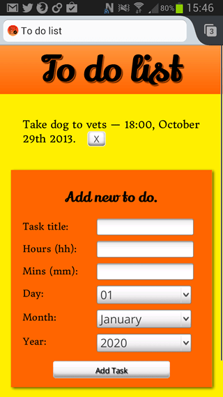
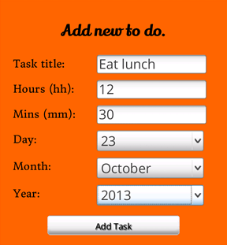

{{DefaultAPISidebar("IndexedDB")}}

In this article we look at a complex example involving checking the current time and date against a deadline stored via IndexedDB. The main complication here is checking the stored deadline info (month, hour, day, etc.) against the current time and date taken from a [Date](/en-US/docs/Web/JavaScript/Reference/Global_Objects/Date) object.



The main example application we will be referring to in this article is **To-do list notifications**, a simple to-do list application that stores task titles and deadline times and dates via [IndexedDB](/en-US/docs/Web/API/IndexedDB_API), and then provides users with notifications when deadline dates are reached, via the [Notification](/en-US/docs/Web/API/Notification), and [Vibration](/en-US/docs/Web/API/Vibration_API) APIs. You can [download the To-do list notifications app from GitHub](https://github.com/mdn/dom-examples/tree/main/to-do-notifications) and play around with the source code, or [view the app running live](https://mdn.github.io/dom-examples/to-do-notifications/).

## The basic problem

In the to-do app, we wanted to first record time and date information in a format that is both machine readable and human understandable when displayed, and then check whether each time and date is occurring at the current moment. Basically, we want to check what the time and date is right now, and then check each stored event to see if any of their deadlines match the current time and date. If they do, we want to let the user know with some kind of notification.

This would be easy if we were just comparing two {{jsxref("Global_Objects/Date", "Date")}} objects, but of course humans don't want to enter deadline information in the same format JavaScript understands. Human-readable dates are quite different, with a number of different representations.

### Recording the date information

To provide a reasonable user experience on mobile devices, and to cut down on ambiguities, I decided to create an HTML form with:



- A text input for entering a title for your to-do list. This is the least avoidable bit of user typing.
- Number inputs for the hour and minute parts of the deadline. On browsers that support `type="number"`, you get a nice little up and down arrow number picker. On mobile platforms you tend to get a numeric keypad for entering data, which is helpful. On others you just get a standard text input, which is okay.
- {{HTMLElement("select")}} elements for inputting the day, month and year of the deadline. Because these values are the most ambiguous for users to enter (7, sunday, sun? 04, 4, April, Apr? 2013, '13, 13?), I decided the best solution was to give them a choice to pick from, which also saves on annoying typing for mobile users. The days are recorded as numerical days of the month, the months are recorded as full month names, and the years are recorded as full four digit year numbers.

When the form's submit button is pressed, we run the `addData()` function, which starts like this:

```js
function addData(e) {
  e.preventDefault();

  if (!title.value || !hours.value || !minutes.value || !day.value || !month.value || !year.value) {
    note.innerHTML += '<li>Data not submitted — form incomplete.</li>';
    return;
  }
```

In this segment, we check to see if the form fields have all been filled in. If not, we drop a message into our developer notifications pane (see the bottom left of the app UI) to tell the user what is going on, and exit out of the function. This step is mainly for browsers that don't support HTML form validation (I have used the `required` attribute in my HTML to force validation, in those that do.)

```js
   else {
    const newItem = [
      {
        taskTitle: title.value,
        hours    : hours.value,
        minutes  : minutes.value,
        day      : day.value,
        month    : month.value,
        year     : year.value,
        notified : "no"
      }
    ];

    // open a read/write db transaction, ready for adding the data
    const transaction = db.transaction(["toDoList"], "readwrite");

    // report on the success of opening the transaction
    transaction.oncomplete = (event) => {
      note.innerHTML += '<li>Transaction opened for task addition.</li>';
    };

    transaction.onerror = (event) => {
      note.innerHTML += '<li>Transaction not opened due to error. Duplicate items not allowed.</li>';
    };

    // create an object store on the transaction
    const objectStore = transaction.objectStore("toDoList");

    // add our newItem object to the object store
    const request = objectStore.add(newItem[0]);
```

In this section we create an object called `newItem` that stores the data in the format required to insert it into the database. The next few lines open the database transaction and provide messages to notify the user if this was successful or failed. Then an `objectStore` is created into which the new item is added. The `notified` property of the data object indicates that the to-do list item's deadline has not yet come up and been notified - more on this later!

> **Note:** The `db` variable stores a reference to the IndexedDB database instance; we can then use various properties of this variable to manipulate the data.

```js
    request.onsuccess = (event) => {

      note.innerHTML += '<li>New item added to database.</li>';

      title.value = '';
      hours.value = null;
      minutes.value = null;
      day.value = '01';
      month.value = 'January';
      year.value = 2020;
    };
  }
```

This next section creates a log message to say the new item addition is successful, and resets the form so it's ready for the next task to be entered.

```js
  // update the display of data to show the newly added item, by running displayData() again.
  displayData();
};
```

Last of all, we run the `displayData()` function, which updates the display of data in the app to show the new task that was just entered.

### Checking whether a deadline has been reached

At this point our data is in the database; now we want to check whether any of the deadlines have been reached. This is done by our `checkDeadlines()` function:

```js
function checkDeadlines() {
  const now = new Date();
```

First we grab the current date and time by creating a blank `Date` object. Easy huh? It's about to get a bit more complex.

```js
const minuteCheck = now.getMinutes();
const hourCheck = now.getHours();
const dayCheck = now.getDate();
const monthCheck = now.getMonth();
const yearCheck = now.getFullYear();
```

The `Date` object has a number of methods to extract various parts of the date and time inside it. Here we fetch the current minutes (gives an easy numerical value), hours (gives an easy numerical value), day of the month (`getDate()` is needed for this, as `getDay()` returns the day of the week, 1-7), month (returns a number from 0-11, see below), and year (`getFullYear()` is needed; `getYear()` is deprecated, and returns a weird value that is not much use to anyone!)

```js
  const objectStore = db.transaction(['toDoList'], "readwrite").objectStore('toDoList');

  objectStore.openCursor().onsuccess = (event) => {
    const cursor = event.target.result;
    let monthNumber;

    if (cursor) {
```

Next we create another IndexedDB `objectStore`, and use the `openCursor()` method to open a cursor, which is basically a way in IndexedDB to iterate through all the items in the store. We then loop through all the items in the cursor for as long as there is a valid item left in the cursor.

```js
switch (cursor.value.month) {
  case "January":
    monthNumber = 0;
    break;
  case "February":
    monthNumber = 1;
    break;

  // other lines removed from listing for brevity

  case "December":
    monthNumber = 11;
    break;
  default:
    alert("Incorrect month entered in database.");
}
```

The first thing we do is convert the month names we have stored in the database into a month number that JavaScript will understand. As we saw before, the JavaScript `Date` object creates month values as a number between 0 and 11.

```js
if (
  Number(cursor.value.hours) === hourCheck &&
  Number(cursor.value.minutes) === minuteCheck &&
  Number(cursor.value.day) === dayCheck &&
  monthNumber === monthCheck &&
  cursor.value.year === yearCheck &&
  notified === "no"
) {
  // If the numbers all do match, run the createNotification()
  // function to create a system notification
  createNotification(cursor.value.taskTitle);
}
```

With the current time and date segments that we want to check against the IndexedDB stored values all assembled, it is time to perform the checks. We want all the values to match before we show the user some kind of notification to tell them their deadline is up.

The `+` operator in this case converts numbers with leading zeros into their non leading zero equivalents, e.g. 09 -> 9. This is needed because JavaScript `Date` number values never have leading zeros, but our data might.

The `notified === "no"` check is designed to make sure you will only get one notification per to-do item. When a notification is fired for each item object, its `notification` property is set to `"yes"` so this check will not pass on the next iteration, via the following code inside the `createNotification()` function (read [Using IndexedDB](/en-US/docs/Web/API/IndexedDB_API/Using_IndexedDB) for an explanation):

```js
    // now we need to update the value of notified to "yes" in this particular data object, so the
    // notification won't be set off on it again

    // first open up a transaction as usual
    const objectStore = db.transaction(['toDoList'], "readwrite").objectStore('toDoList');

    // get the to-do list object that has this title as it's title
    const request = objectStore.get(title);

    request.onsuccess = () => {
      // grab the data object returned as the result
      const data = request.result;

      // update the notified value in the object to "yes"
      data.notified = "yes";

      // create another request that inserts the item back into the database
      const requestUpdate = objectStore.put(data);

      // when this new request succeeds, run the displayData() function again to update the display
      requestUpdate.onsuccess = () => {
        displayData();
      }
```

If the checks all match, we then run the `createNotification()` function to provide a notification to the user.

```js
      cursor.continue();
    }
  }
}
```

The last line of the function moves the cursor on, which causes the above deadline checking mechanism to be run for the next task stored in the IndexedDB.

### Keep on checking!

Of course, it is no use to just run the above deadline checking function once! We want to keep constantly checking all the deadlines to see if any of them are being reached. To do this, we are using `setInterval()` to run `checkDeadlines()` once per second:

```js
setInterval(checkDeadlines, 1000);
```
