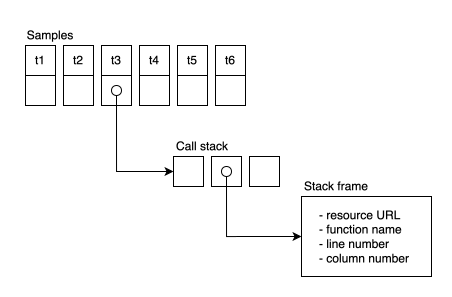

In this page we'll describe how to interpret a profile captured using the Self-Profiling API.

The format of the object returned by {{domxref("Profiler.stop()")}} is designed to be space-efficient: for example, the format aims to avoid duplicating URL values for functions which are defined in the same script. This means that some interpretation is needed to understand how a sample in the profile object maps to a location in the program, and this guide page aims to explain how to perform this interpretation.

In the first section, we'll describe the [abstract structure of a profile](#anatomy_of_a_profile). In the next section we'll describe [the format of the profile object](#profile_format) returned by {{domxref("Profiler.stop()")}}. Finally we'll [walk through an example](#example) to show what a profile for a given program looks like and how it can be interpreted.

## Anatomy of a profile

In this section we'll describe the abstract structure of a profile. Note that this isn't the same as the format of the object returned by returned by {{domxref("Profiler.stop()")}}: we'll describe that format in the next section of this guide.

A profile consists of an array of samples. Each sample consists of a timestamp and a call stack. Each call stack consists of an array of stack frames, and each stack frame contains information about the location of its corresponding function in the program:



The timestamp is a {{domxref("DOMHighResTimeStamp")}} which measures milliseconds since the _time origin_: for a window context, this is the time the window was created (if the window is new) or the time the browser started navigating to this document.

The call stack is a representation of the JavaScript call stack, which enables you to understand the execution path to the program's location at the point that the sample was taken.

The call stack consists of an array of stack frames. A stack frame essentially represents a nested function call, so if function `a()` calls function `b()`, which calls function `c()`, and a sample is taken while the browser is executing `c()`, then the call stack will consist of frames `[a, b, c]`:

```js
function c() {
  // sample taken here
}

function b() {
  c();
}

function a() {
  b();
}
```

Each stack frame contains information about the location of its corresponding function in the program:

- The URL of the script
- The name of the function
- The line number of the function definition in the script
- The column number of the function definition in the line

## Profile format

Although the section above describes the _logical_ structure of a profile, the format of the object returned by {{domxref("Profiler.stop()")}} is different. The reason is that the format is designed to be space-efficient: for example, the format aims to avoid duplicating URL values for functions which are defined in the same script.

The profile object contains four properties, all arrays:

- `frames`
  - : An array of objects, each containing information about a stack frame:
    - `column`: the column number of the function definition.
    - `line`: the line number of the function definition.
    - `name`: the name of the function.
    - `resourceId`: the index of an item in `resources`, representing the URL of the script in which the function is defined.

    Only `name` is always present: if the function is not defined in a script (for example, if it is a function that's built into the browser) then the other three properties are omitted.

- `resources`
  - : An array of strings, each representing the URL of a script.
- `samples`
  - : An array of object, each containing two properties:
    - `timestamp`: the time at which the sample was taken.
    - `stackId`: the index of an element in the `stacks` array.
- `stacks`
  - : An array of objects, each containing two properties:
    - `frameId`: the index of an element in `frames` which represents the most-nested frame in the stack.
    - `parentId`: the index of another entry in `stacks`, which represents the call stack up to but not including the frame represented by `frameId`. This is not present if the frame represented by `frameId` was at the top level of the stack.

## Example

In the following example we have a web page that contains a button: when the user presses the button, the page generates some prime numbers.

The HTML contains only the button:

```html
<button id="generate">generate!</button>
```

The JavaScript is split across two files. The "main.js" script contains the click handler for the button. This starts a profile, then calls the code to generate the primes, then logs the resulting profile:

```js
// main.js

import { genPrimes } from "./generate.js";

async function handleClick() {
  const profiler = new Profiler({ sampleInterval: 10, maxBufferSize: 10000 });

  const primes = genPrimes();
  console.log(`Finished generating ${primes.length} primes!`);

  const trace = await profiler.stop();
  console.log(JSON.stringify(trace));
}

document.querySelector("#generate").addEventListener("click", handleClick);
```

The "generate.js" script generates the primes, organized into two functions, `genPrimes()` and `isPrime()`:

```js
// generate.js

const MAX_PRIME = 1000000000;
const PRIMES_QUOTA = 10000;

function isPrime(n) {
  for (let i = 2; i <= Math.sqrt(n); i++) {
    if (n % i === 0) {
      return false;
    }
  }
  return n > 1;
}

export function genPrimes() {
  const primes = [];
  while (primes.length < PRIMES_QUOTA) {
    const candidate = Math.floor(Math.random() * MAX_PRIME);
    if (isPrime(candidate)) {
      primes.push(candidate);
    }
  }
  return primes;
}
```

If we run this code, a profile such as the one below will be logged to the developer tools console:

```json
{
  "frames": [
    { "name": "Profiler" },
    { "column": 27, "line": 5, "name": "handleClick", "resourceId": 0 },
    { "column": 17, "line": 6, "name": "isPrime", "resourceId": 1 },
    { "column": 26, "line": 15, "name": "genPrimes", "resourceId": 1 }
  ],
  "resources": [
    "http://localhost:3000/main.js",
    "http://localhost:3000/generate.js"
  ],
  "samples": [
    { "stackId": 1, "timestamp": 2972.734999999404 },
    { "stackId": 3, "timestamp": 2973.4899999946356 },
    { "stackId": 3, "timestamp": 2974.5700000077486 },
    { "stackId": 3, "timestamp": 2977.8649999946356 },
    { "stackId": 3, "timestamp": 2978.4899999946356 },
    { "stackId": 3, "timestamp": 2978.6950000077486 },
    { "stackId": 3, "timestamp": 2978.9500000029802 },
    { "stackId": 3, "timestamp": 2979.405000001192 },
    { "stackId": 2, "timestamp": 2980.030000001192 },
    { "stackId": 2, "timestamp": 2980.655000001192 }
  ],
  "stacks": [
    { "frameId": 1 },
    { "frameId": 0, "parentId": 0 },
    { "frameId": 3, "parentId": 0 },
    { "frameId": 2, "parentId": 2 }
  ]
}
```

This profile captured 10 samples, listed in the `samples` property.

The `stackId` property of each sample enables us to understand where the program was at the point the sample was taken, and in this case we've taken samples in three different places:

- `stackId: 1`: one sample
- `stackId: 3`: seven samples
- `stackId: 2`: two samples

To find the complete call stack for a sample, we retrieve the stack given the `stackId`, then use the `frameId` value in the stack to find the most-nested function, then recursively fetch parent stacks using `parentId`, until we reach the top level, which doesn't have a `parentId` value.

For example, the diagram below shows how we could derive the complete call stack for the seven samples whose `stackId` is 3:


Note also that the first item in `frames`, which has a `name` value of `Profiler`, represents a sample taken in the {{domxref("Profiler.Profiler", "Profiler()")}} constructor: since this is a function provided by the browser, the frame doesn't include script information.
