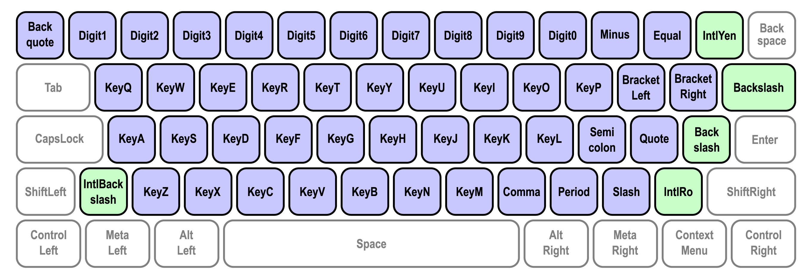

{{SeeCompatTable}}{{APIRef("Keyboard API")}}

The Keyboard API provides methods for working with a physical keyboard that is attached to a device running a browser.

It provides several capabilities. _Keyboard mapping_ provides an interface for retrieving the string generated by particular physical key on a keyboard to correctly identify that key to a user. _Keyboard locking_ enables a web page to capture keys that are normally reserved by the user agent or the underlying operating system. The intended use of the Keyboard API is by web applications such as games or remote access apps that provide a fullscreen immersive experience.

## Keyboard API concepts and usage

### Keyboard mapping

On physical keyboards, the `code` attribute contains the physical location of the key that was pressed, and the `key` attribute contains the string generated by pressing the key at that physical location on the keyboard. The `key` value takes into account the keyboard's locale (for example, 'en-US'), layout (for example, 'QWERTY'), and modifier-key state (Shift, Control, etc.). Historically there has been no way to retrieve that information.

The Keyboard Map API provides a way to retrieve the string generated by a particular key press, through the {{domxref('Keyboard')}} interface and the {{domxref('KeyboardLayoutMap')}} interface. The {{domxref('Keyboard')}} interface is accessed through {{domxref('navigator.keyboard')}}. {{domxref('Keyboard')}} provides the {{domxref('Keyboard.getLayoutMap')}} method, which returns a promise that resolves with a {{domxref('KeyboardLayoutMap')}} object that contains members for converting codes to keys. A list of valid code values is found in the [Writing System Keys](https://w3c.github.io/uievents-code/#key-alphanumeric-writing-system) section of the [UI Events KeyboardEvent code Values](https://w3c.github.io/uievents-code/) spec.

The following example demonstrates how to get the location-specific or layout-specific string associated with the key labeled `W` on an English QWERTY keyboard.

```js
if (navigator.keyboard) {
  const keyboard = navigator.keyboard;
  keyboard.getLayoutMap()
  .then((keyboardLayoutMap) => {
    const upKey = keyboardLayoutMap.get('KeyW');
    window.alert(`Press ${upKey} to move up.`);
  });
} else {
  // Do something else.
}
```

### Keyboard locking

Richly interactive web pages, games, and remote-streaming experiences often require access to special keys and keyboard shortcuts while in fullscreen mode. Examples of such key/key combinations include Escape, Alt+Tab, and Ctrl+N. Those keys and key combinations are typically captured by the user agent or the underlying operating system, as illustrated in the following example.

To capture the "W", "A", "S", and "D" keys, call `lock()` with a list that contains the key code attribute value for each of these keys:

```js
navigator.keyboard.lock(["KeyW", "KeyA", "KeyS", "KeyD"]);
```

This captures these keys regardless of which modifiers are used with the key press. Assuming a standard United States QWERTY layout, registering `KeyW` ensures that "W", Shift+"W", Control+"W", Control+Shift+"W", and all other key modifier combinations with "W" are sent to the app. The same applies to for `KeyA`, `KeyS` and `KeyD`.

### Writing system keys

The codes passed {{domxref('Keyboard.lock')}} and the various methods of the {{domxref('KeyboardLayoutMap')}} interface are called "writing system keys".

"Writing system keys" are defined in the [Writing System Keys](https://w3c.github.io/uievents-code/#key-alphanumeric-writing-system) section of the [UI Events KeyboardEvent code Values](https://w3c.github.io/uievents-code/) spec as the physical keys that change meaning based on the current locale and keyboard layout. These keys are shown below. Blue keys are present on all standard keyboards while green keys are only available on some keyboards.



## Interfaces

- {{domxref('Keyboard')}} {{experimental_inline}}
  - : Provides functions that retrieve keyboard layout maps and toggle capturing of key presses from the physical keyboard.
- {{domxref('KeyboardLayoutMap')}} {{experimental_inline}}
  - : A map-like object with functions for retrieving the string associated with specific physical keys.
- {{domxref('navigator.keyboard')}} {{ReadOnlyInline}} {{experimental_inline}}
  - : Returns a {{domxref('Keyboard')}} object which provides access to functions that retrieve keyboard layout maps and toggle capturing of key presses from the physical keyboard.

## Specifications

{{Specifications}}

## Browser compatibility

{{Compat}}
