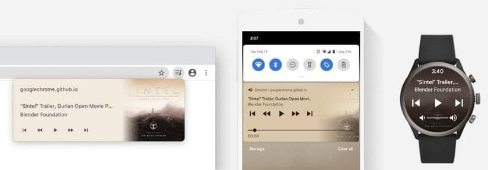

{{DefaultAPISidebar("Media Session API")}}

The **Media Session API** provides a way to customize media notifications. It does this by providing metadata for display by the user agent for the media your web app is playing.

It also provides action handlers that the browser can use to access platform media keys such as hardware keys found on keyboards, headsets, remote controls, and software keys found in notification areas and on lock screens of mobile devices. So you can seamlessly control web-provided media via your device, even when not looking at the web page.

The aim is to allow users to know what's playing and to control it, without needing to open the specific page that launched it. To be able to support the Media Session API, a browser first needs a mechanism by which to access and be controlled by the OS-level media controls (such as Firefox's [MediaControl](https://bugzil.la/1648100)).

## Media Session concepts and usage

The {{domxref("MediaMetadata")}} interface lets a website provide rich metadata to the platform UI for media that is playing. This metadata includes the title, artist (creator) name, album (collection), artwork, and chapter information. The platform can show this metadata in media centers, notifications, device lock screens, and so on. For example, different devices might present the Media Session API data like so:



> [!CALLOUT]
> Original image source: [Customize media notifications and playback controls with the Media Session API](https://web.dev/articles/media-session) on web.dev (2024)

The {{domxref("MediaSession")}} interface lets users control the playback of media through user-agent-defined interface elements. Interaction with these elements triggers action handlers on the web page playing the media. Since multiple pages may be simultaneously using this API, the user agent is responsible for calling the correct page's action handlers. The user agent provides default behaviors when no page-defined behavior is available.

## Accessing the Media Session API

The primary interface for the Media Session API is the {{domxref("MediaSession")}} interface. Rather than creating your own `MediaSession` instance, you access the API using the {{domxref("navigator.mediaSession")}} property. For example, to set the current state of the media session to `playing`:

```js
navigator.mediaSession.playbackState = "playing";
```

## Interfaces

- {{domxref("ChapterInformation")}}
  - : Represents the metadata for an individual chapter of a media resource (i.e., a video or audio file).
- {{domxref("MediaMetadata")}}
  - : Allows a web page to provide rich media metadata for display in a platform UI.
- {{domxref("MediaSession")}}
  - : Allows a web page to provide custom behaviors for standard media playback interactions.

## Examples

### Setting up action handlers for a music player

The following example shows feature detection for the Media Session API. It then instantiates a metadata object for the session, and adds action handlers for the user control actions:

```js
if ("mediaSession" in navigator) {
  navigator.mediaSession.metadata = new MediaMetadata({
    title: "Unforgettable",
    artist: "Nat King Cole",
    album: "The Ultimate Collection (Remastered)",
    artwork: [
      {
        src: "https://dummyimage.com/96x96",
        sizes: "96x96",
        type: "image/png",
      },
      {
        src: "https://dummyimage.com/128x128",
        sizes: "128x128",
        type: "image/png",
      },
      {
        src: "https://dummyimage.com/192x192",
        sizes: "192x192",
        type: "image/png",
      },
      {
        src: "https://dummyimage.com/256x256",
        sizes: "256x256",
        type: "image/png",
      },
      {
        src: "https://dummyimage.com/384x384",
        sizes: "384x384",
        type: "image/png",
      },
      {
        src: "https://dummyimage.com/512x512",
        sizes: "512x512",
        type: "image/png",
      },
    ],
  });

  navigator.mediaSession.setActionHandler("play", () => {
    /* Code excerpted. */
  });
  navigator.mediaSession.setActionHandler("pause", () => {
    /* Code excerpted. */
  });
  navigator.mediaSession.setActionHandler("stop", () => {
    /* Code excerpted. */
  });
  navigator.mediaSession.setActionHandler("seekbackward", () => {
    /* Code excerpted. */
  });
  navigator.mediaSession.setActionHandler("seekforward", () => {
    /* Code excerpted. */
  });
  navigator.mediaSession.setActionHandler("seekto", () => {
    /* Code excerpted. */
  });
  navigator.mediaSession.setActionHandler("previoustrack", () => {
    /* Code excerpted. */
  });
  navigator.mediaSession.setActionHandler("nexttrack", () => {
    /* Code excerpted. */
  });
  navigator.mediaSession.setActionHandler("skipad", () => {
    /* Code excerpted. */
  });
  navigator.mediaSession.setActionHandler("togglecamera", () => {
    /* Code excerpted. */
  });
  navigator.mediaSession.setActionHandler("togglemicrophone", () => {
    /* Code excerpted. */
  });
  navigator.mediaSession.setActionHandler("hangup", () => {
    /* Code excerpted. */
  });
}
```

Some user agents disable autoplay for media elements on mobile devices and require a user gesture to start media. The following example adds a `pointerup` event to an on-page play button, which is then used to kick off the media session code:

```js
playButton.addEventListener("pointerup", (event) => {
  const audio = document.querySelector("audio");

  // User interacted with the page. Let's play audio!
  audio
    .play()
    .then(() => {
      /* Set up media session controls, as shown above. */
    })
    .catch((error) => {
      console.error(error);
    });
});
```

### Using action handlers to control a slide presentation

The `"previousslide"` and `"nextslide"` action handlers can be used to handle moving forward and backward through a slide presentation, for example when the user puts their presentation into a {{domxref("Picture-in-Picture API", "Picture-in-Picture", "", "nocode")}} window, and presses the browser-supplied controls for navigating through slides.

```js
try {
  navigator.mediaSession.setActionHandler("previousslide", () => {
    log('> User clicked "Previous Slide" icon.');
    if (slideNumber > 1) slideNumber--;
    updateSlide();
  });
} catch (error) {
  log('Warning! The "previousslide" media session action is not supported.');
}

try {
  navigator.mediaSession.setActionHandler("nextslide", () => {
    log('> User clicked "Next Slide" icon.');
    slideNumber++;
    updateSlide();
  });
} catch (error) {
  log('Warning! The "nextslide" media session action is not supported.');
}
```

See [Presenting Slides / Media Session Sample](https://googlechrome.github.io/samples/media-session/slides.html) for a working example.

## Specifications

{{Specifications}}

## Browser compatibility

{{Compat}}

## See also

- [Customize media notifications and playback controls with the Media Session API](https://web.dev/articles/media-session) on web.dev (2024)
