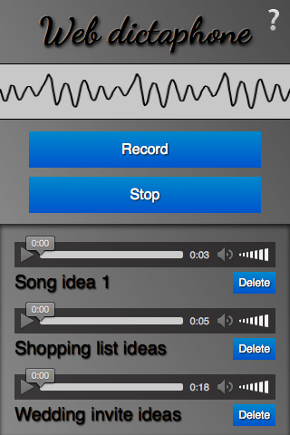

{{DefaultAPISidebar("MediaStream Recording")}}

The [MediaStream Recording API](/en-US/docs/Web/API/MediaStream_Recording_API) makes it easy to record audio and/or video streams. When used with {{domxref("MediaDevices.getUserMedia()","navigator.mediaDevices.getUserMedia()")}}, it provides an easy way to record from the user's input devices and instantly use the result in web apps.

Both audio and video may be recorded, separately or together. This article aims to provide a basic guide on how to use the MediaRecorder interface, which provides this API.

## A sample application: Web Dictaphone



To demonstrate basic usage of the MediaStream Recording API, we have built a web-based dictaphone. It allows you to record snippets of audio and then play them back. It even gives you a visualization of your device's sound input, using the Web Audio API. We'll concentrate on the recording and playback functionality for this article.

You can see this [demo running live](https://mdn.github.io/dom-examples/media/web-dictaphone/), or [grab the source code](https://github.com/mdn/dom-examples/tree/main/media/web-dictaphone) on GitHub.

## CSS goodies

The HTML is pretty simple in this app, so we won't go through it here; there are a couple of slightly more interesting bits of CSS worth mentioning, however, so we'll discuss them below. If you are not interested in CSS and want to get straight to the JavaScript, skip to the [Basic app setup](#basic_app_setup) section.

### Keeping the interface constrained to the viewport, regardless of device height, with calc()

The {{cssxref("calc", "calc()")}} function is one of those useful little utility features that's cropped up in CSS that doesn't look like much initially, but soon starts to make you think "Wow, why didn't we have this before? Why was CSS2 layout so awkward?" It allows you do a calculation to determine the computed value of a CSS unit, mixing different units in the process.

For example, in Web Dictaphone we have three main UI areas, stacked vertically. We wanted to give the first two (the header and the controls) fixed heights:

```css
header {
  height: 70px;
}

.main-controls {
  padding-bottom: 0.7rem;
  height: 170px;
}
```

However, we wanted to make the third area (which contains the recorded samples you can play back) take up whatever space is left, regardless of the device height. Flexbox could be the answer here, but it's a bit overkill for such a simple layout. Instead, the problem was solved by making the third container's height equal to 100% of the parent height, minus the heights and padding of the other two:

```css
.sound-clips {
  box-shadow: inset 0 3px 4px rgb(0 0 0 / 70%);
  background-color: rgb(0 0 0 / 10%);
  height: calc(100% - 240px - 0.7rem);
  overflow: scroll;
}
```

### Checkbox hack for showing/hiding

This is fairly well documented already, but we thought we'd give a mention to the checkbox hack, which abuses the fact that you can click on the {{htmlelement("label")}} of a checkbox to toggle it checked/unchecked. In Web Dictaphone this powers the Information screen, which is shown/hidden by clicking the question mark icon in the top right-hand corner. First of all, we style the `<label>` how we want it, making sure that it has enough z-index to always sit above the other elements and therefore be focusable/clickable:

```css
label {
  font-family: "NotoColorEmoji";
  font-size: 3rem;
  position: absolute;
  top: 2px;
  right: 3px;
  z-index: 5;
  cursor: pointer;
}
```

Then we hide the actual checkbox, because we don't want it cluttering up our UI:

```css
input[type="checkbox"] {
  position: absolute;
  top: -100px;
}
```

Next, we style the Information screen (wrapped in an {{htmlelement("aside")}} element) how we want it, give it fixed position so that it doesn't appear in the layout flow and affect the main UI, transform it to the position we want it to sit in by default, and give it a transition for smooth showing/hiding:

```css
aside {
  position: fixed;
  top: 0;
  left: 0;
  text-shadow: 1px 1px 1px black;
  width: 100%;
  height: 100%;
  transform: translateX(100%);
  transition: 0.6s all;
  background-color: #999;
  background-image: linear-gradient(
    to top right,
    rgb(0 0 0 / 0%),
    rgb(0 0 0 / 50%)
  );
}
```

Last, we write a rule to say that when the checkbox is checked (when we click/focus the label), the adjacent `<aside>` element will have its horizontal translation value changed and transition smoothly into view:

```css
input[type="checkbox"]:checked ~ aside {
  transform: translateX(0);
}
```

## Basic app setup

To grab the media stream we want to capture, we use `getUserMedia()`. We then use the MediaStream Recording API to record the stream, and output each recorded snippet into the source of a generated {{htmlelement("audio")}} element so it can be played back.

We'll declare some variables for the record and stop buttons, and the {{htmlelement("article")}} that will contain the generated audio players:

```js
const record = document.querySelector(".record");
const stop = document.querySelector(".stop");
const soundClips = document.querySelector(".sound-clips");
```

Finally for this section, we set up the basic `getUserMedia` structure:

```js
if (navigator.mediaDevices && navigator.mediaDevices.getUserMedia) {
  console.log("getUserMedia supported.");
  navigator.mediaDevices
    .getUserMedia(
      // constraints - only audio needed for this app
      {
        audio: true,
      },
    )

    // Success callback
    .then((stream) => {})

    // Error callback
    .catch((err) => {
      console.error(`The following getUserMedia error occurred: ${err}`);
    });
} else {
  console.log("getUserMedia not supported on your browser!");
}
```

The whole thing is wrapped in a test that checks whether `getUserMedia` is supported before running anything else. Next, we call `getUserMedia()` and inside it define:

- **The constraints**: Only audio is to be captured for our dictaphone.
- **The success callback**: This code is run once the `getUserMedia` call has been completed successfully.
- **The error/failure callback**: The code is run if the `getUserMedia` call fails for whatever reason.

> **Note:** All of the code below is placed inside the `getUserMedia` success callback.

## Capturing the media stream

Once `getUserMedia` has created a media stream successfully, you create a new Media Recorder instance with the `MediaRecorder()` constructor and pass it the stream directly. This is your entry point into using the MediaStream Recording API — the stream is now ready to be captured into a {{domxref("Blob")}}, in the default encoding format of your browser.

```js
const mediaRecorder = new MediaRecorder(stream);
```

There are a series of methods available in the {{domxref("MediaRecorder")}} interface that allow you to control recording of the media stream; in Web Dictaphone we just make use of two, and listen to some events. First of all, {{domxref("MediaRecorder.start()")}} is used to start recording the stream once the record button is pressed:

```js
record.onclick = () => {
  mediaRecorder.start();
  console.log(mediaRecorder.state);
  console.log("recorder started");
  record.style.background = "red";
  record.style.color = "black";
};
```

When the `MediaRecorder` is recording, the {{domxref("MediaRecorder.state")}} property will return a value of "recording".

As recording progresses, we need to collect the audio data. We register an event handler to do this using {{domxref("mediaRecorder.dataavailable_event", "ondataavailable")}}:

```js
let chunks = [];

mediaRecorder.ondataavailable = (e) => {
  chunks.push(e.data);
};
```

> **Note:** The browser will fire `dataavailable` events as needed, but if you want to intervene you can also include a timeslice when invoking the `start()` method — for example `start(10000)` — to control this interval, or call {{domxref("MediaRecorder.requestData()")}} to trigger an event when you need it.

Lastly, we use the {{domxref("MediaRecorder.stop()")}} method to stop the recording when the stop button is pressed, and finalize the {{domxref("Blob")}} ready for use somewhere else in our application.

```js
stop.onclick = () => {
  mediaRecorder.stop();
  console.log(mediaRecorder.state);
  console.log("recorder stopped");
  record.style.background = "";
  record.style.color = "";
};
```

Note that the recording may also stop naturally if the media stream ends (e.g. if you were grabbing a song track and the track ended, or the user stopped sharing their microphone).

## Grabbing and using the blob

When recording has stopped, the `state` property returns a value of "inactive", and a stop event is fired. We register an event handler for this using {{domxref("mediaRecorder.stop_event", "onstop")}}, and finalize our blob there from all the chunks we have received:

```js
mediaRecorder.onstop = (e) => {
  console.log("recorder stopped");

  const clipName = prompt("Enter a name for your sound clip");

  const clipContainer = document.createElement("article");
  const clipLabel = document.createElement("p");
  const audio = document.createElement("audio");
  const deleteButton = document.createElement("button");

  clipContainer.classList.add("clip");
  audio.setAttribute("controls", "");
  deleteButton.textContent = "Delete";
  clipLabel.textContent = clipName;

  clipContainer.appendChild(audio);
  clipContainer.appendChild(clipLabel);
  clipContainer.appendChild(deleteButton);
  soundClips.appendChild(clipContainer);

  const blob = new Blob(chunks, { type: "audio/ogg; codecs=opus" });
  chunks = [];
  const audioURL = window.URL.createObjectURL(blob);
  audio.src = audioURL;

  deleteButton.onclick = (e) => {
    let evtTgt = e.target;
    evtTgt.parentNode.parentNode.removeChild(evtTgt.parentNode);
  };
};
```

Let's go through the above code and look at what's happening.

First, we display a prompt asking the user to name their clip.

Next, we create an HTML structure like the following, inserting it into our clip container, which is an {{htmlelement("article")}} element.

```html
<article class="clip">
  <audio controls></audio>
  <p>your clip name</p>
  <button>Delete</button>
</article>
```

After that, we create a combined {{domxref("Blob")}} out of the recorded audio chunks, and create an object URL pointing to it, using `window.URL.createObjectURL(blob)`. We then set the value of the {{HTMLElement("audio")}} element's [`src`](/en-US/docs/Web/HTML/Element/audio#src) attribute to the object URL, so that when the play button is pressed on the audio player, it will play the `Blob`.

Finally, we set an `onclick` handler on the delete button to be a function that deletes the whole clip HTML structure.

## Specifications

{{Specifications}}

## Browser compatibility

{{Compat}}

## See also

- [Media Capture and Streams API](/en-US/docs/Web/API/Media_Capture_and_Streams_API) landing page
- {{domxref("MediaDevices.getUserMedia()")}}
