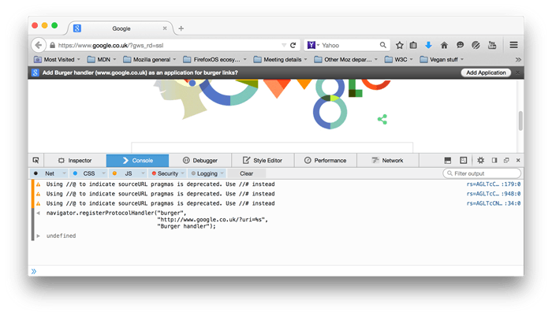

## Background

It's fairly common to find web pages link to resources using non-`http` protocols. An example is the `mailto:` protocol:

```html
<a href="mailto:webmaster@example.com">Web Master</a>
```

Web authors can use a `mailto:` link when they want to provide a convenient way for users to send an email, directly from the webpage. When the link is activated, the browser should launch the default desktop application for handling email. You can think of this as a _desktop-based_ protocol handler.

Web-based protocol handlers allow web-based applications to participate in the process too. This is becoming more important as more types of applications migrate to the web. In fact, there are many web-based email handling applications that could process a `mailto` link.

## Registering

Setting up a web application as a protocol handler is not a difficult process. Basically, the web application uses [`registerProtocolHandler()`](/en-US/docs/Web/API/Navigator/registerProtocolHandler) to register itself with the browser as a potential handler for a given protocol. For example:

```js
navigator.registerProtocolHandler(
  "web+burger",
  "http://www.google.co.uk/?uri=%s",
  "Burger handler",
);
```

Where the parameters are:

- The protocol.
- The URL template, used as the handler. The "%s" is replaced with the `href` of the link and a GET is executed on the resultant URL.
- The user friendly name for the protocol handler.

When a browser executes this code, it should let the user choose how to handle the protocol. The browser could prompt the user for registration immediately, or wait until the user clicks on a link that uses the protocol. Firefox displays a prompt in the notification bar area:



> **Note:** The URL template supplied when registering **must** be of the same domain as the webpage attempting to perform the registration or the registration will fail. For example, `http://example.com/homepage.html` can register a protocol handler for `http://example.com/handle_mailto/%s`, but not for `http://example.org/handle_mailto/%s`.

### Example

```html
<!doctype html>
<html lang="en-US">
  <head>
    <meta charset="utf-8" />
    <meta name="viewport" content="width=device-width" />
    <title>Web Protocol Handler Sample - Register</title>
    <script>
      navigator.registerProtocolHandler(
        "web+burger",
        "http://www.google.co.uk/?uri=%s",
        "Burger handler",
      );
    </script>
  </head>
  <body>
    <h1>Web Protocol Handler Sample</h1>
    <p>
      This web page will install a web protocol handler for the
      <code>web+burger:</code> protocol.
    </p>
  </body>
</html>
```

## Activating

Now, anytime the user activates a link that uses the registered protocol, the browser will route the action to the URL supplied when the web application registered. Firefox will, by default, prompt the user before handling off the action.

### Example

```html
<!doctype html>
<html lang="en">
  <head>
    <title>Web Protocol Handler Sample - Test</title>
  </head>
  <body>
    <p>Hey have you seen <a href="web+burger:cheeseburger">this</a> before?</p>
  </body>
</html>
```

## Handling

The next phase is handling the action. The browser extracts the `href` from the activated link, combines it with the URL template supplied during handler registration and performs an HTTP GET on the URL. So, using the above examples, the browser would perform a GET on this URL:

```
http://www.google.co.uk/?uri=web+burger:cheeseburger
```

Server side code can extract the query string parameters and perform the desired action.

> **Note:** The server side code is passed the **entire** contents of the `href`. This means the server side code will have to parse out the protocol from the data.

### Example

```php
<?php
$value = "";
if ( isset ( $_GET["value"] ) ) {
  $value = $_GET["value"];
}
?>

<!DOCTYPE html>
<html lang="en">
<head>
    <title>Web Protocol Handler Sample</title>
</head>
<body>
  <h1>Web Protocol Handler Sample - Handler</h1>
  <p>This web page is called when handling a <code>web+burger:</code> protocol action. The data sent:</p>
  <textarea>
<?php echo(htmlspecialchars($value, ENT_QUOTES, 'UTF-8')); ?>
  </textarea>
</body>
</html>
```

## References

- [http://www.w3.org/TR/2011/WD-html5-20110525/timers.html#custom-handlers](https://www.w3.org/TR/2011/WD-html5-20110525/timers.html#custom-handlers)

## See also

- `nsIProtocolHandler` (XUL only)
- [RegisterProtocolHandler Enhancing the Federated Web](https://blog.mozilla.org/webdev/2010/07/26/registerprotocolhandler-enhancing-the-federated-web/) at Mozilla Webdev
- [Register a custom protocolHandler](https://web.dev/registering-a-custom-protocol-handler/) at web.dev.
