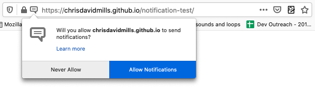

{{DefaultAPISidebar("Web Notifications")}}{{securecontext_header}} {{AvailableInWorkers}}

The Notifications API allows web pages to control the display of system notifications to the end user.
These are outside the top-level browsing context viewport, so therefore can be displayed even when the user has switched tabs or moved to a different app.
The API is designed to be compatible with existing notification systems, across different platforms.

## Concepts and usage

Showing a system notification generally involves first requesting permission to use the feature, and then creating a notification.

### Notifications require user permission

In order to use notifications, the user needs to grant the current origin permission to display system notifications.
This is generally done when the app or site initializes, using the {{domxref("Notification.requestPermission_static", "Notification.requestPermission()")}} method.
This method should only be called when handling a user gesture, such as when handling a mouse click.
For example:

```js
btn.addEventListener("click", () => {
  let promise = Notification.requestPermission();
  // wait for permission
});
```

This will spawn a request dialog, along the following lines:



From here the user can choose to allow notifications from this origin, or block them.
Once a choice has been made, the setting will generally persist for the current session.

### Notification display and handling

Notifications are created using the {{domxref("Notification.Notification","Notification()")}} constructor.
This must be passed a title argument, and can optionally be passed a parameter to specify options such as text direction, body text, icon to display, notification sound to play, and more.

For example, the following code shows how you might create a notification that sets the [`navigate`](/en-US/docs/Web/API/Notification/Notification#navigate) option, specifying a URL that will be opened if the notification is accepted (you can also defined click handlers to process notification actions).

```js
if (Notification.permission === "granted") {
  const notification = new Notification("New message from Alice", {
    body: "Hey, are you free for lunch?",
    navigate: "/messages/alice",
  });
}
```

For more usage examples see [Using the Notifications API](/en-US/docs/Web/API/Notifications_API/Using_the_Notifications_API).

### Persistent and non-persistent notifications

The Notifications API supports two types of notifications:

- **Non-persistent notifications** are created in a browsing context, such as a web page or tab.
  Their lifetime is tied to the lifetime of the page — if the page is closed, the notification can no longer be interacted with.

  They are created using the {{domxref("Notification.Notification","Notification()")}} constructor and fire events such as {{domxref("Notification/click_event", "click")}} directly on the `Notification` instance

- **Persistent notifications** are created from a service worker, and can remain interactive beyond the lifetime of an individual page.

  They are created using {{domxref("ServiceWorkerRegistration.showNotification()")}} from a service worker and fire {{domxref("ServiceWorkerGlobalScope/notificationclick_event", "notificationclick")}} and {{domxref("ServiceWorkerGlobalScope/notificationclose_event", "notificationclose")}} events on the {{domxref("ServiceWorkerGlobalScope")}}.

## Interfaces

- {{domxref("Notification")}}
  - : Defines a notification object.
    When activated, a non-persistent notification fires a {{domxref("Notification.click_event", "click")}} event, unless a {{domxref("Notification.navigate", "navigate")}} URL is set, in which case the user agent navigates to that URL instead.
- {{domxref("NotificationEvent")}}
  - : Represents a notification event dispatched on the {{domxref("ServiceWorkerGlobalScope")}} of a {{domxref("ServiceWorker")}}.

### Extensions to other interfaces

- {{domxref("ServiceWorkerGlobalScope/notificationclick_event", "notificationclick")}} event
  - : Occurs when a user clicks on a displayed persistent notification, unless a {{domxref("Notification.navigate", "navigate")}} URL is set.
- {{domxref("ServiceWorkerGlobalScope/notificationclose_event", "notificationclose")}} event
  - : Occurs when a user closes a displayed notification.
- {{domxref("ServiceWorkerRegistration.getNotifications()")}}
  - : Returns a list of the notifications in the order that they were created from the current origin via the current service worker registration.
- {{domxref("ServiceWorkerRegistration.showNotification()")}}
  - : Displays the notification with the requested title.

## Specifications

{{Specifications}}

## Browser compatibility

{{Compat}}

## See also

- [Using the Notifications API](/en-US/docs/Web/API/Notifications_API/Using_the_Notifications_API)
