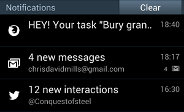

{{APIRef("Web Notifications")}}{{AvailableInWorkers}}{{securecontext_header}}

The [Notifications API](/en-US/docs/Web/API/Notifications_API) lets a web page or app send notifications that are displayed outside the page at the system level; this lets web apps send information to a user even if the application is idle or in the background. This article looks at the basics of using this API in your own apps.

Typically, system notifications refer to the operating system's standard notification mechanism: think for example of how a typical desktop system or mobile device broadcasts notifications.



The system notification system will vary of course by platform and browser, but this is OK, and the Notifications API is written to be general enough for compatibility with most system notification systems.

## Examples

One of the most obvious use cases for web notifications is a web-based mail or IRC application that needs to notify the user when a new message is received, even if the user is doing something else with another application. Many examples of this now exist, such as [Slack](https://slack.com/).

We've written a real-world example — a to-do list app — to give more of an idea of how web notifications can be used. It stores data locally using [IndexedDB](/en-US/docs/Web/API/IndexedDB_API) and notifies users when tasks are due using system notifications. [Download the To-do list code](https://github.com/mdn/dom-examples/tree/main/to-do-notifications), or [view the app running live](https://mdn.github.io/dom-examples/to-do-notifications/).

## Requesting permission

Before an app can send a notification, the user must grant the application the right to do so. This is a common requirement when an API tries to interact with something outside a web page — at least once, the user needs to specifically grant that application permission to present notifications, thereby letting the user control which apps/sites are allowed to display notifications.

Because of abuses of push notifications in the past, web browsers and developers have begun to implement strategies to help mitigate this problem. You should only request consent to display notifications in response to a user gesture (e.g. clicking a button). This is not only best practice — you should not be spamming users with notifications they didn't agree to — but going forward browsers will explicitly disallow notification permission requests not triggered in response to a user gesture. Firefox is already doing this from version 72, for example, and Safari has done it for some time.

In addition, In Chrome and Firefox you cannot request notifications at all unless the site is a secure context (i.e. HTTPS), and you can no longer allow notification permissions to be requested from cross-origin {{htmlelement("iframe")}}s.

### Checking current permission status

You can check to see if you already have permission by checking the value of the {{domxref("Notification.permission")}} read only property. It can have one of three possible values:

- `default`
  - : The user hasn't been asked for permission yet, so notifications won't be displayed.
- `granted`
  - : The user has granted permission to display notifications, after having been asked previously.
- `denied`
  - : The user has explicitly declined permission to show notifications.

### Getting permission

If permission to display notifications hasn't been granted yet, the application needs to use the {{domxref("Notification.requestPermission()")}} method to request this from the user. In its simplest form, we just include the following:

```js
Notification.requestPermission().then((result) => {
  console.log(result);
});
```

This uses the promise-based version of the method. If you want to support older versions, you might have to use the older callback version, which looks like this:

```js
Notification.requestPermission((result) => {
  console.log(result);
});
```

The callback version optionally accepts a callback function that is called once the user has responded to the request to display permissions.

> **Note:** There's no way to reliably feature-test whether `Notification.requestPermission` supports the promise-based version. If you need to support older browsers, just use the callback-based version—although this is deprecated, it still works in new browsers. Check the [browser compatibility table](/en-US/docs/Web/API/Notification/requestPermission_static#browser_compatibility) for more information.

### Example

In our todo list demo, we include an "Enable notifications" button that, when pressed, requests notification permissions for the app.

```html
<button id="enable">Enable notifications</button>
```

Clicking this calls the `askNotificationPermission()` function:

```js
function askNotificationPermission() {
  // function to actually ask the permissions
  function handlePermission(permission) {
    // set the button to shown or hidden, depending on what the user answers
    notificationBtn.style.display =
      Notification.permission === "granted" ? "none" : "block";
  }

  // Let's check if the browser supports notifications
  if (!("Notification" in window)) {
    console.log("This browser does not support notifications.");
  } else {
    Notification.requestPermission().then((permission) => {
      handlePermission(permission);
    });
  }
}
```

Looking at the second main block first, you'll see that we first check to see if Notifications are supported. If they are, we then run a check to see whether the promise-based version of `Notification.requestPermission()` is supported. If it is, we run the promise-based version (supported everywhere except Safari), and if not, we run the older callback-based version (which is supported in Safari).

To avoid duplicating code, we have stored a few bits of housekeeping code inside the `handlePermission()` function, which is the first main block inside this snippet. Inside here we explicitly set the `Notification.permission` value (some old versions of Chrome failed to do this automatically), and show or hide the button depending on what the user chose in the permission dialog. We don't want to show it if permission has already been granted, but if the user chose to deny permission, we want to give them the chance to change their mind later on.

> **Note:** Before version 37, Chrome doesn't let you call {{domxref("Notification.requestPermission()")}} in the `load` event handler (see [issue 274284](https://crbug.com/274284)).

## Creating a notification

Creating a notification is easy; just use the {{domxref("Notification")}} constructor. This constructor expects a title to display within the notification and some options to enhance the notification such as an {{domxref("Notification.icon","icon")}} or a text {{domxref("Notification.body","body")}}.

For example, in the to-do-list example we use the following snippet to create a notification when required (found inside the `createNotification()` function):

```js
const img = "/to-do-notifications/img/icon-128.png";
const text = `HEY! Your task "${title}" is now overdue.`;
const notification = new Notification("To do list", { body: text, icon: img });
```

## Closing notifications

Use {{domxref("Notification.close","close()")}} to remove a notification that is no longer relevant to the user (e.g. the user already read the notification on the webpage, in the case of a messaging app, or the following song is already playing in a music app to notifies upon song changes). Most modern browsers dismiss notifications automatically after a few moments (around four seconds) but this isn't something you should generally be concerned about as it's up to the user and user agent. The dismissal may also happen at the operating system level and users should remain in control of this. Old versions of Chrome didn't remove notifications automatically so you can do so after a {{domxref("setTimeout()")}} only for those legacy versions in order to not remove notifications from notification trays on other browsers.

```js
const n = new Notification("My Great Song");
document.addEventListener("visibilitychange", () => {
  if (document.visibilityState === "visible") {
    // The tab has become visible so clear the now-stale Notification.
    n.close();
  }
});
```

> **Note:** This API shouldn't be used just to have the notification removed from the screen after a fixed delay (on modern browsers) since this method will also remove the notification from any notification tray, preventing users from interacting with it after it was initially shown.

> **Note:** When you receive a "close" event, there is no guarantee that it's the user who closed the notification. This is in line with the specification, which states: "When a notification is closed, either by the underlying notifications platform or by the user, the close steps for it must be run."

## Notification events

There are four events that are triggered on the {{domxref("Notification")}} instance:

- `click`
  - : Triggered when the user clicks on the notification.
- `close`
  - : Triggered once the notification is closed.
- `error`
  - : Triggered if something goes wrong with the notification; this is usually because the notification couldn't be displayed for some reason.
- `show`
  - : Triggered when the notification is displayed to the user.

These events can be tracked using the {{domxref("Notification.click_event","onclick")}}, {{domxref("Notification.close_event","onclose")}}, {{domxref("Notification.error_event","onerror")}}, and {{domxref("Notification.show_event","onshow")}} handlers. Because {{domxref("Notification")}} also inherits from {{domxref("EventTarget")}}, it's possible to use the {{domxref("EventTarget.addEventListener","addEventListener()")}} method on it.

## Replacing existing notifications

It is usually undesirable for a user to receive a lot of notifications in a short space of time — for example, what if a messenger application notified a user for each incoming message, and they were being sent a lot? To avoid spamming the user with too many notifications, it's possible to modify the pending notifications queue, replacing single or multiple pending notifications with a new one.

To do this, it's possible to add a tag to any new notification. If a notification already has the same tag and has not been displayed yet, the new notification replaces that previous notification. If the notification with the same tag has already been displayed, the previous notification is closed and the new one is displayed.

### Tag example

Assume the following basic HTML:

```html
<button>Notify me!</button>
```

It's possible to handle multiple notifications this way:

```js
window.addEventListener("load", () => {
  const button = document.querySelector("button");

  if (window.self !== window.top) {
    // Ensure that if our document is in a frame, we get the user
    // to first open it in its own tab or window. Otherwise, it
    // won't be able to request permission to send notifications.
    button.textContent = "View live result of the example code above";
    button.addEventListener("click", () => window.open(location.href));
    return;
  }

  button.addEventListener("click", () => {
    if (Notification?.permission === "granted") {
      // If the user agreed to get notified
      // Let's try to send ten notifications
      let i = 0;
      // Using an interval cause some browsers (including Firefox) are blocking notifications if there are too much in a certain time.
      const interval = setInterval(() => {
        // Thanks to the tag, we should only see the "Hi! 9" notification
        const n = new Notification(`Hi! ${i}`, { tag: "soManyNotification" });
        if (i === 9) {
          clearInterval(interval);
        }
        i++;
      }, 200);
    } else if (Notification && Notification.permission !== "denied") {
      // If the user hasn't told if they want to be notified or not
      // Note: because of Chrome, we are not sure the permission property
      // is set, therefore it's unsafe to check for the "default" value.
      Notification.requestPermission().then((status) => {
        // If the user said okay
        if (status === "granted") {
          let i = 0;
          // Using an interval cause some browsers (including Firefox) are blocking notifications if there are too much in a certain time.
          const interval = setInterval(() => {
            // Thanks to the tag, we should only see the "Hi! 9" notification
            const n = new Notification(`Hi! ${i}`, {
              tag: "soManyNotification",
            });
            if (i === 9) {
              clearInterval(interval);
            }
            i++;
          }, 200);
        } else {
          // Otherwise, we can fallback to a regular modal alert
          alert("Hi!");
        }
      });
    } else {
      // If the user refuses to get notified, we can fallback to a regular modal alert
      alert("Hi!");
    }
  });
});
```

### Result

{{ EmbedLiveSample('Tag_example', '100%', 30) }}

## Specifications

{{Specifications}}

## Browser compatibility

{{Compat}}

## See also

- {{ domxref("Notification") }}
