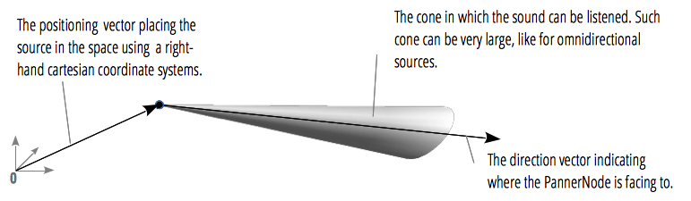

{{ APIRef("Web Audio API") }}

The `PannerNode` interface defines an audio-processing object that represents the location, direction, and behavior of an audio source signal in a simulated physical space. This {{domxref("AudioNode")}} uses right-hand Cartesian coordinates to describe the source's _position_ as a vector and its _orientation_ as a 3D directional cone.

A `PannerNode` always has exactly one input and one output: the input can be _mono_ or _stereo_ but the output is always _stereo_ (2 channels); you can't have panning effects without at least two audio channels!

{{InheritanceDiagram}}

<table class="properties">
  <tbody>
    <tr>
      <th scope="row">Number of inputs</th>
      <td><code>1</code></td>
    </tr>
    <tr>
      <th scope="row">Number of outputs</th>
      <td><code>1</code></td>
    </tr>
    <tr>
      <th scope="row">Channel count mode</th>
      <td><code>"clamped-max"</code></td>
    </tr>
    <tr>
      <th scope="row">Channel count</th>
      <td><code>2</code></td>
    </tr>
    <tr>
      <th scope="row">Channel interpretation</th>
      <td><code>"speakers"</code></td>
    </tr>
  </tbody>
</table>

## Constructor

- {{domxref("PannerNode.PannerNode", "PannerNode()")}}
  - : Creates a new `PannerNode` object instance.

## Properties

_Inherits properties from its parent, {{domxref("AudioNode")}}_.

> **Note:** The orientation and position value are set and retrieved using different syntaxes, since they're stored as {{domxref("AudioParam")}} values. Retrieval is done by accessing, for example, `PannerNode.positionX`. While setting the same property is done with `PannerNode.positionX.value`. This is why these values are not marked read only, which is how they appear in the WebIDL.

- {{domxref("PannerNode.coneInnerAngle")}}
  - : A double value describing the angle, in degrees, of a cone inside of which there will be no volume reduction.
- {{domxref("PannerNode.coneOuterAngle")}}
  - : A double value describing the angle, in degrees, of a cone outside of which the volume will be reduced by a constant value, defined by the `coneOuterGain` property.
- {{domxref("PannerNode.coneOuterGain")}}
  - : A double value describing the amount of volume reduction outside the cone defined by the `coneOuterAngle` attribute. Its default value is `0`, meaning that no sound can be heard.
- {{domxref("PannerNode.distanceModel")}}
  - : An enumerated value determining which algorithm to use to reduce the volume of the audio source as it moves away from the listener. Possible values are `"linear"`, `"inverse"` and `"exponential"`. The default value is `"inverse"`.
- {{domxref("PannerNode.maxDistance")}}
  - : A double value representing the maximum distance between the audio source and the listener, after which the volume is not reduced any further.
- {{domxref("PannerNode.orientationX")}}
  - : Represents the horizontal position of the audio source's vector in a right-hand Cartesian coordinate system. While this {{domxref("AudioParam")}} cannot be directly changed, its value can be altered using its {{domxref("AudioParam.value", "value")}} property. The default is value is 1.
- {{domxref("PannerNode.orientationY")}}
  - : Represents the vertical position of the audio source's vector in a right-hand Cartesian coordinate system. The default is 0. While this {{domxref("AudioParam")}} cannot be directly changed, its value can be altered using its {{domxref("AudioParam.value", "value")}} property. The default is value is 0.
- {{domxref("PannerNode.orientationZ")}}
  - : Represents the longitudinal (back and forth) position of the audio source's vector in a right-hand Cartesian coordinate system. The default is 0. While this {{domxref("AudioParam")}} cannot be directly changed, its value can be altered using its {{domxref("AudioParam.value", "value")}} property. The default is value is 0.
- {{domxref("PannerNode.panningModel")}}
  - : An enumerated value determining which spatialization algorithm to use to position the audio in 3D space.
- {{domxref("PannerNode.positionX")}}
  - : Represents the horizontal position of the audio in a right-hand Cartesian coordinate system. The default is 0. While this {{domxref("AudioParam")}} cannot be directly changed, its value can be altered using its {{domxref("AudioParam.value", "value")}} property. The default is value is 0.
- {{domxref("PannerNode.positionY")}}
  - : Represents the vertical position of the audio in a right-hand Cartesian coordinate system. The default is 0. While this {{domxref("AudioParam")}} cannot be directly changed, its value can be altered using its {{domxref("AudioParam.value", "value")}} property. The default is value is 0.
- {{domxref("PannerNode.positionZ")}}
  - : Represents the longitudinal (back and forth) position of the audio in a right-hand Cartesian coordinate system. The default is 0. While this {{domxref("AudioParam")}} cannot be directly changed, its value can be altered using its {{domxref("AudioParam.value", "value")}} property. The default is value is 0.
- {{domxref("PannerNode.refDistance")}}
  - : A double value representing the reference distance for reducing volume as the audio source moves further from the listener. For distances greater than this the volume will be reduced based on `rolloffFactor` and `distanceModel`.
- {{domxref("PannerNode.rolloffFactor")}}
  - : A double value describing how quickly the volume is reduced as the source moves away from the listener. This value is used by all distance models.

## Methods

_Inherits methods from its parent, {{domxref("AudioNode")}}_.

- {{domxref("PannerNode.setPosition()")}} {{deprecated_inline}}
  - : Defines the position of the audio source relative to the listener (represented by an {{domxref("AudioListener")}} object stored in the {{domxref("BaseAudioContext.listener")}} attribute.)
- {{domxref("PannerNode.setOrientation()")}} {{deprecated_inline}}
  - : Defines the direction the audio source is playing in.
- {{domxref("PannerNode.setVelocity()")}} {{deprecated_inline}}
  - : Defines the velocity vector of the audio source — how fast it is moving and in what direction. In a previous version of the specification, the {{domxref("PannerNode")}} had a velocity vector that could pitch up or down {{domxref("AudioBufferSourceNode")}} objects connected downstream. This feature was not clearly specified and had a number of issues, so it was removed from the specification.

## Examples

See [`BaseAudioContext.createPanner()`](/en-US/docs/Web/API/BaseAudioContext/createPanner#example) for example code.

## Specifications

{{Specifications}}

## Browser compatibility

{{Compat}}

## See also

- [Using the Web Audio API](/en-US/docs/Web/API/Web_Audio_API/Using_Web_Audio_API)
