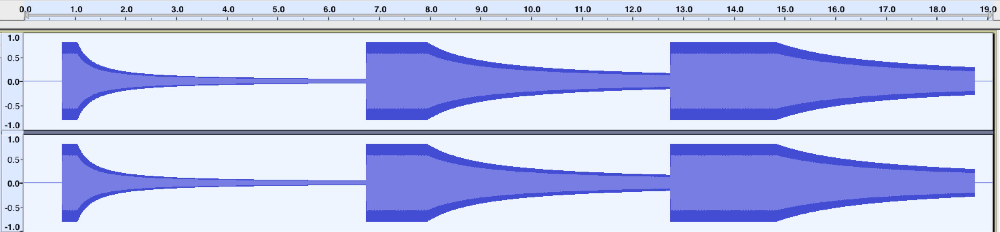

{{ APIRef("Web Audio API") }}

The `refDistance` property of the {{ domxref("PannerNode") }} interface is a double value representing the reference distance for reducing volume as the audio source moves further from the listener – i.e. the distance at which the volume reduction starts taking effect. This value is used by all distance models.

The `refDistance` property's default value is `1`.

## Value

A non-negative number. If the value is set to less than 0, a {{jsxref("RangeError")}} is thrown.

### Exceptions

- {{jsxref("RangeError")}}
  - : Thrown if the property has been given a value that is outside the accepted range.

## Examples

This example demonstrates how different values of {{ domxref("PannerNode.refDistance", "refDistance") }} affect how the volume of a sound decays as it moves away from the listener. Unlike {{ domxref("PannerNode.rolloffFactor", "rolloffFactor") }}, changing this value also _delays_ the volume decay until the sound moves past the reference point.

```js
const context = new AudioContext();
// all our test tones will last this many seconds
const NOTE_LENGTH = 6;
// this is how far we'll move the sound
const Z_DISTANCE = 20;

// this function creates a graph for the test tone with a given refDistance
// and schedules it to move away from the listener along the Z (depth-wise) axis
// at the given start time, resulting in a decrease in volume (decay)
const scheduleTestTone = (refDistance, startTime) => {
  const osc = new OscillatorNode(context);

  const panner = new PannerNode(context);
  panner.refDistance = refDistance;

  // set the initial Z position, then schedule the ramp
  panner.positionZ.setValueAtTime(0, startTime);
  panner.positionZ.linearRampToValueAtTime(Z_DISTANCE, startTime + NOTE_LENGTH);

  osc.connect(panner)
     .connect(context.destination);

  osc.start(startTime);
  osc.stop(startTime + NOTE_LENGTH);
};

// this tone should decay immediately and fairly quickly
scheduleTestTone(1, context.currentTime);
// this tone should decay slower and later than the previous one
scheduleTestTone(4, context.currentTime + NOTE_LENGTH);
// this tone should decay only slightly, and only start decaying fairly late
scheduleTestTone(7, context.currentTime + NOTE_LENGTH * 2);
```

After running this code, the resulting waveforms should look something like this:



## Specifications

{{Specifications}}

## Browser compatibility

{{Compat}}

## See also

- [Using the Web Audio API](/en-US/docs/Web/API/Web_Audio_API/Using_Web_Audio_API)
- [Web Audio spatialization basics](/en-US/docs/Web/API/Web_Audio_API/Web_audio_spatialization_basics)
